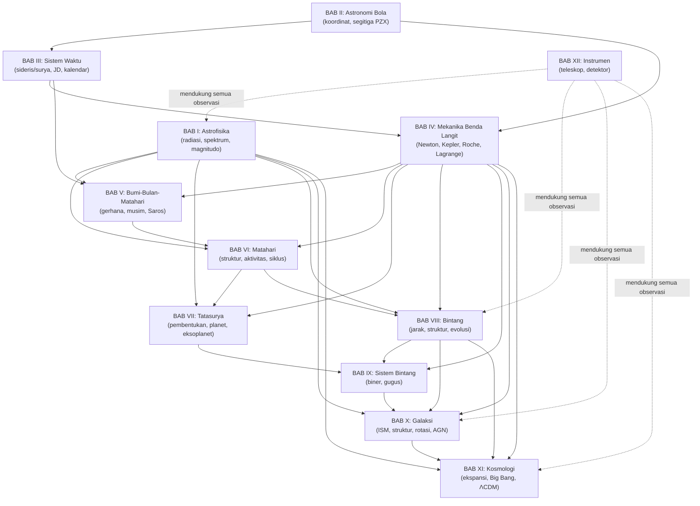

# RANGKUMAN AKHIR — DAFTAR RUMUS LENGKAP, PETA KONSEP KESELURUHAN, DAN TOPIK TERSERING

*(Part 12 — bagian penutup seri Ringkasan Materi OSN Astronomi. Bagian ini merangkum seluruh Part 1–11 menjadi satu referensi cepat untuk revisi akhir sebelum ujian.)*

---

## Cara Menggunakan Dokumen Ini

Dokumen ini BUKAN pengganti Part 1–11 (yang berisi konsep, derivasi, intuisi, dan contoh soal lengkap) — melainkan **lembar rujukan cepat (quick reference)** untuk:
- Revisi H-3 hingga H-1 sebelum kompetisi (mengecek rumus yang mungkin terlupa)
- Mencari rumus spesifik dengan cepat tanpa membuka semua 11 file
- Melihat keterkaitan antar-bab secara menyeluruh (peta konsep gabungan)
- Fokus belajar pada topik dengan probabilitas kemunculan tertinggi jika waktu terbatas

---

## 1. DAFTAR RUMUS LENGKAP PER BAB

### BAB I — Astrofisika

**Radiasi & Doppler**
$$F=\frac{L}{4\pi r^2}\qquad \frac{\Delta\lambda}{\lambda_0}=\frac{v_r}{c}\qquad E=h\nu=\frac{hc}{\lambda}\qquad p=\frac h\lambda$$

**Benda Hitam**
$$B_\nu(T)=\frac{2h\nu^3}{c^2}\frac1{e^{h\nu/k_BT}-1}\qquad \lambda_{max}T=2{,}898\times10^{-3}\text{ m·K (Wien)}$$
$$F=\sigma T^4\qquad L=4\pi R^2\sigma T_{eff}^4\text{ (Stefan-Boltzmann)}\qquad B_\nu^{RJ}=\frac{2\nu^2k_BT}{c^2}\text{ (Rayleigh-Jeans)}$$

**Fotometri**
$$m_1-m_2=-2{,}5\log_{10}\frac{F_1}{F_2}\text{ (Pogson)}\qquad m-M=5\log_{10}\left(\frac r{10\text{pc}}\right)+A$$
$$M_{bol}-M_{bol,\odot}=-2{,}5\log_{10}\frac{L}{L_\odot}\qquad A_V\approx3{,}0\,E_{B-V}$$

**Atom Bohr/Rydberg**
$$E_n=-\frac{13{,}6\text{eV}}{n^2}\qquad \frac1\lambda=R\left(\frac1{n_1^2}-\frac1{n_2^2}\right)$$

**Struktur Bintang (dasar)**
$$\frac{dP}{dr}=-\frac{GM(r)\rho}{r^2}\qquad \frac{dm}{dr}=4\pi r^2\rho\qquad \frac{dL}{dr}=4\pi r^2\rho\varepsilon$$

**Nuklir**
$$E=\Delta mc^2\qquad N(t)=N_0e^{-\lambda t}\qquad t_{1/2}=\frac{\ln2}\lambda$$

### BAB II — Astronomi Bola

$$\frac{\sin a}{\sin A}=\frac{\sin b}{\sin B}=\frac{\sin c}{\sin C}\text{ (sinus bola)}\qquad \cos a=\cos b\cos c+\sin b\sin c\cos A\text{ (kosinus bola)}$$
$$\text{Luas}=E\,r^2,\ E=A+B+C-180°$$

**Segitiga PZX (transformasi horizontal↔ekuatorial)**
$$\sin a=\sin\delta\sin\varphi+\cos\delta\cos\varphi\cos h\qquad \sin\delta=\sin a\sin\varphi+\cos a\cos\varphi\cos A$$
$$\Theta=h+\alpha\qquad a_{max}=90°\mp\varphi\pm\delta\qquad \cos h_0=-\tan\delta\tan\varphi\text{ (terbit/terbenam)}$$

**Sirkumpolar:** $\delta>90°-|\varphi|$ (sirkumpolar); $\delta<-(90°-|\varphi|)$ (tak pernah terbit)

### BAB III — Sistem Waktu dan Kalendar

$$24^h_{\text{surya}}=24^h3^m56{,}56^s_{\text{sideris}}\qquad \frac1\tau=\frac1{\tau_*}\mp\frac1P$$
$$T=\frac{J-2.451.545{,}0}{36.525}\text{ (Julian century)}\qquad \text{LMT}-\text{zona}=\frac{\lambda_{lokal}-\lambda_{zona}}{15°}\text{ jam}$$

**Kabisat Gregorian:** $4\mid Y$ DAN ($100\nmid Y$ ATAU $400\mid Y$)
**Hijriah Urfi:** rerata 354,367 hari/tahun; Tahun M $\approx621{,}56+0{,}970224\times$Tahun H

### BAB IV — Mekanika Benda Langit

$$F=\frac{Gm_Am_B}{r^2}\qquad \ddot{\mathbf r}=-\mu\frac{\mathbf r}{r^3},\ \mu=G(m_1+m_2)$$
$$r=\frac{k^2/\mu}{1+e\cos f}\qquad \dot A=\frac12k\text{ (konstan)}\qquad P^2=\frac{4\pi^2}{G(m_1+m_2)}a^3\ \text{atau}\ a^3=(m_1+m_2)P^2\text{ (au-th-}M_\odot\text{)}$$
$$\frac12v^2-\frac\mu r=h\qquad a=-\frac\mu{2h}$$

**Roche & Barycenter**
$$R_{Roche}\approx2{,}5R_{planet}\ (\rho\text{ sama})\qquad d\approx2{,}44R_{planet}\left(\frac{\rho_{planet}}{\rho_{satelit}}\right)^{1/3}\qquad d_1=\frac{m_2}{m_1+m_2}d$$

**Anomali**
$$M=E-e\sin E\text{ (Persamaan Kepler)}\qquad M=\frac{2\pi}P(t-\tau)\qquad r=a(1-e\cos E)$$

### BAB V — Sistem Bumi-Bulan-Matahari

**Siklus:** Saros $=223$ bulan sinodis $=6585{,}78$ hari $\approx18$th$11$hr; Meton $=19$th$\approx235$ bulan sinodis
**Bulan:** sinodis $29{,}531$ hr; sideris $27{,}322$ hr; nodical $27{,}212$ hr; anomalistic $27{,}555$ hr
$$L_{out}=A\frac{L_\odot R^2}{4r^2}\qquad m=m_0+5\log_{10}(r\Delta)-2{,}5\log_{10}\Phi(\alpha)\qquad \Omega\approx\pi(R/d)^2$$

### BAB VI — Matahari

$$M_\odot=1{,}989\times10^{30}\text{kg}\quad R_\odot=6{,}96\times10^8\text{m}\quad L_\odot=3{,}9\times10^{26}\text{W}\quad T_{eff}=5778\text{K}$$
$$\Omega=A-B\sin^2\psi,\ A=14{,}5°/\text{hr},\ B=2{,}9°/\text{hr}\qquad Z=C(S+10G)\text{ (Zürich)}$$
$$S_\odot\approx1370\text{ W/m}^2\qquad P_{rad}=F/c\text{ (serap) atau }2F/c\text{ (pantul)}$$

### BAB VII — Tatasurya

$$\text{Presesi}\approx50''/\text{th},\ \text{periode}\approx26.000\text{th}$$
$$T=T_\odot\left[\frac{1-A}4\right]^{1/4}\sqrt{\frac{R_\odot}r}\qquad a=0{,}4+0{,}3\times2^n\text{ au (Titius-Bode, historis)}$$
$$\frac1{P_{sin}}=\frac1{P_1}-\frac1{P_2}\qquad \sin\varepsilon_{max}=\frac{a_{planet}}{a_{Bumi}}\text{ (inferior)}$$
$$v_{rms}=\sqrt{3k_BT/m}<0{,}2\,v_e\text{ (retensi atmosfer)}$$
$$\frac{\Delta F}F=\left(\frac{R_p}{R_*}\right)^2\text{ (transit)}\qquad K\propto\frac{m_p\sin i}{(m_*+m_p)^{2/3}}P^{-1/3}\text{ (RV)}$$

### BAB VIII — Bintang

$$r=1/\pi\text{ (pc, arcsec)}\qquad 1\text{pc}=3{,}26\text{ly}=206.265\text{au}\qquad v_t=4{,}74\,\mu\,r$$
$$L\propto M^{3{,}5}\text{ (deret utama)}\qquad t\propto M/L$$
$$t_d\approx\sqrt{R^3/GM}\qquad t_t\approx\frac{0{,}5GM^2/R}L$$
**Nukleosintesis:** pp chain ($M\lesssim1{,}5M_\odot$), CNO ($M\gtrsim1{,}5M_\odot$), triple-alpha: $3\,^4He\to{}^{12}C$
$$M_{Ch}\approx1{,}4M_\odot\qquad M_{OV}\approx1{,}5\text{–}2M_\odot$$

### BAB IX — Sistem Bintang

$$\frac{a_1}{a_2}=\frac{m_2}{m_1}\qquad a=a_1+a_2\qquad m_1+m_2=\frac{a^3}{P^2}\text{(au-th-}M_\odot\text{)}$$
$$v=v_0\sin i\qquad \frac{m_2^3\sin^3i}{(m_1+m_2)^2}=\frac{v_1^3P}{2\pi G}\text{ (fungsi massa)}$$
$$r_{moving cluster}=\frac{v_r}\mu\tan\theta\qquad M_{Virial}\approx\frac{\langle v^2\rangle R}G$$

### BAB X — Galaksi

$$\lambda_{21cm}=21{,}1\text{cm}$$
$$A\approx15,\ B\approx-10\text{ km/s/kpc}\qquad v_r\approx Ar\sin2l\qquad \mu\approx A\cos2l+B\qquad M(<R_0)=\frac{R_0V_0^2}G$$
$$n=10(1-b/a)\text{ (elips E}n\text{)}$$
$$L_{Edd}=\frac{4\pi GMm_pc}{\sigma_T}\approx3{,}2\times10^4(M/M_\odot)L_\odot$$

### BAB XI — Kosmologi

$$z=\frac{\Delta\lambda}{\lambda_0}\qquad V=Hr=cz\ (z\text{ kecil})\qquad H_0\approx70\text{km/s/Mpc}\qquad T=H^{-1}\approx14\text{ miliar th}$$
$$\rho_c=\frac{3H^2}{8\pi G}\qquad \Omega=\rho/\rho_c\qquad q=-\frac{R\ddot R}{\dot R^2}\qquad \Omega=2q\ (\Lambda=0)$$
$$m=5\log_{10}z+C\text{ (standard candle)}$$
$$\rho_{materi}\propto R^{-3}\qquad \rho_{radiasi}\propto R^{-4}\qquad T\propto R^{-1}$$
$$\Omega_\Lambda\approx0{,}7\quad \Omega_{materi}\approx0{,}3\quad \text{usia}\approx13{,}8\text{ miliar th}$$

### BAB XII — Instrumen

$$F=D/f\qquad \omega=f/f'\qquad \omega_{max}\approx D(\text{mm})\qquad \theta=1{,}22\lambda/D\text{ (Rayleigh)}$$

---

## 2. PETA KONSEP KESELURUHAN — HUBUNGAN ANTAR-BAB

### Benang Merah Konseptual Lintas-Bab

Beberapa konsep MUNCUL BERULANG di banyak bab dengan wujud berbeda — memahami satu bentuk membantu memahami semua bentuk lainnya:

| Konsep Inti | Muncul di Bab | Wujud Berbeda |
|---|---|---|
| **Hukum kuadrat-terbalik** | I, IV, V, VI | Fluks cahaya; gravitasi Newton; tekanan radiasi |
| **Kekekalan momentum sudut** | IV, VII (presesi), X (rotasi galaksi) | Kepler II; presesi giroskopik; kurva rotasi |
| **Kesetimbangan energi (in=out)** | I (benda hitam), VII (temperatur planet), VIII (struktur bintang) | Stefan-Boltzmann; temperatur kesetimbangan; kesetimbangan hidrostatik |
| **Periode sideris vs sinodis** | III, IV, VII | Hari; orbit planet; rotasi planet |
| **Standard candle / tangga jarak** | VIII, IX, X, XI | Paralaks → Cepheid → Tully-Fisher → SN Ia |
| **Teorema Virial** | IV, IX, X, XI | Skala waktu termal bintang; massa gugus; massa galaksi/kluster |
| **Degenerasi kuantum** | I (elektron/foton dualisme), VIII (katai putih/bintang neutron) | Prinsip Pauli mendasari tekanan degenerasi |
| **Efek geometris murni (bukan fisis baru)** | II (sirkumpolar), IV (retrograde), IX (klasifikasi biner), X (superluminal) | Perspektif & proyeksi menjelaskan banyak "ilusi" pengamatan |
| **Materi/energi tak terlihat, terdeteksi lewat gravitasi** | IV (Lagrange tersembunyi), X (materi gelap), XI (energi gelap) | Pola inferensi tidak langsung yang berulang |

---

## 3. TOPIK PALING SERING MUNCUL — RANGKUMAN LINTAS-BAB (Prioritas Belajar Jika Waktu Terbatas)

### Tingkat Prioritas TERTINGGI (hampir pasti muncul tiap tahun)
1. **Modulus jarak + ekstingsi** (Bab I) digabung **Wien/Stefan-Boltzmann**
2. **Transformasi horizontal↔ekuatorial** lewat segitiga PZX (Bab II)
3. **Hukum Kepler III bentuk Newton** untuk menghitung massa (Bab IV, berulang di VI-IX)
4. **Geometri gerhana** & **siklus Saros** (Bab V)
5. **Kurva rotasi galaksi & bukti materi gelap** (Bab X)
6. **Hukum Hubble & redshift** (Bab XI)
7. **Paralaks & jarak bintang** $r=1/\pi$ (Bab VIII)
8. **Penentuan massa biner** (Bab IX)

### Tingkat Prioritas TINGGI (sangat sering)
9. Efek Doppler & kecepatan radial (Bab I, IX, XI)
10. Julian Date & kalender kabisat (Bab III)
11. Limit Roche & titik Lagrange (Bab IV)
12. Konfigurasi planet & periode sinodis (Bab VII)
13. Relasi massa-luminositas & umur bintang (Bab VIII)
14. Nasib akhir bintang (katai putih/neutron/lubang hitam) (Bab VIII)
15. Titik belok deret utama & usia gugus (Bab IX)
16. Bukti Big Bang, terutama CMB (Bab XI)

### Tingkat Prioritas SEDANG (sering, terutama level Seleksi/lanjut)
17. Data fisis Matahari & konstanta Matahari (Bab VI)
18. Nukleosintesis (pp chain vs CNO) (Bab VIII)
19. Temperatur kesetimbangan planet & efek rumah kaca (Bab VII)
20. Metode deteksi eksoplanet (transit, RV) (Bab VII, IX)
21. Klasifikasi Hubble galaksi (Bab X)
22. Daya pisah teleskop & Kriteria Rayleigh (Bab XII)
23. Konversi kalendar Hijriah (Bab III) — khas soal Indonesia
24. Konstanta Oort (Bab VI rotasi Matahari, Bab X rotasi Galaksi — JANGAN TERTUKAR, dua rumus mirip tapi konteks beda)

### Perhatian Khusus: Miskonsepsi yang Sering Diuji
- Musim disebabkan **kemiringan sumbu**, BUKAN jarak Bumi-Matahari (Bab V/VII)
- $M$ (anomali rata-rata) $\neq$ $f$ (anomali sejati) kecuali orbit lingkaran (Bab IV)
- Magnifikasi teleskop BUKAN ukuran kualitas; aperture yang penting (Bab XII)
- Supernova Tipe Ia (ledakan termonuklir total) vs Tipe II (runtuh inti, sisa bintang kompak) (Bab VIII)
- Bima Sakti BUKAN pusat ekspansi alam semesta (Bab XI)
- Fungsi massa RV HANYA memberi $m\sin i$ (batas bawah), bukan massa sejati (Bab VII, IX)
- Rotasi diferensial Matahari (Bab VI) vs rotasi diferensial Galaksi (Bab X) — rumus Oort mirip tapi konteks & nilai konstanta berbeda total

---

4. Untuk pendalaman soal (bukan hanya materi), kerjakan arsip soal OSN/IOAA tahun-tahun sebelumnya sambil merujuk kembali ke bagian rumus & derivasi yang relevan di Part 1–11.

Selamat belajar dan semoga sukses di IMPACT 6.0 dan OSN Astronomi!
