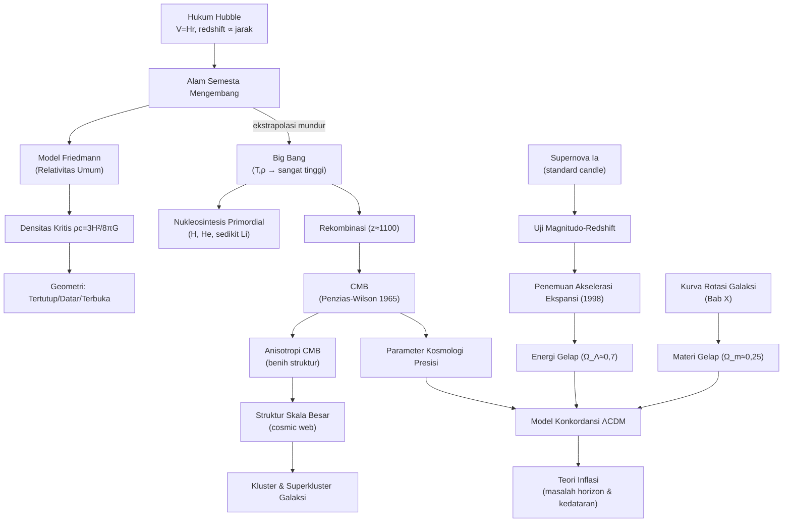

# BAB XI — KOSMOLOGI

*(Part 10 dari seri Ringkasan OSN Astronomi — lihat Part 1 untuk daftar isi keseluruhan)*

---

## Daftar Isi Bab Ini

1. [Alam Semesta Mengembang, Redshift, dan Hukum Hubble](#1)
2. [Model Kosmologi Standar: Model Friedmann](#2)
3. [Densitas Kritis dan Parameter Kosmologi](#3)
4. [Bukti Observasional Big Bang](#4)
5. [Nukleosintesis Primordial dan Sejarah Termal Alam Semesta](#5)
6. [Struktur Skala Besar dan Gugus Galaksi](#6)
7. [Mengukur Jarak dengan Supernova Tipe Ia](#7)
8. [Model Konkordansi (ΛCDM) dan Evolusi Alam Semesta](#8)

---

<a name="1"></a>
## 1. Alam Semesta Mengembang, Redshift, dan Hukum Hubble

### A. Konsep Inti

**Hukum Hubble** — Edwin Hubble (1929) menemukan bahwa hampir semua galaksi menunjukkan **pergeseran merah (redshift)** pada spektrumnya, dengan besar pergeseran **berbanding lurus dengan jaraknya**. Interpretasi paling sederhana: alam semesta sedang **mengembang** — bukan galaksi yang "bergerak menjauh" dalam ruang statis, melainkan **ruang itu sendiri yang meregang**, membawa galaksi-galaksi menjauh satu sama lain.

**Prinsip kosmologis (cosmological principle)** — asumsi fundamental kosmologi modern: alam semesta bersifat **homogen** (sama di semua tempat, dalam skala cukup besar) dan **isotropik** (sama di semua arah) — TIDAK ada pusat maupun tepi alam semesta. Hukum Hubble berlaku sama dari sudut pandang pengamat manapun (bukan hanya dari Bumi) — analog permukaan balon yang mengembang: setiap titik "melihat" titik lain menjauh, tanpa ada titik pusat khusus di permukaan itu.

**Redshift kosmologis** — PENTING dibedakan dari Doppler biasa (§I.1): redshift kosmologis disebabkan **peregangan ruang** sepanjang perjalanan cahaya (panjang gelombang "ikut meregang" bersama ekspansi ruang), bukan gerak sumber melintasi ruang statis — meski untuk redshift kecil ($z\ll1$), rumusnya secara matematis identik dengan Doppler non-relativistik.

### B. Rumus Penting

| Nama | Rumus | Variabel | Keterangan |
|---|---|---|---|
| **Definisi redshift** | $z=\dfrac{\lambda_{obs}-\lambda_0}{\lambda_0}=\dfrac{\Delta\lambda}{\lambda_0}$ | | Definisi umum, berlaku untuk semua penyebab pergeseran |
| **Hukum Hubble (redshift)** | $z=\dfrac{H}{c}r$ | $H$: konstanta Hubble, $r$: jarak galaksi | Untuk $z$ kecil |
| **Hukum Hubble (bentuk kecepatan)** | $V=Hr$ | $V=cz$ untuk $z\ll1$ | Bentuk paling umum dipakai |
| Nilai konstanta Hubble (terkini) | $H_0\approx70$ km/s/Mpc | Rentang literatur $67$–$73$ km/s/Mpc (masih diperdebatkan, "tegangan Hubble"/*Hubble tension*) | |
| **Faktor skala** | $r(t)=\dfrac{R(t)}{R(t_0)}r_0$ | $R(t)$: faktor skala alam semesta | Deskripsi formal ekspansi ruang |
| Konstanta Hubble dari faktor skala | $H=\dot R(t)/R(t)$ | | Definisi formal |
| **Waktu Hubble (estimasi usia)** | $T=H^{-1}$ | Batas ATAS usia alam semesta jika ekspansi melambat; estimasi kasar bila laju konstan | $H_0^{-1}\approx14$ miliar tahun |
| Modulus jarak-redshift (standard candle) | $m=5\log_{10}z+C$, $C=M_0+5\log_{10}(c/H\times1/10\text{pc})$ | Untuk $z$ kecil | Basis uji kosmologi lewat standard candle |

### C. Derivasi Singkat

Untuk standard candle dengan magnitudo absolut $M_0$ pada jarak $r$: modulus jarak (§I.3) memberi $m=M_0+5\log_{10}(r/10\text{pc})$. Substitusi $r=cz/H$ (dari Hukum Hubble, $z$ kecil):
$$m = M_0+5\log_{10}\left(\frac{cz}{H\times10\text{pc}}\right) = 5\log_{10}z + \underbrace{\left[M_0+5\log_{10}\left(\frac{c}{10\text{pc}\times H}\right)\right]}_{C}$$
menghasilkan hubungan **linear** antara $m$ dan $\log_{10}z$ — inilah dasar **uji magnitudo-redshift** untuk mengukur parameter kosmologi (§XI.7) memakai supernova Ia.

### D. Intuisi dan Interpretasi

- Kesalahpahaman umum: Bima Sakti BUKAN "pusat" ekspansi meski semua galaksi tampak menjauhi kita — analog titik manapun di permukaan balon yang mengembang akan "melihat" semua titik lain menjauh dengan pola serupa (Hukum Hubble berlaku dari SEMUA titik pandang, konsekuensi langsung prinsip kosmologis).
- $H^{-1}$ HANYA estimasi usia alam semesta yang TEPAT jika laju ekspansi konstan sepanjang sejarah — pada kenyataannya laju ekspansi berubah (melambat akibat gravitasi materi, lalu ditemukan justru **berakselerasi** akibat energi gelap, §XI.8) — sehingga usia sebenarnya memerlukan model kosmologi lengkap (§XI.2), bukan sekadar $1/H_0$.
- "Tegangan Hubble" (*Hubble tension*) $[\text{Tambahan, isu riset aktif}]$ — pengukuran $H_0$ dari metode "lokal" (tangga jarak: Cepheid, supernova Ia) vs metode "global" (CMB, §XI.4) menghasilkan nilai yang **tidak konsisten secara statistik** — salah satu misteri kosmologi paling aktif diteliti saat ini.

### E. Contoh Soal OSN

**Soal:** Sebuah galaksi menunjukkan pergeseran garis Hα dari $656{,}3$ nm menjadi $675{,}0$ nm. Dengan $H_0=70$ km/s/Mpc, perkirakan jaraknya.

**Penyelesaian:**
$$z = \frac{675{,}0-656{,}3}{656{,}3}=\frac{18{,}7}{656{,}3}\approx0{,}0285$$
$$V=cz=3\times10^5\times0{,}0285\approx8550\text{ km/s}$$
$$r = V/H_0 = 8550/70\approx122\text{ Mpc}$$

---

<a name="2"></a>
## 2. Model Kosmologi Standar: Model Friedmann

### A. Konsep Inti

**Model Friedmann** — solusi persamaan Relativitas Umum Einstein untuk alam semesta homogen-isotropik yang mengembang/menyusut (Alexander Friedmann, 1922) — kerangka matematis standar seluruh kosmologi modern. Tiga kemungkinan geometri global bergantung densitas rata-rata alam semesta dibanding **densitas kritis** $\rho_c$ (§XI.3):

| Model | Kondisi | Geometri | Nasib Akhir (tanpa energi gelap) |
|---|---|---|---|
| **Tertutup (closed)** | $\rho>\rho_c$ | Positif (seperti permukaan bola) | Ekspansi berhenti, berbalik jadi kontraksi ("Big Crunch") |
| **Datar (flat, Einstein-de Sitter)** | $\rho=\rho_c$ | Nol (Euclidean) | Ekspansi terus melambat, mendekati nol laju tanpa henti |
| **Terbuka (open)** | $\rho<\rho_c$ | Negatif (seperti pelana kuda) | Ekspansi terus selamanya, tak pernah berhenti |

**Analogi Newtonian sederhana (pendekatan energi)** — meski derivasi penuh butuh Relativitas Umum, hasil KUALITATIF bisa dipahami lewat analogi "peluru ditembakkan vertikal dari permukaan planet": energi total $E=\tfrac12mV^2-GMm/r$ menentukan apakah peluru (galaksi di tepi bola imajiner) akan lepas selamanya ($E>0$, terbuka), tepat lepas ($E=0$, datar), atau jatuh kembali ($E<0$, tertutup) — kesetaraan matematis inilah yang menghasilkan rumus densitas kritis yang identik dengan hasil relativistik penuh.

**Konstanta kosmologis $\Lambda$** — awalnya diperkenalkan Einstein (1917) sebagai "gaya tolak" buatan agar modelnya statis (sebelum penemuan ekspansi Hubble) — Einstein kemudian menyebutnya "kesalahan terbesar dalam hidupnya" setelah ekspansi ditemukan. **Ironisnya**, observasi modern (§XI.7-8) menunjukkan $\Lambda$ (dalam bentuk **energi gelap**) memang diperlukan — namun untuk alasan BERBEDA: bukan menjaga alam semesta statis, melainkan menjelaskan **percepatan** ekspansi yang teramati.

### B. Rumus Penting

| Nama | Rumus | Keterangan |
|---|---|---|
| **Densitas kritis** | $\rho_c = \dfrac{3H^2}{8\pi G}$ | Untuk $\Lambda=0$; nilai saat ini $\rho_c\approx1{,}9\times10^{-26}$ kg/m³ ($H_0=100$km/s/Mpc, skalakan sesuai $H_0$ aktual) $\approx$ 10 atom hidrogen/m³ |
| **Parameter densitas** | $\Omega = \rho/\rho_c$ | $\Omega=1$: datar; $\Omega>1$: tertutup; $\Omega<1$: terbuka |
| **Parameter deselerasi** | $q = -R\ddot R/\dot R^2$ | Mengukur laju perlambatan/percepatan ekspansi |
| Hubungan $\Omega$-$q$ ($\Lambda=0$) | $\Omega=2q$ | Uji konsistensi Relativitas Umum |
| Hukum kekekalan (analog Newtonian) | $E=\tfrac12mH^2r^2-\dfrac{GMm}{r}=0$ pada $\rho=\rho_c$ | Derivasi $\rho_c$ dari energi total nol |

### C. Derivasi Singkat

**Densitas kritis** (pendekatan Newtonian, sesuai buku sumber): tinjau galaksi bermassa $m$ di tepi bola berjari-jari $r$ berisi massa $M=\tfrac43\pi r^3\rho$. Energi total $E=\tfrac12mV^2-GMm/r$ dengan $V=Hr$ (Hukum Hubble). Kasus batas $E=0$ (analog "tepat lepas"):
$$\frac12mH^2r^2 = \frac{Gm}{r}\times\frac43\pi r^3\rho_c \Rightarrow \rho_c=\frac{3H^2}{8\pi G}$$

### D. Intuisi dan Interpretasi

- Analogi "peluru vertikal" sangat berguna untuk intuisi cepat: densitas kritis adalah densitas "tepat pas" yang membuat "kecepatan lepas" ekspansi sama dengan laju ekspansi aktual — analog kecepatan lepas planet (§IV.4) tapi diterapkan pada keseluruhan alam semesta.
- Observasi CMB (Planck 2015, §XI.4) menunjukkan kelengkungan alam semesta **sangat dekat nol** ($\Omega_{total}\approx1$ dalam presisi $0{,}5\%$) — alam semesta kita **hampir persis datar** — hasil mengejutkan yang menjadi salah satu motivasi utama **teori inflasi** (§XI.8, ekspansi sangat cepat di awal alam semesta yang secara alami "meratakan" kelengkungan apa pun menjadi mendekati nol).

---

<a name="3"></a>
## 3. Densitas Kritis dan Parameter Kosmologi

*(Lihat §XI.2 untuk rumus formal — bagian ini fokus pada nilai observasi & komposisi.)*

### A. Konsep Inti

**Komposisi alam semesta** (model konkordansi, §XI.8) — densitas total $\Omega_0\approx1$ (datar) terbagi menjadi:

| Komponen | Fraksi $\Omega$ | Keterangan |
|---|---|---|
| **Materi biasa (baryonic)** | $\approx0{,}05$ ($5\%$) | Atom, bintang, gas — SEMUA yang bisa dijelaskan fisika partikel dikenal |
| **Materi gelap (dark matter)** | $\approx0{,}25$ ($25\%$) | Terdeteksi lewat gravitasi (kurva rotasi §X.4, lensing, CMB) — sifat partikel belum diketahui |
| **Energi gelap (dark energy, $\Omega_\Lambda$)** | $\approx0{,}70$ ($70\%$) | Bertanggung jawab atas percepatan ekspansi (§XI.7-8) — hakikat fisisnya adalah misteri terbesar kosmologi modern |

### D. Intuisi dan Interpretasi

Angka $\Omega_0=0{,}3$ (materi total, baryonik+gelap) dan $\Omega_\Lambda=0{,}7$ diperoleh dari **beberapa metode independen yang saling konsisten** (uji magnitudo-redshift supernova Ia §XI.7, fluktuasi CMB §XI.4, kelimpahan gugus galaksi §XI.6) — konvergensi hasil dari metode-metode yang secara fisis sama sekali berbeda inilah yang memberi kepercayaan tinggi pada **model konkordansi ΛCDM** (§XI.8), meski penyusun terbesarnya (materi gelap & energi gelap, total $95\%$ alam semesta) masih belum dipahami sifat fundamentalnya.

---

<a name="4"></a>
## 4. Bukti Observasional Big Bang

### A. Konsep Inti

Empat pilar bukti utama mendukung model Big Bang (bukan sekadar "teori terbaik yang ada" — masing-masing adalah **prediksi terverifikasi**, bukan hanya kecocokan pasca-fakta):

1. **Ekspansi alam semesta (Hukum Hubble, §XI.1)** — bukti pertama & paling langsung.
2. **Radiasi Latar Belakang Kosmik Gelombang Mikro (CMB)** — ditemukan **tidak sengaja** oleh Penzias & Wilson (1965, Bell Labs) — radiasi gelombang mikro nyaris sempurna isotropik dengan spektrum **benda hitam sempurna** (§I.7) pada temperatur $2{,}725$ K. **Diprediksi terlebih dahulu** oleh George Gamow (akhir 1940-an) sebagai "cahaya sisa" alam semesta awal yang sangat panas & padat, sebelum benar-benar ditemukan — salah satu prediksi teoretis paling sukses dalam sejarah sains. Penzias & Wilson menerima Nobel Fisika 1979.
3. **Kelimpahan unsur ringan (nukleosintesis primordial, §XI.5)** — proporsi hidrogen-helium-litium yang teramati di alam semesta cocok presisi dengan prediksi reaksi nuklir pada menit-menit pertama Big Bang.
4. **Evolusi galaksi & quasar dengan redshift** — galaksi & quasar pada redshift tinggi (alam semesta "lebih muda") menunjukkan sifat sistematis berbeda dari galaksi lokal (mis. quasar jauh lebih umum di masa lalu, §X.7) — konsisten dengan alam semesta yang BEREVOLUSI, bertentangan dengan model "steady state" (alam semesta statis tanpa awal) yang pernah bersaing dengan Big Bang di pertengahan abad 20.

**Anisotropi CMB** — meski secara keseluruhan sangat isotropik, CMB menunjukkan **fluktuasi temperatur sangat kecil** (amplitudo relatif $\sim6\times10^{-6}$) — inilah "jejak" ketidakteraturan kerapatan alam semesta awal yang KELAK tumbuh (lewat gravitasi) menjadi struktur galaksi & kluster galaksi yang kita amati hari ini (§XI.6) — peta fluktuasi CMB memberikan constraint presisi tinggi untuk SEMUA parameter kosmologi ($H_0$, $\Omega_0$, $\Omega_\Lambda$, kelengkungan, dst.).

### D. Intuisi dan Interpretasi

- CMB adalah **"foto tertua"** alam semesta yang bisa kita ambil — berasal dari **epoch rekombinasi** ($z\approx1100$, usia alam semesta $\sim380.000$ tahun), saat alam semesta cukup dingin ($\sim3000$ K) bagi elektron & proton bergabung jadi atom hidrogen netral, membuat alam semesta tiba-tiba **transparan** terhadap cahaya (sebelumnya, foton terus-menerus terhambur elektron bebas — alam semesta "berkabut" secara optis) — kita TIDAK BISA melihat lebih jauh/lebih awal dari momen ini secara elektromagnetik (analog "kabut" yang menghalangi pandangan ke masa sebelumnya).
- Prediksi Gamow tentang CMB SEBELUM penemuannya adalah contoh ideal **metode ilmiah bekerja**: teori (Big Bang) membuat prediksi spesifik & teruji (radiasi sisa bertemperatur tertentu), dan verifikasi observasional independen (Penzias-Wilson, awalnya bahkan tidak sedang mencari CMB — mengira sinyal itu "derau" instrumen mereka!) mengonfirmasinya — jenis bukti paling kuat dalam sains.

---

<a name="5"></a>
## 5. Nukleosintesis Primordial dan Sejarah Termal Alam Semesta

### A. Konsep Inti

**Sejarah termal** — saat alam semesta mengembang, faktor skala $R$ bertambah, sementara **densitas** ($\rho\propto R^{-3}$, materi biasa) dan **temperatur** ($T\propto R^{-1}$) menurun. Menelusuri MUNDUR ke masa lampau: alam semesta pernah jauh lebih PANAS & PADAT — ekstrapolasi hingga $R\to0$ ("Big Bang" itu sendiri) menyiratkan densitas & temperatur nyaris tak terhingga — kondisi fisis SANGAT EKSTREM di mana fisika partikel yang kita pahami mulai tidak cukup untuk mendeskripsikannya secara pasti (fisika di dekat $t=0$ tetap sangat spekulatif).

**Tahapan kunci evolusi termal (kronologi, dari awal ke akhir):**
- **Era sangat awal** ($t\ll1$ s) — energi sangat tinggi, fisika partikel & gravitasi kuantum belum sepenuhnya dipahami; kemungkinan **inflasi** (ekspansi eksponensial sangat cepat) terjadi di sini.
- **Anihilasi pasangan nukleon-antinukleon** ($t\sim10^{-4}$ s).
- **Anihilasi pasangan elektron-positron** ($t\sim1$ s).
- **Nukleosintesis Big Bang (BBN)** ($t\sim1$–$20$ menit) — fusi nuklir primordial: proton & neutron bergabung membentuk deuterium, helium-4 (& sedikit litium-7) — TIDAK ada unsur lebih berat terbentuk (temperatur sudah terlalu rendah & waktu terlalu singkat sebelum ekspansi "membekukan" reaksi).
- **Rekombinasi** ($t\approx380.000$ tahun, $T\approx3000$ K) — elektron+proton bergabung jadi atom netral → alam semesta jadi transparan → CMB "dipancarkan" (§XI.4).
- **"Zaman gelap" (dark ages)** — sebelum bintang/galaksi pertama terbentuk, tanpa sumber cahaya (selain CMB yang makin meredup).
- **Reionisasi** ($z\sim6$–$20$) — bintang & galaksi pertama memancarkan UV cukup kuat untuk mengionisasi ulang sebagian besar hidrogen antargalaksi.

### B. Rumus Penting

| Nama | Rumus | Keterangan |
|---|---|---|
| Densitas materi vs faktor skala | $\rho\propto R^{-3}$ | Konservasi massa dalam volume yang mengembang |
| Densitas radiasi vs faktor skala | $\rho_{rad}\propto R^{-4}$ | Faktor tambahan $R^{-1}$ dari redshift energi foton individual |
| Temperatur vs faktor skala | $T\propto R^{-1}$ | Radiasi benda hitam yang "meregang" mempertahankan bentuk Planck tapi bergeser $T$ |
| Prediksi kelimpahan Helium primordial | $\approx25\%$ massa alam semesta (H+He) menjadi He-4 | Relatif tidak sensitif terhadap densitas — TIDAK jadi uji kosmologi kuat |
| Kelimpahan deuterium | Sangat sensitif densitas baryonik | Deuterium SANGAT berguna sebagai penguji $\Omega_{baryon}$ |

### D. Intuisi dan Interpretasi

- Karena densitas radiasi turun LEBIH CEPAT ($R^{-4}$) dibanding densitas materi ($R^{-3}$) seiring ekspansi, alam semesta awal (R kecil) **didominasi radiasi**, sementara alam semesta yang lebih berkembang (seperti sekarang) **didominasi materi** (dan belakangan, energi gelap yang bahkan TIDAK berkurang dengan ekspansi — densitas $\Lambda$ konstan terhadap $R$!) — pergeseran dominasi komponen ini menentukan LAJU ekspansi pada tahap berbeda sejarah alam semesta.
- Kelimpahan deuterium sangat sensitif densitas karena deuterium mudah "dihancurkan" oleh tumbukan berikutnya (bereaksi lebih lanjut jadi helium) — makin tinggi densitas baryon, makin sedikit deuterium YANG SELAMAT hingga hari ini — inilah mengapa deuterium (BUKAN helium) menjadi "termometer densitas baryon" paling presisi dari BBN.

---

<a name="6"></a>
## 6. Struktur Skala Besar dan Gugus Galaksi

### A. Konsep Inti

Galaksi TIDAK tersebar acak, melainkan membentuk hierarki struktur:
- **Grup galaksi (group)** — puluhan galaksi (mis. Grup Lokal berisi Bima Sakti, Andromeda, ~80 galaksi kecil lain).
- **Kluster galaksi (cluster)** — ratusan hingga ribuan galaksi terikat gravitasi, ukuran $\sim1$–$10$ Mpc (mis. Kluster Virgo, Coma).
- **Superkluster (supercluster)** — kumpulan kluster & grup, ukuran hingga puluhan-ratusan Mpc — struktur TERBESAR yang teramati $\sim100$ Mpc (mis. "Great Wall").
- **Struktur kosong (voids)** — region sangat jarang galaksi, ukuran sebanding superkluster — bersama filamen & dinding galaksi membentuk **struktur "kosmik jaring laba-laba" (cosmic web)**.

**Interaksi galaksi & merger** — galaksi dalam kluster cukup rapat sehingga tumbukan/interaksi gravitasi SERING terjadi (berbeda dengan tumbukan bintang individual yang sangat langka, §VII.2) — merger galaksi dapat memicu ledakan pembentukan bintang (*starburst*), mengubah morfologi (mis. dua spiral bermerger sering menghasilkan galaksi elips, §X.5), dan memicu aktivitas AGN (materi terdorong ke pusat, memicu akresi lubang hitam supermasif, §X.7).

**Efek Sunyaev-Zel'dovich** $[\text{Tambahan}]$ — CMB yang melewati gas panas kluster galaksi ($T\sim10^8$ K) sedikit terdistorsi (foton CMB "diberi energi tambahan" lewat hamburan Compton terbalik oleh elektron energik) — metode independen mendeteksi & mengukur massa kluster galaksi (termasuk kandungan materi gelapnya) tanpa bergantung cahaya optik.

### D. Intuisi dan Interpretasi

Struktur skala besar (cosmic web) BUKAN acak — ia adalah hasil **pertumbuhan gravitasi** dari fluktuasi densitas sangat kecil yang sudah ada sejak alam semesta sangat awal (jejaknya terlihat di anisotropi CMB, §XI.4) — daerah sedikit lebih padat menarik lebih banyak materi lewat gravitasi (kolaps gravitasi, mirip Kriteria Jeans §IV.4 tapi skala kosmologis), tumbuh makin padat, sementara daerah sedikit kurang padat kehilangan materi & menjadi *void* — proses ini memerlukan **materi gelap** sebagai "kerangka gravitasi" yang mulai mengumpul lebih awal dari materi biasa (yang masih terikat interaksi dengan radiasi hingga rekombinasi) untuk menjelaskan mengapa struktur sebesar yang teramati bisa terbentuk dalam waktu (relatif) sesingkat usia alam semesta.

---

<a name="7"></a>
## 7. Mengukur Jarak dengan Supernova Tipe Ia

### A. Konsep Inti

*(Mekanisme fisis SN Ia sudah dibahas §VIII.9 — di sini fokus aplikasi kosmologisnya.)* Karena SEMUA supernova Ia meledak pada mekanisme & massa pemicu yang hampir identik ($\approx M_{Ch}$, §VIII.9), luminositas puncaknya SANGAT KONSISTEN (setelah dikalibrasi lewat hubungan kecerahan-lebar kurva cahaya) — menjadikannya **standard candle** paling andal untuk jarak kosmologis SANGAT JAUH (hingga $z\sim1{,}7$ dengan Hubble Space Telescope).

**Penemuan percepatan ekspansi (1998)** — dua tim independen (Riess, Perlmutter, Schmidt — Nobel Fisika 2011) mengukur SN Ia jauh dan menemukan mereka **lebih redup** dari prediksi model tanpa energi gelap ($\Lambda=0$) — berarti mereka berada pada jarak LEBIH JAUH dari prediksi pada redshift tersebut, mengindikasikan ekspansi alam semesta sedang **BERAKSELERASI**, bukan melambat seperti diperkirakan sebelumnya (gravitasi materi seharusnya memperlambat ekspansi) — penemuan ini adalah **bukti observasional langsung pertama energi gelap**.

### B. Rumus Penting

*(Lihat §XI.1 untuk rumus dasar $m=5\log_{10}z+C$ — untuk redshift besar, hubungan ini menyimpang bergantung $q_0$, memberikan cara mengukur $q_0$ dan komposisi kosmologis.)*

### D. Intuisi dan Interpretasi

- **Uji magnitudo-redshift**: pada redshift kecil semua model kosmologi memberi hubungan $m$-$\log z$ yang SAMA (linear) — perbedaan model HANYA muncul pada redshift besar, di mana efek kelengkungan & evolusi kosmologis mulai signifikan — inilah mengapa perlu SN Ia jauh (bukan galaksi terdekat) untuk membedakan model $\Lambda=0$ vs $\Lambda\neq0$.
- "Lebih redup dari prediksi" = "lebih jauh dari prediksi" pada redshift sama, berarti CAHAYA telah menempuh jarak lebih jauh untuk mencapai redshift tersebut dibanding jika ekspansi konstan/melambat — konsisten HANYA dengan skenario di mana ekspansi lebih LAMBAT di masa lalu dibanding sekarang (yakni: BERAKSELERASI) — logika inferensial ini adalah inti penemuan energi gelap.

---

<a name="8"></a>
## 8. Model Konkordansi (ΛCDM) dan Evolusi Alam Semesta

### A. Konsep Inti

**Model ΛCDM (Lambda Cold Dark Matter)** — model kosmologi standar saat ini, menggabungkan SEMUA bukti (§XI.1, §XI.4, §XI.6, §XI.7) menjadi satu kerangka konsisten:
- **Λ** — konstanta kosmologis/energi gelap ($\Omega_\Lambda\approx0{,}7$), penyebab percepatan ekspansi.
- **CDM (Cold Dark Matter)** — materi gelap "dingin" (bergerak non-relativistik saat struktur mulai terbentuk — kontras "hot dark matter"/neutrino yang bergerak relativistik & TERBUKTI TIDAK COCOK menjelaskan pertumbuhan struktur skala kecil observasi, karena partikel bergerak cepat "menghaluskan" fluktuasi kecil, bertentangan dengan struktur granular yang teramati).

**Parameter model konkordansi (nilai representatif):** $H_0\approx70$ km/s/Mpc, $\Omega_\Lambda\approx0{,}7$, $\Omega_0\approx0{,}3$ (materi total), usia alam semesta $\approx13{,}8$ miliar tahun.

**Inflasi kosmik** $[\text{Tambahan, extension standar}]$ — hipotesis ekspansi EKSPONENSIAL sangat cepat pada $t\sim10^{-36}$–$10^{-32}$ detik setelah Big Bang, diusulkan menyelesaikan beberapa masalah model Big Bang standar sederhana:
- **Masalah kedataran (flatness problem)** — mengapa $\Omega_0$ begitu dekat $1$ (§XI.3) tanpa "penyetelan halus" (*fine-tuning*) khusus — inflasi secara alami mendorong $\Omega\to1$ (analog meregangkan permukaan bola sangat besar hingga tampak lokal datar).
- **Masalah horizon** — mengapa CMB begitu seragam (isotropik) di seluruh langit meski daerah-daerah berjauhan (secara naif) "seharusnya" tidak pernah kontak kausal — inflasi menyiratkan seluruh alam semesta teramati berasal dari region SANGAT KECIL yang sempat berkontak kausal SEBELUM inflasi meregangkannya jauh melampaui horizon.

```
[Sisipkan Diagram: Garis Waktu Sejarah Alam Semesta]
Deskripsi: Sumbu waktu horizontal logaritmik dari kiri (Big Bang,
t=0) ke kanan (sekarang, 13,8 miliar tahun). Tandai secara berurutan:
inflasi (~10^-35 s), anihilasi nukleon (~10^-4 s), anihilasi elektron-
positron (~1 s), nukleosintesis Big Bang/BBN (~1-20 menit, tandai
proporsi H:He terbentuk), rekombinasi & pelepasan CMB (~380.000
tahun), "zaman gelap", pembentukan bintang & galaksi pertama
(reionisasi, beberapa ratus juta tahun), lalu evolusi struktur
skala besar hingga sekarang. Gambarkan alam semesta sebagai "corong"
yang melebar dari kiri (kecil/panas/padat) ke kanan (besar/dingin/
renggang), dengan percepatan pelebaran yang terlihat di bagian
paling kanan (era dominasi energi gelap).
```

### D. Intuisi dan Interpretasi

- Model ΛCDM BUKAN "teori final" — $95\%$ komposisi alam semesta (materi gelap + energi gelap) masih belum dipahami secara fundamental dari fisika partikel — model ini adalah kerangka **fenomenologis** yang sangat sukses mencocokkan SEMUA observasi, tapi penjelasan MENGAPA $\Lambda$ bernilai seperti itu (bukan nol, atau jauh lebih besar seperti diprediksi teori kuantum medan naif) tetap menjadi salah satu masalah terbuka terbesar fisika modern.
- Konvergensi usia alam semesta dari BEBERAPA metode independen (CMB $\to13{,}80$ Ga; usia gugus globular tertua $\to13$–$14$ Ga, §IX.6; $H_0^{-1}$ dikoreksi model $\to$ konsisten) adalah salah satu pencapaian PALING KUAT kosmologi modern — konfirmasi silang dari fisika yang sama sekali berbeda (evolusi bintang vs relativitas umum vs radiasi latar) menghasilkan jawaban yang saling sesuai.

---

## Daftar Rumus Ringkas — Bab XI Kosmologi

**Redshift & Hukum Hubble**
- $z=\Delta\lambda/\lambda_0$; $V=Hr=cz$ ($z$ kecil)
- $H_0\approx70$ km/s/Mpc; $T=H^{-1}\approx14$ miliar tahun (estimasi kasar)

**Model Friedmann**
- $\rho_c=3H^2/8\pi G$
- $\Omega=\rho/\rho_c$; $q=-R\ddot R/\dot R^2$; $\Omega=2q$ (untuk $\Lambda=0$)

**Uji Kosmologi**
- $m=5\log_{10}z+C$ (standard candle, $z$ kecil)

**Sejarah Termal**
- $\rho_{materi}\propto R^{-3}$; $\rho_{radiasi}\propto R^{-4}$; $T\propto R^{-1}$
- Rekombinasi: $z\approx1100$, $t\approx380.000$ tahun, $T\approx3000$ K

**Model Konkordansi**
- $\Omega_\Lambda\approx0{,}7$; $\Omega_{materi}\approx0{,}3$ (baryon $\approx0{,}05$ + gelap $\approx0{,}25$)
- Usia alam semesta $\approx13{,}8$ miliar tahun

---

## Peta Konsep Bab XI



---

## Topik Paling Sering Muncul di OSN (Bab XI)

1. **Hukum Hubble & redshift** — hampir selalu muncul, perhitungan jarak/kecepatan dari data spektrum
2. **Bukti Big Bang** (terutama CMB) — konseptual, sejarah penemuan Penzias-Wilson
3. **Densitas kritis & parameter $\Omega$** — kuantitatif dan konseptual (geometri alam semesta)
4. **Supernova Ia & percepatan ekspansi** — konseptual, sering dikombinasikan Bab VIII (mekanisme SN Ia)
5. **Sejarah termal alam semesta** (urutan kejadian, rekombinasi vs CMB) — sering soal urutan kronologis
6. Model ΛCDM & komposisi alam semesta — hafalan angka $\Omega_\Lambda, \Omega_m$ dan interpretasinya

---

*Selanjutnya: Bab XII — Instrumen Astronomi (teleskop, detektor, astronomi multi-panjang gelombang, teleskop Observatorium Bosscha). Balas "lanjut" untuk melanjutkan ke Part 11 — bagian terakhir sebelum rangkuman rumus & peta konsep keseluruhan.*
