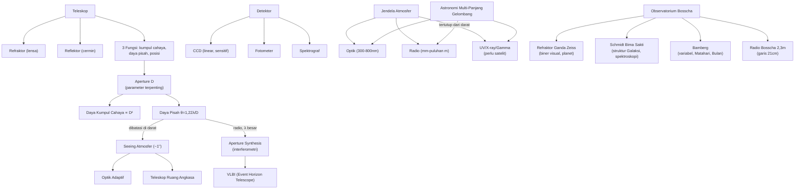

# BAB XII — INSTRUMEN ASTRONOMI

*(Part 11 dari seri Ringkasan OSN Astronomi — lihat Part 1 untuk daftar isi keseluruhan)*

---

## Daftar Isi Bab Ini

1. [Teleskop: Prinsip Dasar, Magnifikasi, Panjang Fokus](#1)
2. [Daya Pisah (Resolving Power) dan Limit Difraksi](#2)
3. [Detektor: CCD, Fotometer, Spektrograf](#3)
4. [Teleskop Radio dan Aperture Synthesis](#4)
5. [Astronomi Multi-Panjang Gelombang dan Efek Atmosfer Bumi](#5)
6. [Teleskop-Teleskop Observatorium Bosscha](#6)

---

## 1. Teleskop: Prinsip Dasar, Magnifikasi, Panjang Fokus

### A. Konsep Inti

Teleskop memiliki **tiga fungsi utama** (bukan hanya "memperbesar" seperti kesalahpahaman umum):
1. **Mengumpulkan cahaya** dari area luas — memungkinkan pengamatan objek sangat redup (fungsi PALING penting).
2. **Meningkatkan daya pisah (resolusi)** — memperbesar sudut tampak objek (§XII.2).
3. **Mengukur posisi** benda langit secara presisi (astrometri, §II).

Dua jenis dasar teleskop optik:
- **Refraktor (lens telescope)** — memakai **lensa objektif** untuk mengumpulkan & memfokuskan cahaya.
- **Reflektor (mirror telescope)** — memakai **cermin objektif** — DOMINAN untuk teleskop besar modern (lebih mudah dibuat presisi besar, tanpa aberasi kromatik, bisa ditopang dari belakang tanpa melengkung akibat berat sendiri seperti lensa besar).

**Aperture (bukaan)** $D$ — diameter objektif (lensa/cermin utama), parameter TERPENTING teleskop (menentukan daya kumpul cahaya DAN daya pisah). **Rasio aperture (aperture ratio/f-number)** $F=D/f$ — mengkarakterisasi "kecepatan" teleskop (rasio besar/dekat $f/1$–$f/3$ = "cepat", cocok eksposur singkat karena citra terang; rasio kecil $f/8$–$f/15$ = "lambat").

### B. Rumus Penting

| Nama | Rumus | Variabel | Keterangan |
|---|---|---|---|
| Skala citra (bidang fokus) | $s = f\tan u\approx fu$ | $f$: panjang fokus objektif, $u$: sudut objek (radian), $s$: ukuran citra | Untuk sudut kecil |
| **Rasio aperture (f-number)** | $F=D/f$ | $D$: diameter objektif, $f$: panjang fokus | Ditulis $f/n$, mis. $f/8$ |
| **Magnifikasi (perbesaran)** | $\omega = u'/u \approx f/f'$ | $f$: fokus objektif, $f'$: fokus eyepiece | BUKAN parameter fundamental — bisa diubah cukup ganti eyepiece |
| Daya kumpul cahaya relatif | $\propto D^2$ | | Sebanding luas aperture |
| **Perbesaran maksimum berguna** | $\omega_{max}\approx D/1\text{mm}$ | $D$ dalam mm | Dari rasio daya pisah mata ($\approx2''$) terhadap daya pisah teleskop |

### C. Derivasi Singkat

**Perbesaran maksimum:** dari daya pisah mata $e\approx2''=5{,}8\times10^{-4}$ rad dan daya pisah teleskop $\theta\approx\lambda/D$ (§XII.2):
$$\omega_{max}=\frac{e}{\theta}=\frac{eD}{\lambda}=\frac{5{,}8\times10^{-4}\times D}{5{,}5\times10^{-7}\text{m}}\approx\frac{D}{1\text{mm}}$$
(dengan $\lambda\approx550$ nm, cahaya kuning, sensitivitas puncak mata).

### D. Intuisi dan Interpretasi

- **Magnifikasi BUKAN ukuran kualitas teleskop** — kesalahpahaman sangat umum di kalangan awam ("teleskop bagus = perbesaran tinggi"). Magnifikasi hanya bergantung rasio fokus objektif-eyepiece, bisa diubah kapan saja; yang benar-benar membatasi kemampuan teleskop adalah APERTURE (daya kumpul cahaya & daya pisah) — memperbesar citra redup & buram (melebihi $\omega_{max}$) hanya menghasilkan citra besar TAPI kabur, tanpa detail tambahan.
- Melebihi $\omega_{max}$ disebut **"empty magnification"** (perbesaran kosong) — citra makin besar tapi TIDAK ada informasi/detail baru yang terlihat, karena sudah dibatasi daya pisah fundamental sistem (mata atau teleskop, mana yang lebih membatasi).

---

## 2. Daya Pisah (Resolving Power) dan Limit Difraksi

### A. Konsep Inti

Bahkan untuk sumber titik sempurna (bintang tunggal, jauh tak berhingga), teleskop TIDAK menghasilkan citra titik sempurna — cahaya "menekuk di sudut" (**difraksi**) menghasilkan pola cincin konsentris (**pola difraksi Airy**). Ukuran pola difraksi inilah yang membatasi kemampuan MEMISAHKAN (resolving) dua objek berdekatan (mis. komponen bintang biner, §IX.1).

**Kriteria Rayleigh** — dua sumber titik dianggap "baru bisa dipisahkan" jika puncak pola difraksi satu sumber jatuh tepat pada minimum pertama pola difraksi sumber lainnya.

### B. Rumus Penting

| Nama | Rumus | Keterangan |
|---|---|---|
| **Limit difraksi (Kriteria Rayleigh)** | $\theta = 1{,}22\,\lambda/D$ | $[\theta]$ dalam radian; berlaku UNIVERSAL (optik maupun radio) |
| Aturan praktis (Dawes limit, mendekati) | $\theta\approx\lambda/D$ | Sedikit lebih optimis dari Rayleigh, sering dipakai sebagai estimasi cepat |

### C. Contoh Aplikasi

Untuk cahaya kuning ($\lambda=550$ nm) & aperture $D=1$ m: $\theta\approx\lambda/D = 5{,}5\times10^{-7}\text{ rad}\approx0{,}11''$ — daya pisah teoretis SANGAT baik. **NAMUN**, di permukaan Bumi, **seeing atmosfer** (turbulensi udara, lapisan berbeda temperatur/densitas menyebabkan cahaya "berkedip"/bergoyang, §III konteks refraksi) biasanya membatasi resolusi PRAKTIS hanya hingga $\sim1''$ — jauh lebih buruk dari limit difraksi teoretis untuk teleskop besar. Inilah alasan utama:
- Observatorium dibangun di lokasi tinggi, kering, jauh dari turbulensi (mis. puncak gunung, gurun tinggi).
- **Optik adaptif** (*adaptive optics*, [Tambahan] — cermin fleksibel yang mengoreksi distorsi atmosfer real-time) dikembangkan untuk teleskop darat modern.
- Teleskop ruang angkasa (di atas atmosfer sepenuhnya) mencapai limit difraksi teoretis penuh.

### D. Intuisi dan Interpretasi

- Rumus $\theta=1{,}22\lambda/D$ berlaku UNIVERSAL untuk SEMUA jenis teleskop (optik maupun radio, §XII.4) — hanya $\lambda$ dan $D$ yang berbeda. Karena panjang gelombang radio $\sim10.000\times$ lebih panjang dari cahaya tampak, teleskop radio butuh aperture SANGAT BESAR (kilometer) untuk mencapai daya pisah sebanding teleskop optik — motivasi utama teknik aperture synthesis (§XII.4).
- Trade-off fundamental: aperture besar → daya pisah lebih baik DAN daya kumpul cahaya lebih besar (bisa mengamati objek lebih redup) — dua alasan independen mengapa astronom selalu mengejar teleskop beraperture lebih besar.

---

## 3. Detektor: CCD, Fotometer, Spektrograf

### A. Konsep Inti

**CCD (Charge-Coupled Device)** — detektor DOMINAN astronomi modern (menggantikan pelat fotografi sejak akhir abad 20): array piksel silikon yang mengonversi foton datang menjadi muatan listrik (efek fotolistrik, §I.8) sebanding jumlah foton yang diterima.

**Keunggulan CCD dibanding pelat fotografi (alasan pergantian teknologi):**
- **Linear** — sinyal keluaran sebanding LANGSUNG jumlah foton (pelat fotografi memiliki respons non-linear, terutama pada kecerahan ekstrem).
- **Sensitivitas jauh lebih tinggi** — mendeteksi fraksi foton datang jauh lebih besar (**efisiensi kuantum**) dibanding pelat fotografi.
- **Bisa dibaca langsung secara digital** — analisis data langsung dengan komputer, tanpa proses kimia.

**Fotometer** — mengukur kecerahan (fluks) presisi tinggi pada satu (atau beberapa) titik/filter — instrumen dasar pengukuran magnitudo (§I.3) & kurva cahaya bintang variabel (§VIII.4)/biner gerhana (§IX.2).

**Polarimeter** — mengukur derajat & arah polarisasi cahaya (§I.2) — informasi tentang medan magnet (bintik matahari §VI.3, sinkrotron AGN §X.7) atau hamburan (debu antarbintang §X.1).

**Spektrograf** — memisahkan cahaya berdasarkan panjang gelombang (memakai prisma atau **kisi difraksi/grating**) untuk menghasilkan spektrum — instrumen paling informatif dalam astrofisika (memberi akses ke SEMUA informasi dari garis spektrum: komposisi kimia, temperatur, kecepatan radial, medan magnet, tekanan — §I.1-2).

### D. Intuisi dan Interpretasi

Linearitas CCD sangat penting untuk **fotometri presisi** (§I.3): karena sinyal sebanding LANGSUNG jumlah foton, magnitudo bisa dihitung akurat langsung dari perbandingan sinyal (memakai rumus Pogson, §I.3) tanpa kalibrasi non-linear rumit yang dulu diperlukan untuk pelat fotografi — salah satu alasan revolusi astronomi observasional presisi tinggi di akhir abad 20 (termasuk deteksi eksoplanet lewat transit, §VII.9, yang butuh presisi fotometri sangat tinggi).

---

## 4. Teleskop Radio dan Aperture Synthesis

### A. Konsep Inti

Teleskop radio bekerja pada prinsip sama (mengumpulkan & memfokuskan gelombang EM) tapi pada rentang panjang gelombang JAUH lebih panjang (radio: mm hingga puluhan meter) — konsekuensinya, **daya pisah jauh lebih buruk** untuk aperture sama (§XII.2, $\theta\propto\lambda$) — teleskop radio piringan tunggal terbesar sekalipun (mis. Arecibo, $300$ m) hanya mencapai resolusi $\sim$ beberapa arcsecond pada frekuensi tertinggi.

**Aperture synthesis (interferometri)** — solusi elegan mengatasi keterbatasan ini TANPA perlu membangun satu piringan raksasa: MENGGABUNGKAN sinyal dari BANYAK antena kecil tersebar pada jarak (**baseline**) besar, memakai **transformasi Fourier** untuk merekonstruksi citra setara dengan teleskop tunggal seukuran jarak PALING JAUH antar antena.

**Prinsip kerja (interferometer dasar):** dua antena menerima sinyal dari sumber sama dengan sedikit beda fase (bergantung sudut sumber & jarak antar antena) — saat digabungkan, interferensi konstruktif/destruktif menghasilkan **pola frinji (fringe)** yang mengkodekan informasi struktur halus sumber. Rotasi Bumi secara alami mengubah orientasi baseline relatif sumber sepanjang waktu, "menyapu" berbagai orientasi & memungkinkan rekonstruksi citra 2D lengkap dari serangkaian pengukuran (Sir Martin Ryle, penemu teknik ini, Nobel Fisika 1974).

### B. Rumus Penting

| Nama | Rumus | Keterangan |
|---|---|---|
| Daya pisah teleskop radio | $\theta=1{,}22\lambda/D$ | SAMA seperti optik (§XII.2) |
| **Daya pisah aperture synthesis** | $\theta\approx\lambda/D_{max}$ | $D_{max}$: jarak MAKSIMUM antar antena (baseline terpanjang), BUKAN diameter fisik antena individual |

### D. Intuisi dan Interpretasi

- Aperture synthesis memungkinkan resolusi setara teleskop "virtual" berukuran BASELINE TERJAUH — contoh ekstrem: **VLBI (Very Long Baseline Interferometry)**, menggabungkan teleskop radio di BENUA berbeda (baseline ribuan km) mencapai resolusi sub-milliarcsecond — inilah teknik yang memungkinkan **Event Horizon Telescope** memotret bayangan lubang hitam supermasif M87 (2019) — pencapaian resolusi tertinggi dalam sejarah astronomi.
- Trade-off aperture synthesis: DAYA KUMPUL CAHAYA (sensitivitas) tetap terbatas jumlah & ukuran antena individual (tidak seperti daya pisah, sensitivitas TIDAK otomatis meningkat hanya karena baseline besar) — perlu banyak antena sensitif untuk kombinasi resolusi tinggi DAN sensitivitas tinggi (mis. ALMA, VLA, §XII text book).

---

## 5. Astronomi Multi-Panjang Gelombang dan Efek Atmosfer Bumi

### A. Konsep Inti

Atmosfer Bumi TIDAK transparan merata di semua panjang gelombang — hanya ada beberapa **"jendela atmosfer"** tempat radiasi bisa menembus hingga permukaan:

| Jendela | Rentang | Peredam Utama | Implikasi Observasi |
|---|---|---|---|
| **Jendela optik** | $\sim300$–$800$ nm | (relatif transparan) | Mata manusia berevolusi tepat pada rentang ini — bukan kebetulan! |
| UV pendek ($<300$ nm) | — | Ozon stratosfer | TERTUTUP TOTAL dari darat — butuh satelit |
| **Jendela IR dekat** | hingga $\sim1{,}3\,\mu$m | Sebagian (uap air, O₂) | Cukup baik dari darat, lebih baik dari puncak gunung kering |
| **IR menengah-jauh** | $>1{,}3\,\mu$m | Uap air (semakin opak) | Perlu lokasi sangat kering/tinggi, atau satelit |
| **Jendela radio** | mm hingga puluhan meter | (relatif transparan, dengan batas panjang gelombang tertentu diblok ionosfer) | Bisa observasi dari darat, TIDAK terganggu cuaca/siang-malam seperti optik |
| Sinar-X, gamma | — | Diserap total lapisan atas atmosfer | HANYA bisa diamati dari satelit/roket ruang angkasa |

**Astronomi multi-panjang gelombang** — mengamati objek sama pada BERBAGAI panjang gelombang memberikan informasi FISIS BERBEDA & SALING MELENGKAPI:
- **Radio** — gas dingin (HI 21cm §X.1), sinkrotron (elektron relativistik, jet AGN §X.7, sisa supernova).
- **Inframerah** — objek dingin (debu, bintang terselubung, AGB §VIII.8), objek redshift tinggi (cahaya optik ter-redshift ke IR).
- **Optik** — fotosfer bintang, permukaan planet, nebula emisi.
- **Ultraviolet** — bintang sangat panas (O/B, katai putih §VIII.9), inti galaksi aktif.
- **Sinar-X** — gas sangat panas ($10^6$–$10^8$ K): korona bintang (§VI.2), piringan akresi biner sinar-X (§IX.3) & AGN, gas kluster galaksi (§XI.6, efek Sunyaev-Zel'dovich).
- **Sinar gamma** — proses energi paling ekstrem: ledakan sinar gamma (*gamma-ray burst*), pemusnahan partikel-antipartikel, pembusukan radioaktif supernova.

### D. Intuisi dan Interpretasi

- Kebetulan bahwa mata manusia peka TEPAT pada jendela optik atmosfer BUKAN kebetulan evolusioner semata — evolusi mata "memanfaatkan" jendela transparan yang sudah tersedia secara alami (radiasi Matahari juga memuncak di sekitar rentang ini, §I.7, Hukum Wien untuk $T_\odot\approx5778$ K) — dua fakta independen (jendela atmosfer & puncak spektrum Matahari) yang saling terkait secara fisis.
- Objek astrofisika yang SAMA bisa tampak SANGAT BERBEDA di panjang gelombang berbeda — contoh klasik: Crab Nebula (sisa supernova) tampak sebagai nebula gas berpendar di optik, tapi sumber sinkrotron kuat di radio & sinar-X (dari pulsar & elektron relativistik di dalamnya) — pemahaman LENGKAP suatu objek astronomis HAMPIR SELALU memerlukan data multi-panjang gelombang, bukan hanya satu jendela pengamatan.

---

## 6. Teleskop-Teleskop Observatorium Bosscha

### A. Konsep Inti

Observatorium Bosscha (Lembang, Jawa Barat) adalah <cite index="7-1">observatorium astronomi tertua di Indonesia, mengoperasikan sekitar 12 teleskop termasuk tiga teleskop radio</cite>, dikelola Institut Teknologi Bandung (ITB). Beberapa instrumen utama:

| Teleskop | Jenis | Spesifikasi | Kegunaan Utama |
|---|---|---|---|
| **Refraktor Ganda Zeiss** | Refraktor ganda | <cite index="8-1">Diameter teleskop utama 60 cm, teleskop pencari 40 cm; panjang 11 m; beroperasi sejak 1928</cite> | <cite index="9-1">Astrometri, khususnya orbit bintang ganda visual</cite> (§IX.1); pengamatan planet |
| **Teleskop Schmidt Bima Sakti** | Reflektor (kamera Schmidt) | <cite index="3-1">Diameter lensa koreksi 51 cm, diameter cermin 71 cm, panjang fokus 127 cm</cite>; <cite index="2-1">sumbangan UNESCO, diinstalasi 1960</cite> | <cite index="3-1">Mempelajari struktur Galaksi Bima Sakti, spektroskopi bintang, mengamati asteroid dan supernova/nova</cite> |
| **Teleskop Bamberg** | Refraktor | <cite index="6-1">Diameter lensa 0,37 m, panjang fokus 7 m</cite> | <cite index="5-1">Bintang variabel, pengamatan Matahari dan permukaan Bulan, fotometri gerhana bintang</cite> |
| **Teleskop Radio Bosscha** | Radio (SRT) | <cite index="5-1">Diameter 2,3 m, bekerja pada 1400-1440 MHz (garis 21 cm)</cite> | <cite index="5-1">Pengamatan hidrogen netral Bima Sakti, ekstragalaksi, kuasar, Matahari</cite> |

### D. Intuisi dan Interpretasi

- Teleskop Radio Bosscha bekerja **tepat** pada frekuensi garis 21 cm (§X.1) — pilihan desain yang secara langsung menghubungkan instrumen ini dengan konsep struktur Bima Sakti (§X) yang dipelajari lewat garis hidrogen netral tersebut.
- Nama "Bima Sakti" pada Teleskop Schmidt bukan kebetulan — dirancang khusus dengan bidang pandang luas (ciri khas desain kamera Schmidt) untuk survei area langit besar, cocok untuk mempelajari struktur skala besar Galaksi kita, bukan objek titik tunggal.
- Keberadaan gabungan refraktor klasik (Zeiss, Bamberg — teknologi awal abad 20) dan teleskop radio modern di satu observatorium mengilustrasikan **evolusi teknologi astronomi** dari optik murni ke multi-panjang gelombang (§XII.5) bahkan dalam konteks satu institusi observasional Indonesia.

---

## Daftar Rumus Ringkas — Bab XII Instrumen Astronomi

**Teleskop Dasar**
- $F=D/f$ (aperture ratio); $\omega=f/f'$ (magnifikasi)
- $\omega_{max}\approx D(\text{mm})$

**Daya Pisah**
- $\theta=1{,}22\lambda/D$ (Kriteria Rayleigh, universal optik & radio)

**Aperture Synthesis**
- $\theta\approx\lambda/D_{max}$ (baseline terpanjang, BUKAN diameter antena individual)

**Jendela Atmosfer**
- Optik: $\sim300$–$800$ nm; Radio: mm–puluhan m; UV/X/gamma: HANYA dari luar angkasa

---

## Peta Konsep Bab XII

---

## Topik Paling Sering Muncul di OSN (Bab XII)

1. **Daya pisah & Kriteria Rayleigh** — sangat sering, perhitungan langsung $\theta=1{,}22\lambda/D$
2. **Perbedaan magnifikasi vs daya pisah/daya kumpul cahaya** — konseptual, jebakan umum
3. **Jendela atmosfer & alasan observasi dari luar angkasa** — konseptual, terutama UV/X/gamma
4. **Aperture synthesis** — konseptual (mengapa dan bagaimana bekerja) dan kadang kuantitatif
5. CCD vs pelat fotografi — konseptual, keunggulan linearitas & sensitivitas
6. Teleskop Observatorium Bosscha — soal identifikasi/spesifikasi, khas kompetisi tingkat nasional Indonesia

---

*Ini adalah bagian terakhir pembahasan per-bab. Selanjutnya: **Part 12 — Rangkuman Akhir**, berisi daftar rumus ringkas LENGKAP seluruh 12 bab, peta konsep keseluruhan yang menghubungkan semua bab, dan daftar topik paling sering muncul di OSN lintas-bab. Balas "lanjut" untuk menerima Part 12.*
