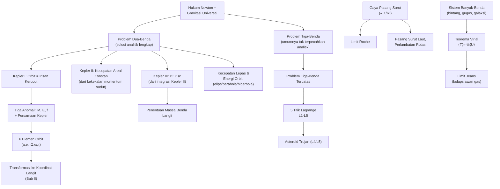

# BAB IV — MEKANIKA BENDA LANGIT

---

## Daftar Isi Bab Ini

1. [Hukum Gravitasi Newton](#1)
2. [Hukum Kepler](#2)
3. [Limit Roche dan Barycenter](#3)
4. [Problem Dua-Benda, Titik Lagrange, Pasang Surut](#4)
5. [Polinom dan Teorema Descartes](#5)
6. [Orbit dalam Ruang (Elemen Orbit & Posisi vs Waktu)](#6)

---

## 1. Hukum Gravitasi Newton

### A. Konsep Inti

Seluruh mekanika benda langit klasik dibangun di atas **tiga Hukum Newton** ditambah **Hukum Gravitasi Universal**:

1. **Hukum I** — benda diam tetap diam, benda bergerak tetap bergerak lurus beraturan, kecuali ada gaya neto.
2. **Hukum II** — $\dot{\mathbf p}=\mathbf F$, atau untuk massa konstan, $\mathbf F=m\mathbf a$.
3. **Hukum III** — aksi-reaksi: gaya A pada B sama besar, berlawanan arah, dengan gaya B pada A.
4. **Hukum Gravitasi Universal** — dua partikel bermassa $m_A, m_B$ terpisah jarak $r$ saling tarik dengan gaya sebesar $Gm_Am_B/r^2$, arah sepanjang garis penghubung keduanya.

Gravitasi adalah **satu-satunya gaya signifikan** yang mengatur gerak benda langit skala besar (mengabaikan gaya elektromagnetik, tekanan radiasi, dll. yang biasanya jauh lebih kecil untuk benda bermassa besar).

### B. Rumus Penting

| Nama | Rumus | Variabel | Satuan |
|---|---|---|---|
| Hukum gravitasi Newton | $F = \dfrac{Gm_Am_B}{r^2}$ | $G=6{,}674\times10^{-11}$ N·m²/kg² | N |
| Persamaan gerak (2 benda) | $\ddot{\mathbf r} = -\mu\dfrac{\mathbf r}{r^3}$, $\mu=G(m_1+m_2)$ | $\mathbf r$: vektor posisi relatif | m/s² |
| Percepatan gravitasi permukaan | $g=\dfrac{GM}{R^2}$ | $M,R$: massa & radius benda | m/s² |

### C. Derivasi Singkat

Persamaan gerak relatif diturunkan dari menggabungkan persamaan gerak kedua benda ($m_2\ddot{\mathbf r}_2 = -Gm_1m_2\,\mathbf r/r^3$ untuk planet, dan reaksinya untuk Matahari), lalu **mengurangkan** keduanya sehingga variabel yang tersisa hanyalah posisi **relatif** $\mathbf r=\mathbf r_2-\mathbf r_1$. Massa-massa individual $m_1,m_2$ pada kedua ruas saling coret, menyisakan hanya jumlahnya $\mu=G(m_1+m_2)$ — ini sebabnya **problem dua-benda selalu bisa direduksi menjadi problem satu-benda** bermassa tereduksi bergerak dalam medan gravitasi pusat.

### D. Intuisi dan Interpretasi

- Karena $\mu$ hanya bergantung **jumlah** massa, orbit relatif planet-Matahari tidak "tahu" berapa besar masing-masing massa secara terpisah — hanya jumlahnya yang menentukan bentuk & periode orbit relatif.
- Hukum III memastikan **Matahari juga bergerak** (sedikit) akibat tarikan planet — inilah dasar deteksi eksoplanet lewat metode kecepatan radial (goyangan bintang induk, Bab IX).

### E. Contoh Soal OSN

**Soal:** Berapa percepatan gravitasi di permukaan sebuah planet dengan massa $2M_\oplus$ dan radius $1{,}5R_\oplus$?

**Penyelesaian:** $g=GM/R^2 \Rightarrow g/g_\oplus = (M/M_\oplus)/(R/R_\oplus)^2 = 2/(1{,}5)^2 = 2/2{,}25\approx0{,}89$. Jadi $g\approx0{,}89\times9{,}8\approx8{,}7$ m/s².

---

## 2. Hukum Kepler

### A. Konsep Inti

Tiga hukum empiris Johannes Kepler (berdasarkan data pengamatan Tycho Brahe), yang kemudian **diturunkan dari hukum Newton** — pencapaian besar yang menyatukan mekanika benda langit dan mekanika benda sehari-hari.

1. **Hukum I** — orbit setiap planet adalah **elips** dengan Matahari di salah satu fokusnya (kasus umum: **irisan kerucut** — elips/parabola/hiperbola, tergantung energi total sistem).
2. **Hukum II** — vektor radius (Matahari-planet) menyapu **luas yang sama dalam waktu yang sama** (kecepatan sapuan/*areal velocity* konstan) — konsekuensi langsung kekekalan momentum sudut.
3. **Hukum III** — kuadrat periode orbit sebanding pangkat tiga sumbu semi-mayor: $P^2\propto a^3$.

<!--
[Sisipkan Diagram: Elips Orbit dengan Elemen Geometrisnya]
Deskripsi: Elips dengan Matahari (S) di salah satu fokus. Tandai:
sumbu semi-mayor a, sumbu semi-minor b, eksentrisitas e (jarak
fokus-pusat = ae), titik perihelion (P, jarak terdekat = a(1-e))
dan aphelion (paling jauh = a(1+e)). Gambar juga sebuah titik X
pada elips dengan garis SX (radius vector r), sudut anomali sejati
f diukur dari arah perihelion ke SX.
-->

### B. Rumus Penting

| Nama | Rumus | Variabel | Syarat |
|---|---|---|---|
| **Persamaan orbit (irisan kerucut)** | $r=\dfrac{k^2/\mu}{1+e\cos f}$ | $f$: anomali sejati, $e$: eksentrisitas | Bentuk umum, $e=0$ lingkaran, $0<e<1$ elips, $e=1$ parabola, $e>1$ hiperbola |
| **Jarak perihelion/aphelion** | $r_{peri}=a(1-e)$, $r_{apo}=a(1+e)$ | | Elips |
| **Hukum Kepler II (kecepatan areal)** | $\dot A = \dfrac12 r^2\dot f = \dfrac12 k$ (konstan) | $k=\lvert\mathbf r\times\dot{\mathbf r}\rvert$: momentum sudut spesifik | Selalu (konsekuensi kekekalan momentum sudut) |
| **Hukum Kepler III (bentuk umum Newton)** | $P^2=\dfrac{4\pi^2}{G(m_1+m_2)}a^3$ | $P$: periode, $a$: sumbu semi-mayor | SI |
| **Hukum Kepler III (satuan au/tahun/M☉)** | $a^3=(m_1+m_2)P^2$ | $a$ dlm au, $P$ dlm tahun sideris, $m$ dlm $M_\odot$ | Praktis untuk Tata Surya |
| **Energi orbit (integral energi)** | $\dfrac12v^2-\dfrac\mu r = h$ | $h<0$: elips, $h=0$: parabola, $h>0$: hiperbola | |
| **Sumbu semi-mayor dari energi** | $a=-\mu/2h$ (elips) | | |

### C. Derivasi Singkat

**Kepler II dari kekekalan momentum sudut:** karena gaya gravitasi sentral (arahnya selalu sepanjang $\mathbf r$), torsi terhadap pusat gaya nol, sehingga momentum sudut spesifik $\mathbf k=\mathbf r\times\dot{\mathbf r}$ **konstan** (besar maupun arah). Dalam koordinat polar, $\mathbf k = r^2\dot f\,\hat{\mathbf z}$, dan luas yang disapu per satuan waktu $\dot A=\tfrac12r^2\dot f=\tfrac12 k$ — konstan karena $k$ konstan. Ini murni geometri + kekekalan, TIDAK memerlukan tahu bentuk detail gaya (berlaku untuk gaya sentral apa pun, bukan hanya $1/r^2$).

**Kepler III dari integrasi Kepler II atas satu periode penuh:** integralkan $dA=\tfrac12k\,dt$ dari $t=0$ sampai $t=P$ menghasilkan luas total elips $\pi ab=k P/2$. Substitusi $b=a\sqrt{1-e^2}$ dan ekspresi $k$ dalam elemen orbit (dari menggabungkan integral energi & momentum sudut) menghasilkan $P^2=\dfrac{4\pi^2}{G(m_1+m_2)}a^3$ — **inilah bukti bahwa Hukum Kepler III bukan kebetulan, melainkan konsekuensi langsung hukum gravitasi kuadrat-terbalik Newton.**

### D. Intuisi dan Interpretasi

- Kepler II ⟺ planet bergerak **tercepat di perihelion**, **terlambat di aphelion** — konsekuensi langsung: luas sapuan sama artinya jarak tempuh busur harus lebih panjang saat $r$ kecil (dekat) untuk mengompensasi busur yang "sempit".
- Kepler III bentuk Newton mengandung **massa total** — ini yang memungkinkan penentuan **massa** benda langit (planet, bintang biner, lubang hitam) hanya dari mengamati periode dan sumbu semi-mayor orbit benda yang mengelilinginya — salah satu teknik paling fundamental & sering dipakai di seluruh astronomi (Bab VII-IX).
- Orbit bukan HANYA elips — bergantung energi total sistem $h$: benda dengan energi $\geq0$ (kecepatan cukup tinggi) tidak terikat gravitasi dan lepas selamanya (parabola/hiperbola) — dasar konsep kecepatan lepas (§IV.4) dan lintasan comet non-periodik/interstellar objects (mis. 'Oumuamua).

### E. Contoh Soal OSN

**Soal:** Sebuah komet punya perihelion 0,5 au dan aphelion 30 au. Berapa periode orbitnya (dalam tahun) dan eksentrisitasnya?

**Penyelesaian:**
$$a=\frac{r_{peri}+r_{apo}}{2}=\frac{0{,}5+30}{2}=15{,}25\text{ au}$$
$$e=\frac{r_{apo}-r_{peri}}{r_{apo}+r_{peri}}=\frac{30-0{,}5}{30{,}5}\approx0{,}984$$
Dengan Kepler III (satuan au/tahun, massa komet diabaikan terhadap Matahari):
$$P^2=a^3=15{,}25^3\approx3548 \Rightarrow P\approx59{,}6\text{ tahun}$$

**Kesalahan umum:** memakai $a=r_{peri}$ atau $a=r_{apo}$ langsung (bukan rata-ratanya) di rumus Kepler III; lupa bahwa rumus sederhana $a^3=(m_1+m_2)P^2$ HANYA berlaku dalam satuan au-tahun-$M_\odot$, bukan SI.

---

## 3. Limit Roche dan Barycenter

### A. Konsep Inti

**Limit Roche** — jarak minimum sebuah benda (mis. bulan/satelit) dari benda pusatnya (planet) agar tidak tercerai-berai oleh **gaya pasang surut (tidal force)** yang melebihi gaya gravitasi yang mengikat benda itu sendiri. Di dalam limit Roche, benda kohesif (padat menyatu tanpa kekuatan mekanik tambahan) akan terkoyak — ini penjelasan klasik pembentukan **cincin planet** (Roche mengusulkan ini untuk cincin Saturnus, 1848).

**Barycenter (pusat massa sistem)** — titik di mana dua (atau lebih) benda yang saling mengorbit sebenarnya **sama-sama** mengelilingi, bukan satu mengelilingi yang lain secara literal. Untuk sistem dua benda $m_1,m_2$ terpisah jarak $d$, barycenter berada pada jarak $d_1=\dfrac{m_2}{m_1+m_2}d$ dari $m_1$ (dan $d_2=\dfrac{m_1}{m_1+m_2}d$ dari $m_2$), memenuhi $m_1d_1=m_2d_2$.

<!--
[Sisipkan Diagram: Barycenter Sistem Bumi-Bulan]
Deskripsi: Bumi (besar) dan Bulan (kecil) dengan garis penghubung.
Tandai titik barycenter B di antara keduanya (KHUSUS untuk sistem
Bumi-Bulan, titik ini masih berada DI DALAM Bumi, sekitar 4670 km
dari pusat Bumi -- karena rasio massa Bumi:Bulan ≈ 81:1). Gambar
kedua benda mengorbit mengelilingi B, bukan Bulan mengorbit pusat
Bumi secara literal.
-->

### B. Rumus Penting

| Nama | Rumus | Variabel | Catatan |
|---|---|---|---|
| **Limit Roche (benda kohesif, kerapatan sama)** | $R_{Roche}\approx2{,}5\,R_{planet}$ | Perbandingan langsung radius planet | Untuk densitas satelit ≈ densitas planet |
| **Limit Roche (bentuk umum)** | $d = r\sqrt[3]{\dfrac{16M}{m}}$ | $M$: massa planet, $m,r$: massa & radius satelit | Diturunkan dari kesetimbangan gaya pasang-surut vs gaya ikat sendiri |
| **Limit Roche (bentuk kerapatan)** | $d\approx2{,}44\,R_{planet}\left(\dfrac{\rho_{planet}}{\rho_{satelit}}\right)^{1/3}$ | $\rho$: densitas | Versi lebih presisi (benda kaku); untuk benda cair-fluida, faktor menjadi ≈2,44 vs ≈1,26 untuk benda sangat kohesif |
| **Posisi barycenter** | $d_1=\dfrac{m_2}{m_1+m_2}d$ | $d$: jarak antar pusat kedua benda | Dari kesetimbangan torsi $m_1d_1=m_2d_2$ |

### C. Derivasi Singkat

**Limit Roche:** tinjau satelit sebagai dua bola kecil massa $m$, radius $r$, terpisah $2r$ (mewakili dua "belahan" satelit), pada jarak $R$ dari pusat planet bermassa $M$. Selisih gaya gravitasi planet pada dua belahan (gaya pasang-surut) adalah:
$$\Delta F \approx GMm\left[\frac1{(R-r)^2}-\frac1{(R+r)^2}\right]\approx\frac{4GMmr}{R^3}$$
(pakai ekspansi binomial untuk $r\ll R$). Gaya gravitasi yang mengikat kedua belahan satu sama lain adalah $F'=Gm^2/(4r^2)$ (jarak pisah $2r$... buku sumber pakai $F'=Gm^2/4r^2$, konsisten dengan pemodelan dua bola bersentuhan). Menyamakan $\Delta F = F'$ pada limit Roche:
$$GMm\frac{4r}{R^3}=\frac{Gm^2}{4r^2} \Rightarrow R^3=\frac{16r^3M}{m}\Rightarrow R=r\sqrt[3]{\frac{16M}{m}}$$
Substitusi $m=\tfrac43\pi r^3\rho_{sat}$, $M=\tfrac43\pi S^3\rho_{planet}$ (dengan $S$=radius planet, asumsi densitas sama untuk versi sederhana) menghasilkan $R\approx2{,}5\,S$.

### D. Intuisi dan Interpretasi

- Limit Roche menjelaskan mengapa **cincin planet** (materi lepas/butiran kecil, TIDAK terikat gravitasi diri sendiri secara signifikan) stabil berada DI DALAM limit Roche, sementara **bulan/satelit besar** (cukup kohesif, terikat gravitasi diri sendiri kuat) hanya bisa stabil DI LUAR limit Roche.
- Faktor pengali berbeda (2,5 vs 2,44 vs 1,26) tergantung asumsi kekakuan benda — benda cair/fluida (mudah berubah bentuk mengikuti gaya pasang-surut, lebih rentan) punya limit Roche lebih jauh dibanding benda sangat kaku (rigid body).
- Barycenter TIDAK selalu di dalam benda yang lebih besar — untuk sistem bintang ganda dengan massa sebanding, atau planet raksasa dengan bintang bermassa rendah (mis. beberapa sistem hot Jupiter), barycenter bisa berada DI LUAR permukaan benda yang lebih besar.

### E. Contoh Soal OSN

**Soal:** Hitung jarak limit Roche Bumi terhadap sebuah asteroid berbatu (densitas $\rho_{sat}=3000$ kg/m³) yang mendekat, jika $\rho_\oplus=5500$ kg/m³ dan $R_\oplus=6371$ km. Gunakan rumus densitas.

**Penyelesaian:**
$$d\approx2{,}44\times6371\times\left(\frac{5500}{3000}\right)^{1/3}=2{,}44\times6371\times1{,}224\approx19.030\text{ km}$$

**Interpretasi:** ini jauh lebih dekat daripada orbit Bulan (~384.000 km) — sehingga Bulan sama sekali tidak dalam bahaya limit Roche, tapi asteroid/komet berdensitas rendah yang lewat sangat dekat Bumi (dalam ~19.000 km) berisiko hancur oleh gaya pasang surut.

---

## 4. Problem Dua-Benda, Titik Lagrange, dan Pasang Surut

### A. Konsep Inti

**Problem dua-benda** (§IV.1) adalah kasus **paling kompleks** dalam mekanika langit yang **masih punya solusi analitik lengkap** — begitu ditambah benda ketiga (**problem tiga-benda**), secara umum TIDAK ADA solusi analitik tertutup (dibuktikan matematis, meski Sundman menemukan solusi deret yang konvergen sangat lambat sehingga tak praktis).

**Problem tiga-benda terbatas (restricted three-body problem)** — kasus khusus yang bisa dianalisis: dua benda masif ("primer") mengorbit lingkaran mengelilingi barycenter bersama, dan benda ketiga bermassa **dapat diabaikan** (tak memengaruhi gerak dua primer) bergerak dalam medan gravitasi gabungan keduanya.

**Titik Lagrange ($L_1$–$L_5$)** — lima titik ekuilibrium dalam problem tiga-benda terbatas, tempat benda ketiga bisa "diam" relatif terhadap kedua primer (dalam kerangka acuan berotasi bersama sistem):
- $L_1, L_2, L_3$ — segaris dengan kedua primer, tapi **tidak stabil** (gangguan kecil menyebabkan benda menjauh).
- $L_4, L_5$ — membentuk **segitiga sama sisi** dengan kedua primer, dan **stabil** (untuk rasio massa primer yang cukup ekstrem) — di sinilah **asteroid Trojan** Jupiter ditemukan, mengikuti/mendahului Jupiter $60°$ di orbitnya.

<!--
[Sisipkan Diagram: Lima Titik Lagrange]
Deskripsi: Dua benda primer (mis. Matahari besar di kiri, planet
kecil di kanan) dengan garis penghubung. Tandai L1 di ANTARA kedua
primer (lebih dekat ke benda kecil), L2 pada garis yang sama tapi
DI LUAR benda kecil (menjauh dari benda besar), L3 pada sisi
berlawanan benda besar (segaris tapi jauh di belakangnya). Tandai
L4 dan L5 membentuk segitiga sama sisi dengan garis primer-primer,
satu di atas garis (L4, mendahului arah orbit planet) dan satu di
bawah (L5, mengikuti arah orbit planet). Beri anotasi: L1,L2,L3
tidak stabil; L4,L5 stabil.
-->

**Pasang surut (tides)** — deformasi & gaya diferensial akibat variasi kekuatan gravitasi benda pengganggu pada sisi dekat vs sisi jauh suatu benda (mekanisme SAMA dengan yang menghasilkan Limit Roche, tapi di sini benda tidak sampai hancur — hanya berubah bentuk / air laut naik-turun).

<!--
[Sisipkan Diagram: Geometri Gaya Pasang Surut Bumi-Bulan]
Deskripsi: Bumi (lingkaran) dengan Bulan jauh di kanan. Gambar
gaya gravitasi Bulan pada TIGA titik di Bumi: sisi dekat Bulan (gaya
lebih kuat, panah panjang mengarah ke Bulan), pusat Bumi (gaya rata-
rata, dipakai sebagai acuan gerak orbital Bumi -- dikurangi dari
semua titik lain), sisi jauh dari Bulan (gaya lebih lemah, panah
pendek). Setelah dikurangi gaya rata-rata pusat, hasilnya: gaya
NETO di sisi dekat mengarah MENJAUH dari Bumi (ke arah Bulan), dan
di sisi jauh JUGA mengarah menjauh dari Bumi (ke arah berlawanan
Bulan) -- inilah mengapa ada DUA tonjolan pasang surut (bulge),
bukan hanya satu, menghasilkan 2 kali pasang naik per hari (bukan 1).
-->

### B. Rumus Penting

| Nama | Rumus | Keterangan |
|---|---|---|
| Gaya pasang surut (beda gravitasi antar dua titik jarak $2r$ pada benda berjarak $R$ dari sumber) | $\Delta F \approx \dfrac{4GMmr}{R^3}$ | Sama seperti turunan Roche; sebanding $1/R^3$ (BUKAN $1/R^2$!) |
| Posisi $L_1$ (aproksimasi, $m_2\ll m_1$) | $r_{L1}\approx d\left(\dfrac{m_2}{3m_1}\right)^{1/3}$ dari benda kedua | $d$: jarak antar primer |
| Posisi $L_2$ (aproksimasi) | $r_{L2}\approx d\left(\dfrac{m_2}{3m_1}\right)^{1/3}$ (di luar benda kedua, arah menjauhi $m_1$) | Simetris dengan $L_1$ untuk aproksimasi orde pertama |

### D. Intuisi dan Interpretasi

- Gaya pasang-surut $\propto 1/R^3$, BUKAN $1/R^2$ seperti gravitasi biasa — ini mengapa gaya pasang-surut turun jauh lebih cepat dengan jarak, dan mengapa meski Matahari jauh lebih masif dari Bulan, pengaruh pasang-surut Bulan pada Bumi **lebih besar** daripada Matahari (karena rasio jarak jauh lebih dominan lewat pangkat tiga).
- **Dua tonjolan pasang-surut** (bukan satu) adalah konsekuensi langsung sifat "diferensial" gaya ini — bukan karena tarikan langsung Bulan pada air laut sisi dekat saja, melainkan **perbedaan** tarikan antar sisi Bumi.
- $L_1$ (di antara dua primer) penting untuk misi ruang angkasa pengamat Matahari (mis. SOHO) karena posisi ini stabil-semi untuk observasi kontinu; $L_2$ (di luar Bumi, menjauhi Matahari) dipakai oleh teleskop ruang angkasa modern (James Webb Space Telescope) karena Bumi & Bulan tidak menghalangi pandangan dan lingkungan termal stabil.
- Pasang surut menyebabkan **disipasi energi** (gesekan internal), yang secara bertahap memperlambat rotasi benda dan mendorong benda menjauh dari primernya (Bulan menjauh dari Bumi ~3,8 cm/tahun) — hubungannya dengan momentum sudut total sistem yang kekal (dibahas detail di Bab V).

### E. Contoh Soal OSN

**Soal (konseptual):** Mengapa titik $L_4$ dan $L_5$ stabil sementara $L_1$, $L_2$, $L_3$ tidak, meski semuanya adalah titik ekuilibrium (gaya neto nol dalam kerangka berotasi)?

**Jawaban:** Kestabilan bukan hanya soal gaya neto nol di titik ekuilibrium, tapi juga soal apa yang terjadi jika benda **sedikit tergeser** dari titik itu. Di $L_1,L_2,L_3$ (segaris dengan primer), gangguan kecil menghasilkan gaya neto yang **menjauhkan** benda lebih jauh dari titik ekuilibrium (analog bola di puncak bukit). Di $L_4,L_5$, kombinasi gaya gravitasi dari kedua primer dan gaya sentrifugal (dalam kerangka berotasi) menghasilkan efek **Coriolis** yang justru mendorong benda kembali berputar mengelilingi titik ekuilibrium tersebut (analog bola di dasar lembah, dengan syarat rasio massa kedua primer $\gtrsim 25$:1 — terpenuhi untuk Matahari-Jupiter).

---

## 5. Polinom dan Teorema Descartes $[\text{Tambahan}]$

### A. Konsep Inti

Dalam **penentuan orbit** (*orbit determination* — menentukan elemen orbit lengkap dari sejumlah kecil pengamatan posisi), metode klasik (mis. metode Gauss atau Laplace) sering berujung pada **persamaan polinomial** derajat tinggi (mis. polinomial derajat 8 dalam metode klasik penentuan jarak geosentris dari tiga pengamatan). Karena banyak akar polinomial semacam ini adalah kompleks atau negatif secara fisis tidak bermakna (jarak tidak boleh negatif/imajiner), astronom perlu cara cepat memperkirakan **berapa banyak akar real positif** yang mungkin menjadi solusi fisis — di sinilah **Teorema/Aturan Tanda Descartes (Descartes' Rule of Signs)** berguna.

**Aturan Tanda Descartes:** untuk polinomial $P(x)$ dengan koefisien real, jumlah akar real **positif** (dihitung dengan multiplisitas) sama dengan jumlah **pergantian tanda** koefisien berurutan $P(x)$, ATAU kurang dari itu dengan kelipatan genap. Jumlah akar real **negatif** diperoleh dengan menerapkan aturan yang sama pada $P(-x)$.

### B. Rumus/Aturan Penting

| Konsep | Aturan |
|---|---|
| Akar positif | $\#(\text{akar real positif}) \leq \#(\text{pergantian tanda pada }P(x))$, selisihnya genap |
| Akar negatif | $\#(\text{akar real negatif}) \leq \#(\text{pergantian tanda pada }P(-x))$, selisihnya genap |
| Total akar | Sesuai derajat polinomial $n$ (Teorema Dasar Aljabar: $n$ akar kompleks dihitung multiplisitas) |

### C. Contoh Penerapan

**Contoh sederhana:** $P(x)=x^3-2x^2-5x+6$. Koefisien berurutan: $+,-,-,+$ → pergantian tanda: $(+\to-)$, $(-\to-,$ tidak berganti$)$, $(-\to+)$ → **2 pergantian tanda** → maksimum 2 akar positif (atau 0). Untuk $P(-x)=-x^3-2x^2+5x+6$: koefisien $-,-,+,+$ → 1 pergantian tanda → **tepat 1 akar negatif**. (Cek: akar sebenarnya adalah $x=1,\,3,\,-2$ — cocok: 2 akar positif, 1 akar negatif.)

### D. Intuisi dan Interpretasi

- Dalam konteks orbit determination, jika polinomial jarak menghasilkan, katakanlah, hanya 1 pergantian tanda, astronom tahu **tanpa perlu menyelesaikan polinomialnya secara eksplisit** bahwa hanya ada SATU solusi jarak geosentris fisis yang mungkin — sangat menghemat komputasi (penting sekali di era pra-komputer).
- Aturan ini murni **alat pembatas cepat** (quick bound), bukan metode mencari nilai akar itu sendiri — untuk nilai numerik tetap perlu metode lain (Newton-Raphson, dsb., termasuk untuk menyelesaikan Persamaan Kepler $M=E-e\sin E$ di §IV.6 yang transendental, bukan polinomial, tapi filosofi "cari solusi numerik yang fisis" serupa).

### E. Contoh Soal OSN

**Soal:** Persamaan Kepler transendental $M=E-e\sin E$ diselesaikan secara numerik (mis. iterasi Newton-Raphson). Mengapa kita perlu tahu terlebih dahulu bahwa solusi $E$ yang dicari berada pada rentang $[0,2\pi)$ dan biasanya unik untuk $M$ tertentu?

**Jawaban:** Karena $E-e\sin E$ adalah fungsi **monoton naik** terhadap $E$ untuk $0\le e<1$ (turunannya $1-e\cos E>0$ selalu, karena $e<1$), maka untuk setiap $M$ hanya ada **tepat satu** solusi $E$ pada rentang $[0,2\pi)$ — analog konsep "membatasi jumlah akar fisis yang valid" seperti pada Aturan Descartes untuk polinomial, meski di sini alatnya adalah analisis monotonisitas fungsi, bukan aturan tanda koefisien.

---

## 6. Orbit dalam Ruang: Elemen Orbit dan Posisi vs Waktu

### A. Konsep Inti

Solusi lengkap problem dua-benda butuh **enam konstanta integrasi** (karena persamaan gerak adalah persamaan diferensial vektor orde-2 = 6 komponen skalar independen). Alih-alih posisi & kecepatan awal (yang tidak intuitif secara geometris), astronom memakai **enam elemen orbit** yang punya makna geometris jelas:

| Elemen | Simbol | Makna |
|---|---|---|
| Sumbu semi-mayor | $a$ | Ukuran orbit |
| Eksentrisitas | $e$ | Bentuk orbit (kebulatan) |
| Inklinasi | $i$ | Kemiringan bidang orbit terhadap bidang acuan (biasanya ekliptika) |
| Bujur node menaik | $\Omega$ | Arah perpotongan bidang orbit dengan bidang acuan, diukur dari titik Aries |
| Argumen perihelion | $\omega$ | Arah perihelion, diukur dari node menaik sepanjang bidang orbit |
| Waktu perihelion | $\tau$ (atau anomali rata-rata $M$ pada epoch tertentu) | "Jam" orbit — kapan benda berada di perihelion |

<!--
[Sisipkan Diagram: Elemen Orbit dalam Ruang 3D]
Deskripsi: Bidang acuan (ekliptika) sebagai bidang horizontal datar
dengan arah ke titik Aries (♈) ditandai. Bidang orbit benda langit
digambar miring memotong bidang ekliptika sepanjang garis "node"
(node menaik = ascending node, tempat benda bergerak dari selatan
ke utara bidang acuan). Tandai sudut i (inklinasi) antara kedua
bidang, sudut Ω (dari arah Aries ke node menaik, diukur sepanjang
ekliptika), dan sudut ω (dari node menaik ke arah perihelion,
diukur sepanjang bidang orbit itu sendiri). Ini diagram elemen orbit
paling standar di semua buku astronomi -- kunci menghubungkan
orientasi orbit 3D nyata dengan sistem koordinat langit (Bab II).
-->

**Tiga jenis "anomali" (sudut yang menyatakan posisi benda dalam orbit)** — sering membingungkan siswa, penting dibedakan:
- **Anomali sejati ($f$ atau $\nu$)** — sudut aktual dari perihelion ke posisi benda, dilihat dari fokus (Matahari). Yang "nyata" secara geometris.
- **Anomali eksentrik ($E$)** — sudut bantu geometris (diproyeksikan ke lingkaran bantu berjari-jari $a$ yang mengelilingi elips).
- **Anomali rata-rata ($M$)** — sudut fiktif yang berubah **linear** terhadap waktu (seakan benda bergerak melingkar beraturan) — inilah yang mudah dihitung langsung dari waktu, tapi TIDAK sama dengan posisi sudut sebenarnya kecuali orbit lingkaran sempurna ($e=0$).

<!--
[Sisipkan Diagram: Tiga Anomali E, f, M pada Elips]
Deskripsi: Elips dengan fokus S (Matahari) dan pusat geometris C.
Gambar lingkaran bantu berjari-jari a (sumbu semi-mayor) berpusat
di C, bersinggungan dengan elips di titik perihelion dan aphelion.
Untuk titik benda X pada elips, proyeksikan vertikal ke titik X'
pada lingkaran bantu. Tandai: f = sudut SX diukur dari arah
perihelion (dilihat dari fokus S) -- ini anomali sejati. E = sudut
CX' diukur dari arah perihelion (dilihat dari PUSAT C, ke titik
proyeksi pada lingkaran bantu) -- ini anomali eksentrik. M tidak
bisa digambar langsung secara geometris (murni definisi waktu:
M = (2π/P)(t-τ)) tapi beri catatan teks di sudut diagram.
-->

### B. Rumus Penting

| Nama | Rumus | Keterangan |
|---|---|---|
| **Persamaan Kepler** | $E-e\sin E = M$ | Menghubungkan anomali eksentrik & rata-rata; **transendental**, diselesaikan numerik (iterasi) |
| **Anomali rata-rata vs waktu** | $M=\dfrac{2\pi}{P}(t-\tau)$ | Berubah linear terhadap waktu — "jam orbit" |
| **Anomali sejati dari anomali eksentrik** | $\cos f = \dfrac{\cos E-e}{1-e\cos E}$, $\sin f = \dfrac{\sqrt{1-e^2}\sin E}{1-e\cos E}$ | |
| **Jarak radius dari anomali eksentrik** | $r=a(1-e\cos E)$ | |
| **Longitude rata-rata** | $L=M+\omega+\Omega$ | Dipakai tabel elemen planet (mean longitude langsung memberi $M$) |

### C. Derivasi Singkat

Persamaan Kepler diturunkan dari **kesetaraan luas**: luas sektor elips yang disapu radius vector dari perihelion ke posisi $X$ (sebanding waktu tempuh via Kepler II) dihubungkan secara geometris ke luas sektor pada **lingkaran bantu** (elips adalah transformasi afin dari lingkaran, faktor skala $b/a$ pada satu sumbu). Luas sektor lingkaran bantu $=\tfrac12a^2(E-e\sin E)$, sementara luas total elips yang disapu dalam satu periode penuh sebanding $2\pi\times$luas per waktu — menyamakan proporsi luas menghasilkan $M=E-e\sin E$ persis (lihat detail geometris di buku sumber, melibatkan pengurangan luas segitiga dari luas sektor).

### D. Intuisi dan Interpretasi

- **Mengapa perlu tiga anomali berbeda?** $M$ mudah dihitung dari waktu (linear) tapi tidak punya makna geometris langsung; $f$ punya makna geometris langsung (sudut sebenarnya dari Matahari) tapi sulit dihitung langsung dari waktu; $E$ adalah **jembatan matematis** antara keduanya lewat Persamaan Kepler.
- Alur praktis menentukan posisi planet pada waktu $t$: **(1)** hitung $M$ dari $t$ (linear, mudah) → **(2)** selesaikan Persamaan Kepler secara numerik untuk dapat $E$ (transendental, butuh iterasi) → **(3)** hitung $f$ dan $r$ dari $E$ (aljabar langsung) → **(4)** transformasikan ke sistem koordinat langit yang diinginkan lewat elemen orbit $i,\Omega,\omega$ (rotasi 3D, mirip §II.2).
- Untuk orbit lingkaran ($e=0$): $E=f=M$ selalu — tidak ada perbedaan, sehingga posisi planet langsung proporsional waktu. Kompleksitas tiga-anomali murni muncul dari elipsitas orbit.

### E. Contoh Soal OSN

**Soal:** Sebuah planet punya periode $P=2$ tahun, eksentrisitas $e=0{,}5$, dan waktu perihelion $\tau=0$. Berapa anomali rata-rata $M$ setelah $t=0{,}5$ tahun (seperempat periode)?

**Penyelesaian:**
$$M=\frac{2\pi}{P}(t-\tau)=\frac{2\pi}{2}(0{,}5-0)=\frac{\pi}{2}=90°$$

**Catatan:** meski $M=90°$ (seperempat "jalan" jika orbitnya lingkaran), anomali sejati $f$ pada saat itu TIDAK sama dengan $90°$ karena $e=0{,}5$ signifikan — untuk mencari $f$ sebenarnya, perlu menyelesaikan Persamaan Kepler $E-0{,}5\sin E = \pi/2$ secara numerik terlebih dahulu (butuh iterasi, misal Newton-Raphson, tidak ada solusi bentuk tertutup) — inilah jebakan konseptual paling umum di soal OSN: **menyamakan $M$ dengan $f$ tanpa sadar keduanya beda kecuali orbit lingkaran sempurna.**

---

## Daftar Rumus Ringkas — Bab IV Mekanika Benda Langit

**Newton & Dua-Benda**
- $F=Gm_Am_B/r^2$
- $\ddot{\mathbf r}=-\mu\mathbf r/r^3$, $\mu=G(m_1+m_2)$

**Kepler**
- $r=\dfrac{k^2/\mu}{1+e\cos f}$
- $\dot A=\tfrac12k$ (konstan)
- $P^2=\dfrac{4\pi^2}{G(m_1+m_2)}a^3$ atau $a^3=(m_1+m_2)P^2$ (au-tahun-$M_\odot$)
- $\tfrac12v^2-\mu/r=h$; $a=-\mu/2h$

**Roche & Barycenter**
- $R_{Roche}\approx2{,}5R_{planet}$ (densitas sama) atau $2{,}44R_{planet}(\rho_p/\rho_s)^{1/3}$
- $d_1=\dfrac{m_2}{m_1+m_2}d$ (barycenter)

**Escape Velocity & Virial**
- $v_e=\sqrt{2\mu/R}=\sqrt2\,v_c$
- $\langle T\rangle=-\tfrac12\langle U\rangle$ (Virial)
- $M_J=CP^{3/2}/(G^{3/2}\rho^2)$ (Jeans mass)

**Anomali & Persamaan Kepler**
- $M=E-e\sin E$
- $M=\dfrac{2\pi}{P}(t-\tau)$
- $r=a(1-e\cos E)$

---

## Peta Konsep Bab IV

---

## Topik Paling Sering Muncul di OSN (Bab IV)

1. **Hukum Kepler III (bentuk Newton)** — soal menghitung massa benda langit dari periode & sumbu semi-mayor benda yang mengorbitnya (hampir selalu muncul, lintas-bab ke Bab VII-IX)
2. **Kecepatan lepas & kecepatan orbit sirkular** — sering digabung dengan soal energi orbit
3. **Limit Roche** — baik menghitung nilai langsung maupun interpretasi konseptual (cincin planet)
4. **Persamaan Kepler & tiga anomali** — soal jebakan konseptual $M$ vs $f$ sangat umum
5. **Titik Lagrange** — terutama konseptual (mengapa $L_4,L_5$ stabil) dan aplikasi (misi luar angkasa, asteroid Trojan)
6. Barycenter — terutama dalam konteks sistem bintang ganda (lintas Bab IX) dan deteksi eksoplanet

---

*Selanjutnya: Bab V — Fenomena Astronomi Sistem Bumi-Bulan-Matahari (pasang surut detail, musim, gerhana, siklus Saros/Meton, skala terang Bulan). Balas "lanjut" untuk melanjutkan ke Part 4.*