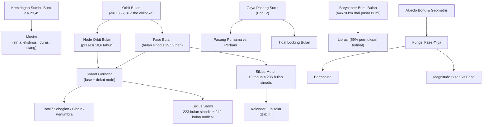

# BAB V — FENOMENA ASTRONOMI (SISTEM BUMI-BULAN-MATAHARI)

*(Part 4 dari seri Ringkasan OSN Astronomi — lihat Part 1 untuk daftar isi keseluruhan)*

> **Catatan:** Beberapa konsep di bab ini (pasang surut, eksentrisitas, periode sideris/sinodis, barycenter) sudah dibahas mendalam di Bab II–IV. Di sini saya **rangkum ulang secara singkat dengan cross-reference**, dan fokuskan penjelasan baru pada topik yang belum dibahas: musim, gerhana, aurora, meteor shower, siklus Saros/Meton, dan skala terang Bulan.

---

## Daftar Isi Bab Ini

1. [Pasang Surut, Musim, Gerhana, Aurora, Meteor Shower (Gambaran Umum)](#1)
2. [Gerhana Bulan dan Matahari: Detail](#2)
3. [Siklus Gerhana: Saros dan Meton](#3)
4. [Gerhana dalam Kultur Manusia](#4)
5. [Equinox, Perihelion-Aphelion, Eksentrisitas, Periode Sideris-Sinodis](#5)
6. [Sistem Bumi-Bulan: Data Fisis dan Orbit](#6)
7. [Skala Terang Sabit Bulan dan Earthshine](#7)

---

## 1. Pasang Surut, Musim, Gerhana, Aurora, Meteor Shower — Gambaran Umum

### A. Konsep Inti

**Pasang surut** — sudah diturunkan lengkap di §IV.4 (gaya diferensial $\propto1/R^3$, dua tonjolan pasang-surut). Tambahan konteks Bumi-Bulan-Matahari: pasang surut Matahari **kurang dari separuh** kekuatan pasang surut Bulan (meski Matahari jauh lebih masif, jaraknya jauh lebih dominan lewat pangkat tiga). Saat Matahari dan Bulan segaris (bulan baru/purnama), efeknya menjumlah → **pasang purnama (spring tide)**, lebih tinggi dari rerata. Saat tegak lurus (kuartal), efeknya saling mengurangi → **pasang perbani (neap tide)**.

**Musim** — disebabkan **kemiringan sumbu rotasi Bumi** (obliquity $\varepsilon\approx23{,}4°$) terhadap bidang orbit, BUKAN perubahan jarak Bumi-Matahari (eksentrisitas orbit Bumi sangat kecil, $e\approx0{,}0167$; Bumi justru di perihelion pada awal Januari, tengah musim dingin belahan utara!). Tiga faktor yang membuat musim panas lebih "panas":
1. **Altitude Matahari lebih tinggi** → fluks per satuan luas $\propto\sin a$ lebih besar.
2. **Ekstingsi atmosfer lebih kecil** saat Matahari tinggi (lintasan optik lebih pendek).
3. **Durasi siang lebih panjang** — signifikan terutama di lintang tinggi.

**Aurora** $[\text{Tambahan, lihat detail di Bab VI}]$ — cahaya di atmosfer atas akibat partikel bermuatan (dari angin Matahari) yang terperangkap medan magnet Bumi dan menumbuk molekul atmosfer (O, N₂) di dekat kutub magnetik, mengeksitasi lalu memancarkan cahaya (mekanisme mirip garis emisi §I.2).

**Meteor shower (hujan meteor)** $[\text{Tambahan}]$ — Bumi melintasi puing-puing (debu, kerikil) yang ditinggalkan komet di sepanjang orbitnya; puing-puing masuk atmosfer dengan kecepatan tinggi dan terbakar akibat gesekan, tampak seolah memancar dari satu titik di langit (**radiant**) akibat efek perspektif geometris (semua puing bergerak sejajar, seperti rel kereta yang tampak menyatu di kejauhan).

### E. Contoh Soal OSN

**Soal (konseptual):** Jelaskan mengapa Bumi berada di perihelion (jarak terdekat ke Matahari) justru pada awal Januari, saat belahan bumi utara mengalami musim dingin.

**Jawaban:** Arah kemiringan sumbu rotasi Bumi (yang menentukan musim) dan posisi Bumi di orbit elipsnya (yang menentukan jarak ke Matahari) adalah **dua hal independen** yang kebetulan tidak sejajar saat ini — orientasi sumbu rotasi ditentukan oleh sejarah pembentukan Bumi & presesi jangka panjang (periode ~26.000 tahun, lihat Bab VII), sementara orientasi perihelion orbit berpresesi dengan periode berbeda (~112.000 tahun, gabungan presesi sumbu & presesi orbit itu sendiri, terkait siklus Milanković). Karena periode kedua presesi ini berbeda, hubungan antara musim dan jarak perihelion terus berubah dalam skala puluhan ribu tahun — saat ini kebetulan perihelion jatuh di pertengahan musim dingin utara, tapi ini akan berubah di masa depan jauh.

---

## 2. Gerhana Bulan dan Matahari: Detail

### A. Konsep Inti

**Gerhana** terjadi saat satu benda melewati bayangan benda lain. Secara teknis: **gerhana Matahari sebenarnya adalah OKULTASI** (Bulan menutupi Matahari dari pandangan kita), sementara **gerhana Bulan adalah gerhana sejati** (Bulan benar-benar memasuki bayangan Bumi).

**Mengapa tidak terjadi gerhana setiap bulan?** Bidang orbit Bulan miring $\approx5°$ terhadap ekliptika — gerhana hanya mungkin terjadi saat fase bulan baru/purnama **DAN** Bulan berada dekat salah satu **node** (titik potong orbit Bulan dengan ekliptika).

<!--
[Sisipkan Diagram: Geometri Gerhana Matahari — Umbra dan Penumbra]
Deskripsi: Matahari (kiri, besar), Bulan (tengah, kecil), Bumi (kanan).
Gambar dua kerucut bayangan dari Bulan: kerucut GELAP sempit (umbra)
yang menyempit ke satu titik, dan kerucut lebih lebar di sekelilingnya
(penumbra) yang melebar. Tunjukkan bahwa jika permukaan Bumi berada
di dalam umbra → gerhana TOTAL (di jalur sempit <270 km lebar);
jika di penumbra saja → gerhana SEBAGIAN. Gambar variasi: jika Bulan
berada di titik terjauh orbitnya (apogee) saat gerhana, ujung umbra
tidak mencapai permukaan Bumi (menyempit menjadi titik SEBELUM sampai
Bumi) sehingga yang terlihat adalah cincin cahaya Matahari mengelilingi
Bulan → gerhana CINCIN (annular).
-->

<!--
[Sisipkan Diagram: Geometri Gerhana Bulan — Umbra dan Penumbra Bumi]
Deskripsi: Matahari (kiri jauh), Bumi (tengah, lebih besar dari Bulan),
Bulan (kanan, bergerak melalui bayangan Bumi). Gambar kerucut umbra
dan penumbra BUMI (lebih besar dari kerucut bayangan Bulan karena
Bumi lebih besar dari Bulan). Tunjukkan 3 kemungkinan lintasan Bulan:
(1) seluruhnya melalui umbra → gerhana bulan TOTAL, (2) sebagian
melalui umbra → gerhana bulan SEBAGIAN, (3) hanya melalui penumbra
(tidak menyentuh umbra) → gerhana PENUMBRA (sulit dilihat mata
telanjang, kecerlangan Bulan nyaris tak berubah).
-->

**Klasifikasi gerhana Matahari:**
| Jenis | Syarat geometris |
|---|---|
| **Total** | Piringan Bulan menutupi seluruh piringan Matahari (Bulan dekat perigee, tampak cukup besar) |
| **Sebagian (partial)** | Pengamat berada di zona penumbra saja |
| **Cincin (annular)** | Bulan dekat apogee — piringan tampak lebih kecil dari Matahari, menyisakan cincin cahaya |
| **Hibrid** | Kombinasi total/cincin tergantung lokasi pengamat di sepanjang jalur (kelengkungan Bumi membuat jarak efektif Bumi-Bulan sedikit bervariasi) |

**Klasifikasi gerhana Bulan:**
| Jenis | Syarat geometris |
|---|---|
| **Total** | Seluruh piringan Bulan masuk umbra Bumi |
| **Sebagian** | Sebagian piringan Bulan masuk umbra |
| **Penumbra** | Bulan hanya melalui penumbra, tak menyentuh umbra — perubahan kecerlangan sangat halus |

### B. Rumus Penting

| Nama | Rumus/Nilai | Keterangan |
|---|---|---|
| Diameter sudut Bulan | $29{,}4'$–$33{,}5'$ | Bervariasi karena orbit elips ($e_{Bulan}=0{,}055$) |
| Diameter sudut Matahari | $\approx31{,}5'$–$32{,}5'$ | Bervariasi karena orbit Bumi elips |
| Syarat gerhana Bulan total | Jarak sudut Bulan-node $<4{,}6°$ | Saat purnama |
| Syarat gerhana Matahari total | Jarak sudut Bulan-node $<10{,}3°$ | Saat bulan baru |
| Lebar maksimum jalur totalitas (gerhana Matahari) | $<270$ km | Karena ukuran sudut umbra Bulan yang sangat kecil di permukaan Bumi |
| Kecepatan bayangan Bulan di permukaan Bumi | $\geq34$ km/menit | Kombinasi rotasi Bumi & orbit Bulan |
| Durasi maksimum totalitas | $\approx7{,}5$ menit | |
| Jumlah gerhana per tahun | 2–7 kali (Matahari + Bulan gabungan) | |

### D. Intuisi dan Interpretasi

- **Koinsidensi kosmik luar biasa:** Matahari $\sim400\times$ lebih besar dari Bulan TAPI juga $\sim400\times$ lebih jauh — sehingga diameter sudut keduanya **hampir identik** ($\sim0{,}5°$), inilah mengapa gerhana Matahari total (bukan hanya okultasi kasar) memungkinkan terjadi sama sekali. Kebetulan geometris ini tidak berlaku untuk pasangan planet-satelit lain di Tata Surya.
- Karena jarak Bumi-Bulan dan Bumi-Matahari SAMA-SAMA bervariasi (orbit elips), kombinasi keduanyalah yang menentukan apakah gerhana Matahari jadi total atau cincin pada kesempatan tertentu — bukan hanya satu faktor saja.
- Gerhana Bulan penumbra sangat sulit dideteksi mata telanjang karena penumbra hanya mengurangi kecerlangan Bulan sedikit (sebagian piringan Matahari masih terlihat dari titik itu) — kontras dengan gerhana Bulan total yang membuat Bulan tampak **merah tembaga** (cahaya Matahari yang dibiaskan atmosfer Bumi, hanya panjang gelombang merah yang lolos hamburan Rayleigh, mirip mekanisme langit senja merah).

### E. Contoh Soal OSN

**Soal:** Saat gerhana Matahari terjadi, Bulan berada pada jarak 405.000 km dari Bumi (dekat apogee) dan Matahari berada pada jarak 1,52×10⁸ km (dekat aphelion Bumi). Diameter Bulan 3474 km, diameter Matahari 1,392×10⁶ km. Tentukan jenis gerhana yang terjadi (total atau cincin).

**Penyelesaian:** Bandingkan diameter sudut keduanya:
$$\theta_{Bulan} = \frac{3474}{405.000}\text{ rad} = 8{,}58\times10^{-3}\text{ rad}\approx29{,}5'$$
$$\theta_{Matahari}=\frac{1{,}392\times10^6}{1{,}52\times10^8}\text{ rad}=9{,}16\times10^{-3}\text{ rad}\approx31{,}5'$$
Karena $\theta_{Bulan}<\theta_{Matahari}$, piringan Bulan **lebih kecil** dari Matahari → gerhana **CINCIN (annular)**.

**Kesalahan umum:** lupa mengonversi radian ke arcmin (faktor $180\times60/\pi\approx3438$); membandingkan radius vs diameter secara tidak konsisten.

---

## 3. Siklus Gerhana: Saros dan Meton

### A. Konsep Inti

**Siklus Saros** — periode $\approx18$ tahun $11$ hari (lebih presisi: $6585{,}78$ hari) setelah mana konfigurasi Matahari-Bumi-Bulan-node **berulang hampir persis**, sehingga gerhana dengan karakteristik serupa (jenis, durasi kurang lebih sama) terjadi lagi. Dikenal sejak Babilonia kuno.

**Siklus Meton** $[\text{Tambahan}]$ — periode 19 tahun tropis $\approx235$ bulan sinodis, setelah mana fase Bulan jatuh pada tanggal kalender yang (hampir) sama lagi. Dasar penentuan kalender lunisolar (termasuk kalender Yahudi, dan historisnya kalender Yunani kuno) — menjelaskan mengapa perlu menyisipkan "bulan kabisat" secara periodik pada kalender lunisolar (lihat Bab III.6).

### B. Rumus Penting

| Nama | Rumus/Nilai | Derivasi Ringkas |
|---|---|---|
| **Periode Saros** | $223$ bulan sinodis $= 6585{,}78$ hari $\approx18$ tahun $11{,}3$ hari | $\approx242$ bulan draconic (nodical) $\approx239$ bulan anomalistic — TIGA siklus berbeda kebetulan hampir sinkron pada periode ini |
| Bulan sinodis | $29{,}531$ hari | Periode fase Bulan (lihat §V.6) |
| Bulan nodical (draconic) | $27{,}212$ hari | Node-ke-node, lebih pendek dari sideris karena presesi node ($18{,}6$ tahun) |
| Bulan anomalistic | $27{,}555$ hari | Perigee-ke-perigee, lebih panjang dari sideris karena presesi apsis orbit |
| **Periode Meton** | $19$ tahun tropis $\approx235$ bulan sinodis $\approx6939{,}7$ hari | $19\times365{,}2422 \approx 235\times29{,}531$ (kecocokan numerik luar biasa presisi) |
| Interval antar-gerhana dalam satu "musim gerhana" | $\approx173$ hari | Waktu Matahari kembali dekat node yang sama (setengah dari $346{,}62$ hari) |

### C. Derivasi Singkat

**Mengapa Saros = 223 bulan sinodis ≈ 242 bulan nodical?** Untuk gerhana berulang dengan geometri serupa, dibutuhkan: (1) Bulan kembali ke fase sama (bulan baru/purnama) — kelipatan bulat bulan **sinodis**; (2) Bulan kembali dekat node yang sama — kelipatan bulat bulan **nodical**. Secara numerik kebetulan luar biasa: $223\times29{,}530589=6585{,}32$ hari, sementara $242\times27{,}212221=6585{,}36$ hari — **hampir sama persis** (selisih hanya ~0,03 hari)! Inilah "kebetulan aritmetik" yang membuat siklus Saros berfungsi sebagai prediktor gerhana yang sangat akurat meski ditemukan **murni secara empiris** oleh astronom kuno, jauh sebelum memahami mekanika orbitnya.

### D. Intuisi dan Interpretasi

- Satu siklus Saros bergeser $\approx1/3$ hari dari kelipatan bulat hari — akibatnya, gerhana berikutnya dalam siklus Saros yang sama terjadi di lokasi geografis yang **bergeser $\approx120°$ bujur ke barat** (karena Bumi sudah berotasi sepertiga putaran tambahan dibanding kelipatan hari bulat) — inilah mengapa gerhana "kembar Saros" tidak pernah terlihat di lokasi geografis yang sama.
- Siklus Meton relevan untuk kalender (Bab III) — karena presisi kecocokan 19 tahun tropis ≈ 235 bulan sinodis, kalender lunisolar (Cina, Yahudi) bisa menyisipkan tepat 7 bulan kabisat dalam setiap siklus 19 tahun untuk tetap sinkron dengan musim.

### E. Contoh Soal OSN

**Soal:** Sebuah gerhana Matahari total terjadi pada tanggal tertentu. Prediksikan (secara kasar) kapan gerhana dengan karakteristik serupa akan terjadi lagi (dalam satuan siklus Saros), dan berapa tahun kalender mendekati kejadian tersebut.

**Penyelesaian:** Satu siklus Saros $=6585{,}78$ hari $= 18$ tahun $11$ hari $8$ jam (mendekati, tergantung jumlah tahun kabisat yang terlewati). Maka gerhana serupa berikutnya terjadi $\approx18$ tahun $11$ hari kemudian, di lokasi geografis yang bergeser $\approx120°$ bujur ke barat (akibat sisa $8$ jam $=1/3$ hari yang menyebabkan pergeseran rotasi Bumi tambahan).

---

## 4. Gerhana dalam Kultur Manusia $[\text{Tambahan}]$

### A. Konsep Inti

Sepanjang sejarah, gerhana (terutama gerhana Matahari total yang dramatis — langit gelap mendadak di siang hari) memicu berbagai respons budaya:

- **Mitologi & ketakutan** — banyak budaya kuno (Cina, Viking, sebagian budaya Mesoamerika) menafsirkan gerhana Matahari sebagai "dimakan" oleh makhluk mitologis (naga di Cina, serigala Sköll di mitologi Norse) — ritual seperti memukul gong/drum untuk "mengusir" pemangsa Matahari tercatat di berbagai budaya secara independen.
- **Pencapaian ilmiah** — astronom Babilonia kuno mampu memprediksi gerhana lewat siklus Saros murni dari observasi berulang selama berabad-abad, tanpa memahami mekanisme fisisnya — salah satu pencapaian sains observasional tertua.
- **Momen pembuktian ilmiah modern** — gerhana Matahari total 1919 (diamati Eddington) dipakai untuk **menguji Teori Relativitas Umum Einstein** lewat pengukuran pembelokan cahaya bintang oleh gravitasi Matahari (hanya bisa diamati saat totalitas, ketika cahaya Matahari yang biasanya menyilaukan tertutup sepenuhnya oleh Bulan).
- **Konteks Indonesia** — gerhana matahari total melintasi Indonesia beberapa kali dalam sejarah modern (mis. 1983, 2016), momen penting edukasi publik astronomi nasional.

### D. Intuisi dan Interpretasi

Poin pembelajaran utama untuk OSN: gerhana adalah contoh sempurna bagaimana **pemahaman ilmiah menggantikan mitos** lewat observasi sistematis dan matematika (siklus Saros ditemukan murni empiris ribuan tahun sebelum hukum Newton/Kepler menjelaskan MENGAPA siklus itu berfungsi) — dan bagaimana peristiwa alam langka bisa menjadi **laboratorium alami** untuk menguji teori fisika fundamental (kasus Eddington 1919).

---

## 5. Equinox, Perihelion-Aphelion, Eksentrisitas, Periode Sideris-Sinodis, Inklinasi, Momentum Sudut

### A. Konsep Inti (Rangkuman & Cross-Reference)

Sebagian besar konsep ini sudah dibahas mendalam:
- **Equinox, solstice** → §II.3 (definisi & diagram)
- **Perihelion, aphelion, eksentrisitas** → §IV.2 (Hukum Kepler I, rumus $r_{peri}=a(1-e)$, dsb.)
- **Periode sideris vs sinodis** → §III.1 (hari) dan §IV.2 (orbit planet, rumus umum $1/\tau=1/\tau_*\mp1/P$)
- **Inklinasi** → §IV.6 (salah satu dari 6 elemen orbit)
- **Momentum sudut** → §IV.2 (Kepler II sebagai konsekuensi kekekalan momentum sudut $\mathbf k=\mathbf r\times\dot{\mathbf r}$)

**Tambahan spesifik konteks Bumi-Bulan-Matahari:**

| Besaran | Nilai Bumi | Nilai Bulan (mengorbit Bumi) |
|---|---|---|
| Eksentrisitas orbit | $e_\oplus=0{,}0167$ | $e_{Bulan}=0{,}055$ |
| Periode sideris | $365{,}256$ hari (tahun sideris) | $27{,}322$ hari (bulan sideris) |
| Periode sinodis (relatif Matahari, dari sudut pandang Bumi) | — (definisi hari surya) | $29{,}531$ hari (bulan sinodis, fase Bulan) |
| Jarak perihelion/aphelion (Bumi-Matahari) | $147$–$152$ juta km | — |
| Jarak perigee/apogee (Bumi-Bulan) | — | $356.400$–$406.700$ km |
| Inklinasi orbit terhadap ekliptika | $0°$ (definisi ekliptika) | $\approx5°$ |

### B. Rumus Penting (Tambahan)

| Nama | Rumus |
|---|---|
| Bulan sideris vs sinodis | $\dfrac1{29{,}531} = \dfrac1{27{,}322}-\dfrac1{365{,}256}$ (analog rumus §IV.2, karena Bumi "mengejar" dalam orbitnya mengelilingi Matahari selama Bulan mengorbit Bumi) |
| Momentum sudut sistem Bumi-Bulan (kekal) | $L_{total}=L_{rotasi,\oplus}+L_{rotasi,Bulan}+L_{orbit}= \text{konstan}$ | Dasar penjelasan perlambatan rotasi Bumi & menjauhnya Bulan (§IV.4) |

### E. Contoh Soal OSN

**Soal:** Verifikasi hubungan bulan sideris-sinodis Bulan menggunakan rumus periode sinodis-sideris umum.

**Penyelesaian:**
$$\frac1{\tau_{sinodis}}=\frac1{\tau_{sideris}}-\frac1{P_{Bumi}} = \frac1{27{,}322}-\frac1{365{,}256}=0{,}036592-0{,}002738=0{,}033854$$
$$\tau_{sinodis}=1/0{,}033854\approx29{,}54\text{ hari}$$
Cocok dengan nilai literatur $29{,}531$ hari (selisih kecil akibat pembulatan).

---

## 6. Sistem Bumi-Bulan: Data Fisis dan Orbit

### A. Konsep Inti

| Parameter | Bumi | Bulan |
|---|---|---|
| Massa | $5{,}97\times10^{24}$ kg | $7{,}35\times10^{22}$ kg ($\approx1/81$ massa Bumi) |
| Radius rata-rata | $6371$ km | $1737$ km ($\approx0{,}27\times$ radius Bumi) |
| Densitas rata-rata | $5514$ kg/m³ | $3344$ kg/m³ |
| Gravitasi permukaan | $9{,}8$ m/s² | $1{,}62$ m/s² ($\approx1/6\,g_\oplus$) |
| Sumbu semi-mayor orbit Bulan | $384.400$ km | |
| Rotasi | Sideris $23^h56^m$ | **Sinkron** dengan periode orbit ($27{,}322$ hari) — **tidal locking** |

**Barycenter sistem Bumi-Bulan** (lihat juga §IV.3): karena rasio massa $\approx81{:}1$, barycenter berjarak $\approx\dfrac{1}{82}\times384.400\approx4670$ km dari pusat Bumi — **masih di dalam Bumi** (radius Bumi $6371$ km), tapi cukup jauh dari pusat sehingga Bumi juga "bergoyang" mengelilinginya (teramati sebagai osilasi kecil posisi Bumi, salah satu metode historis penentuan massa Bulan).

**Librasi** — meski rotasi Bulan tersinkronisasi (satu sisi selalu menghadap Bumi), variasi kecepatan orbit (Kepler II, lebih cepat di perigee) vs kecepatan rotasi yang konstan menyebabkan kita bisa melihat **sedikit lebih dari 50%** permukaan Bulan dari waktu ke waktu (total $\approx59\%$) — disebut **librasi**, ada tiga jenis: librasi longitude (akibat kecepatan orbit vs rotasi tak sinkron sesaat), librasi latitude (akibat kemiringan sumbu rotasi Bulan terhadap bidang orbitnya), dan librasi diurnal (akibat paralaks — posisi pengamat berbeda saat Bulan terbit vs terbenam).

**Medan potensial Bumi-Bulan** $[\text{Tambahan}]$ — superposisi potensial gravitasi kedua benda menghasilkan permukaan ekipotensial kompleks dalam kerangka berotasi bersama sistem; titik Lagrange (§IV.4) adalah titik-titik kritis (ekstrem lokal) dari potensial efektif ini (gravitasi + potensial sentrifugal semu).

### D. Intuisi dan Interpretasi

- **Tidal locking** Bulan adalah konsekuensi jangka panjang disipasi energi pasang-surut (§IV.4) — Bumi awalnya membuat Bulan "berputar goyah" relatif terhadap Bumi, gesekan internal Bulan (jauh lebih kecil & lebih dulu "membeku" secara geologis dibanding Bumi) meredam goyangan ini hingga periode rotasi = periode orbit. Bumi sendiri sedang mengalami proses serupa (diperlambat oleh Bulan) tapi jauh lebih lambat mendekati sinkronisasi penuh (akan butuh miliaran tahun lagi, dan Matahari kemungkinan sudah menjadi raksasa merah lebih dulu).
- Rasio massa Bumi-Bulan ($81{:}1$) termasuk **sangat besar untuk pasangan planet-satelit** dibanding rasio pasangan planet-satelit lain di Tata Surya (kecuali Pluto-Charon) — inilah salah satu alasan sistem Bumi-Bulan kadang disebut "planet ganda" (*double planet*) secara informal.

### E. Contoh Soal OSN

**Soal:** Verifikasi posisi barycenter sistem Bumi-Bulan menggunakan rumus §IV.3, dengan $M_\oplus=5{,}97\times10^{24}$ kg, $M_{Bulan}=7{,}35\times10^{22}$ kg, $d=384.400$ km.

**Penyelesaian:**
$$d_{\oplus} = \frac{M_{Bulan}}{M_\oplus+M_{Bulan}}\times d = \frac{7{,}35\times10^{22}}{5{,}97\times10^{24}+7{,}35\times10^{22}}\times384.400$$
$$=\frac{7{,}35\times10^{22}}{6{,}0435\times10^{24}}\times384.400\approx0{,}01216\times384.400\approx4674\text{ km}$$
Konsisten dengan nilai literatur ($\approx4670$ km) — dan lebih kecil dari radius Bumi ($6371$ km), mengonfirmasi barycenter berada di dalam Bumi.

---

## 7. Skala Terang Sabit Bulan dan Earthshine $[\text{Sebagian Tambahan}]$

### A. Konsep Inti

Kecerlangan Bulan yang teramati bergantung pada **beberapa** faktor sekaligus, bukan hanya "berapa persen piringan yang tersinari":

1. **Sudut fase ($\alpha$)** — sudut Matahari-Bulan-Bumi (0° saat purnama, 180° saat bulan baru arah pandang Bumi... perhatikan konvensi: $\alpha=0$ berarti pengamat "searah" cahaya Matahari, yaitu kondisi purnama).
2. **Elongasi** — sudut Matahari-Bumi-Bulan (jarak sudut Bulan dari Matahari dilihat dari Bumi) — elongasi $0°$=bulan baru (konjungsi), $180°$=purnama (oposisi).
3. **Jarak Bumi-Bulan** (bervariasi, memengaruhi fluks lewat hukum kuadrat-terbalik).
4. **Fungsi fase $\Phi(\alpha)$** — bagaimana kecerlangan permukaan tak-seragam bergantung sudut pandang terhadap sudut penyinaran (lihat §B, konsisten dengan pembahasan fungsi fase planet buku sumber Bab VII).

**Earthshine (cahaya Bumi)** — cahaya Matahari yang dipantulkan Bumi, kemudian menerangi sisi gelap Bulan (bagian yang tidak langsung disinari Matahari) — terlihat sebagai kilau redup "Bulan tua dalam pelukan Bulan muda" (*old Moon in the new Moon's arms*) saat bulan sabit tipis. Karena albedo Bumi ($\approx0{,}3$, jauh lebih tinggi dari albedo Bulan $\approx0{,}12$) dan ukuran sudut Bumi dilihat dari Bulan $\approx4\times$ lebih besar dari Bulan dilihat dari Bumi, earthshine cukup terang untuk terlihat mata telanjang.

### B. Rumus Penting

| Nama | Rumus | Keterangan |
|---|---|---|
| Fluks Matahari pada jarak $r$ | $F=\dfrac{L_\odot}{4\pi r^2}$ | Hukum kuadrat-terbalik standar (§I.1) |
| Fluks diterima benda radius $R$ | $L_{in}=\pi R^2 F = \dfrac{L_\odot R^2}{4r^2}$ | Cross-section benda |
| Fluks dipantulkan (albedo Bond $A$) | $L_{out}=A\,L_{in}$ | $0\le A\le1$ |
| Fluks teramati pengamat jarak $\Delta$ | $F_{obs}=C\,\Phi(\alpha)\dfrac{L_{out}}{4\pi\Delta^2}$ | $\Phi(\alpha)$: fungsi fase (dinormalisasi $\Phi(0)=1$), $C$: konstanta terkait albedo geometris |
| Albedo geometris & Bond | $A=pq$ | $p$: albedo geometris, $q$: integral fase |
| Hubungan magnitudo-fase-jarak | $m = m_0 + 5\log_{10}(r\Delta) - 2{,}5\log_{10}\Phi(\alpha)$ | $r$: jarak objek-Matahari, $\Delta$: jarak objek-pengamat, $m_0$: magnitudo pada $r=\Delta=1$ au dan $\alpha=0$ |
| Sudut ruang piringan Bulan dilihat Bumi | $\Omega \approx \pi\left(\dfrac{R_{Bulan}}{d}\right)^2$ | Untuk sudut kecil, $d$: jarak Bumi-Bulan |

### D. Intuisi dan Interpretasi

- Magnitudo Bulan **tidak berubah linear** terhadap fase — kecerlangan turun jauh lebih cepat dari sekadar "luas sabit yang tersinari" saat mendekati bulan baru, karena efek **opposition surge** (permukaan kasar Bulan memantulkan cahaya jauh lebih efisien saat sudut fase mendekati $0°$/purnama, akibat bayangan mikro-topografi saling menyembunyikan dari sudut pandang pengamat) — efek ini membuat Bulan purnama tampak jauh lebih terang dari yang diprediksi model pemantulan sederhana (Lambertian).
- Earthshine adalah demonstrasi visual langsung konsep **albedo planet dilihat dari luar** — salah satu cara termudah memahami "seperti apa Bumi terlihat dari luar angkasa" tanpa perlu wahana antariksa, dan historis dipakai Galileo untuk berargumen Bumi juga memantulkan cahaya seperti Bulan (mendukung model heliosentris).
- Sudut fase dan elongasi **berbeda titik pandang** (satu diukur dari Bulan, satu dari Bumi) tapi keduanya berhubungan lewat geometri segitiga Matahari-Bumi-Bulan — dalam kasus sistem Bumi-Bulan, elongasi $\varepsilon$ + sudut fase $\alpha$ + sudut ketiga di Matahari = $180°$ (jumlah sudut segitiga datar, karena jarak-jarak yang terlibat cukup dekat sehingga geometri datar cukup akurat, tidak perlu trigonometri bola).

### E. Contoh Soal OSN

**Soal:** Estimasi kasar: berapa kali lebih terang Bumi terlihat dari Bulan (saat "Bumi purnama" dilihat dari Bulan) dibanding Bulan purnama terlihat dari Bumi? Asumsikan albedo Bumi $A_\oplus\approx0{,}3$, albedo Bulan $A_{Bulan}\approx0{,}12$, radius Bumi $R_\oplus=6371$ km, radius Bulan $R_{Bulan}=1737$ km, jarak sama ($d=384.400$ km untuk kedua arah).

**Penyelesaian:** Rasio kecerlangan sebanding $A\times R^2$ (fluks total dipantulkan sebanding albedo dan luas penampang, jarak dianggap sama untuk estimasi kasar, mengabaikan detail fungsi fase):
$$\frac{L_{Bumi}}{L_{Bulan}} = \frac{A_\oplus R_\oplus^2}{A_{Bulan}R_{Bulan}^2} = \frac{0{,}3\times6371^2}{0{,}12\times1737^2}=\frac{0{,}3\times4{,}059\times10^7}{0{,}12\times3{,}017\times10^6}=\frac{1{,}218\times10^7}{3{,}620\times10^5}\approx33{,}6$$

Bumi terlihat **≈34 kali lebih terang** dari Bulan pada konfigurasi "purnama" masing-masing — konsisten dengan earthshine yang cukup terang untuk menerangi sisi gelap Bulan secara terlihat mata telanjang dari Bumi.

**Kesalahan umum:** lupa memangkatkan radius (menggunakan diameter/radius linear alih-alih luas $R^2$); mengabaikan albedo dan hanya membandingkan ukuran.

---

## Daftar Rumus Ringkas — Bab V

**Musim & Gerhana**
- Fluks $\propto\sin a$ (altitude Matahari)
- Syarat gerhana Bulan total: jarak sudut Bulan-node $<4{,}6°$; Matahari total: $<10{,}3°$
- Diameter sudut Bulan: $29{,}4'$–$33{,}5'$; Matahari: mirip $\sim32'$

**Siklus**
- Saros $=223$ bulan sinodis $=6585{,}78$ hari $\approx18$ tahun $11$ hari
- Bulan sinodis $29{,}531$ hari; sideris $27{,}322$ hari; nodical $27{,}212$ hari; anomalistic $27{,}555$ hari
- Meton: 19 tahun tropis $\approx235$ bulan sinodis

**Bumi-Bulan**
- Barycenter: $d_\oplus = \dfrac{M_{Bulan}}{M_\oplus+M_{Bulan}}d$
- Librasi total: $\approx59\%$ permukaan Bulan terlihat dari Bumi

**Kecerlangan & Fase**
- $L_{out}=A\,L_{in}=A\dfrac{L_\odot R^2}{4r^2}$
- $m=m_0+5\log_{10}(r\Delta)-2{,}5\log_{10}\Phi(\alpha)$
- $\Omega\approx\pi(R/d)^2$

---

## Peta Konsep Bab V

---

## Topik Paling Sering Muncul di OSN (Bab V)

1. **Geometri gerhana** (syarat node, jenis gerhana total/cincin/sebagian) — sangat sering, terutama soal menentukan jenis gerhana dari data jarak
2. **Siklus Saros** — perhitungan periode & prediksi pengulangan gerhana
3. **Musim: klarifikasi miskonsepsi jarak vs kemiringan sumbu** — hampir selalu muncul sebagai soal konsep
4. **Barycenter Bumi-Bulan** — perhitungan posisi, sering digabung Bab IV
5. **Pasang surut spring/neap** — konseptual dan kuantitatif
6. Skala terang Bulan/earthshine — lebih jarang tapi muncul di soal analitis tingkat lanjut

---

