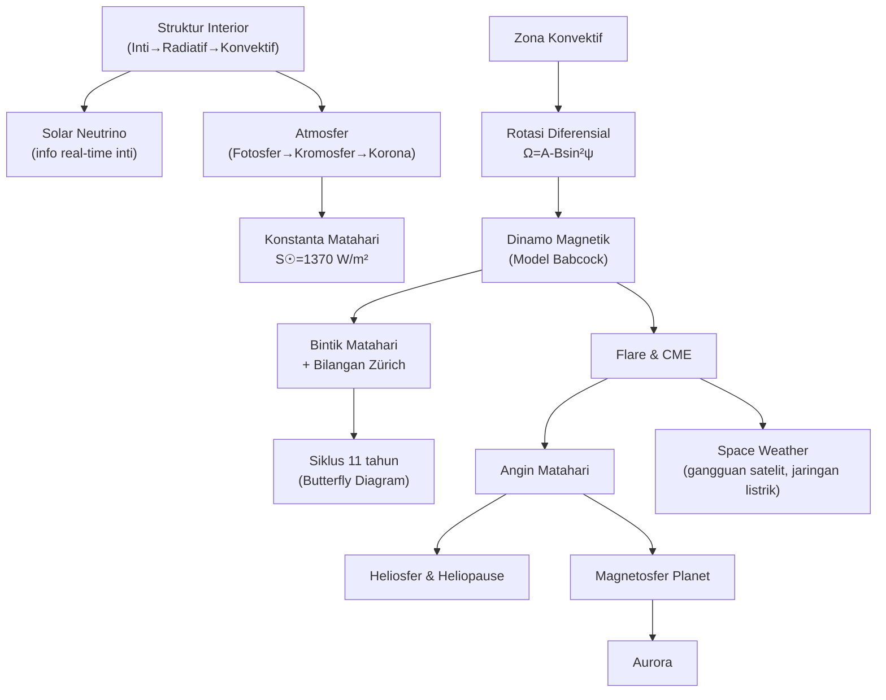

# BAB VI — MATAHARI

## Daftar Isi Bab Ini

1. [Struktur Matahari](#1)
2. [Atmosfer Matahari: Fotosfer, Kromosfer, Korona](#2)
3. [Aktivitas Permukaan: Bintik Matahari, Prominensa, Flare](#3)
4. [Rotasi Matahari dan Rotasi Diferensial](#4)
5. [Radiasi dan Konstanta Matahari](#5)
6. [Solar Neutrino](#6)
7. [Medan Magnet dan Siklus Matahari](#7)
8. [Angin Matahari, Tekanan Radiasi, Heliosfer, Magnetosfer](#8)
9. [Relasi Matahari-Bumi (Space Weather)](#9)

---

<a name="1"></a>
## 1. Struktur Matahari

### A. Konsep Inti

Matahari adalah bintang **deret utama tipe G2V** — bintang "biasa" yang menjadi acuan/tolok ukur untuk semua bintang lain dalam astrofisika (lihat Bab I & VIII). Struktur interior (dari dalam ke luar): **inti (core)** → **zona radiatif** → **zona konvektif** → atmosfer (dibahas §VI.2).

- **Inti** — hingga $\sim25\%$ radius, tempat reaksi fusi (rantai proton-proton/pp chain) berlangsung; $99\%$ energi Matahari dihasilkan dalam seperempat radius ini.
- **Zona radiatif** — hingga $\sim70\%$ radius, energi merambat lewat difusi foton (mekanisme §I.5).
- **Zona konvektif** — dari $\sim70\%$ radius hingga permukaan; opasitas meningkat drastis (gas tidak lagi terionisasi penuh) sehingga transportasi radiatif tidak efisien, digantikan konveksi (§I.5).

```
[Sisipkan Diagram: Potongan Melintang Struktur Matahari]
Deskripsi: Lingkaran besar (Matahari) dibelah menjadi lapisan konsentris
dari dalam ke luar: inti (radius ~0-0,25R, warna paling terang/panas),
zona radiatif (0,25R-0,7R), zona konvektif (0,7R-1,0R, digambar dengan
pola sel-sel konveksi/granulasi), lalu fotosfer (permukaan tampak,
garis tipis), kromosfer (lapisan tipis di atasnya), dan korona (area
luas menyebar keluar, digambar sebagai cahaya difus tidak beraturan).
Beri label temperatur perkiraan tiap lapisan.
```

### B. Rumus Penting — Data Fisis Matahari (Hafalan Wajib)

| Besaran | Nilai |
|---|---|
| Massa $M_\odot$ | $1{,}989\times10^{30}$ kg |
| Radius $R_\odot$ | $6{,}960\times10^8$ m |
| Densitas rata-rata $\bar\rho$ | $1409$ kg/m³ |
| Densitas pusat $\rho_c$ | $1{,}6\times10^5$ kg/m³ |
| Luminositas $L_\odot$ | $3{,}9\times10^{26}$ W |
| Temperatur efektif $T_{eff}$ | $5778$–$5785$ K |
| Temperatur pusat $T_c$ | $1{,}5\times10^7$ K |
| Magnitudo bolometrik absolut $M_{bol}$ | $4{,}72$ |
| Magnitudo visual absolut $M_V$ | $4{,}79$ |
| Indeks warna | $B-V=0{,}62$; $U-B=0{,}10$ |
| Umur | $\approx5\times10^9$ tahun |

### D. Intuisi dan Interpretasi

- Karena zona radiatif sangat "lambat" (foton berdifusi acak/*random walk*, bukan bergerak lurus), energi yang dihasilkan inti hari ini butuh **puluhan ribu hingga ratusan ribu tahun** untuk mencapai permukaan lewat difusi radiatif+konveksi — kontras dengan **neutrino** (§VI.6) yang lolos hampir seketika (~8 menit) karena berinteraksi sangat lemah dengan materi.
- Massa Matahari yang berubah jadi energi selama seluruh hidupnya di deret utama **kurang dari 0,1%** — menunjukkan betapa efisiennya fusi nuklir dibanding sumber energi kimiawi biasa, sekaligus menjelaskan mengapa bintang bisa bersinar stabil selama miliaran tahun.

### E. Contoh Soal OSN

**Soal:** Jika Matahari mengubah $0{,}8\%$ massanya menjadi energi sepanjang hidupnya di deret utama, perkirakan **batas atas** usia Matahari (asumsi luminositas konstan).

**Penyelesaian:**
$$E=\Delta m\,c^2 = 0{,}008\,M_\odot c^2 = 0{,}008\times(2\times10^{30})\times(3\times10^8)^2 \approx1{,}4\times10^{45}\text{ J}$$
$$t=\frac{E}{L_\odot}=\frac{1{,}4\times10^{45}}{3{,}9\times10^{26}}\approx3{,}6\times10^{18}\text{ s}\approx1{,}1\times10^{11}\text{ tahun}$$

**Catatan:** ini jauh melebihi usia aktual Matahari ($\sim5\times10^9$ tahun) karena Matahari hanya menghabiskan hidrogen di **inti** (bukan seluruh massanya) sebelum meninggalkan deret utama — nilai di atas adalah batas atas teoretis, bukan estimasi realistis.

---

<a name="2"></a>
## 2. Atmosfer Matahari: Fotosfer, Kromosfer, Korona

### A. Konsep Inti

- **Fotosfer** — lapisan "permukaan" tampak, tebal hanya $300$–$500$ km, tempat kontinum cahaya tampak dipancarkan; temperatur turun dari $8000$ K (batas dalam) ke $4500$ K (batas luar).
- **Limb darkening (penggelapan tepi)** — tepi piringan Matahari tampak lebih redup dari pusatnya, karena garis pandang ke tepi memotong fotosfer pada sudut sangat miring, sehingga hanya "melihat" lapisan atas yang lebih dingin (kontras pusat piringan, garis pandang tegak lurus, menembus lebih dalam ke lapisan lebih panas).
- **Granulasi** — pola sel konveksi kecil ($\sim1000$ km, sudut $\sim1''$) tampak di fotosfer: pusat granula (gas naik, lebih terang) dan batas granula (gas turun, lebih gelap). Ada juga **supergranulasi** skala lebih besar ($\sim1'$).
- **Kromosfer** — lapisan tipis ($\sim500$ km) di atas fotosfer, temperatur **naik kembali** dari $4500$ K ke $\sim6000$ K (anomali — kebalikan tren pendinginan biasa, tanda awal pemanasan non-radiatif oleh medan magnet/gelombang). Hanya terlihat sesaat saat gerhana Matahari total sebagai **spektrum kilat (flash spectrum)** — garis emisi, bukan absorpsi, karena dilihat dari samping/tanpa latar kontinum fotosfer.
- **Korona** — lapisan terluar, sangat panas ($\sim10^6$ K meski jauh dari inti — "masalah pemanasan korona" yang belum sepenuhnya dipahami, diduga terkait disipasi energi magnetik), sangat renggang, menyebar jauh ke luar angkasa (menjadi angin Matahari, §VI.8).

### D. Intuisi dan Interpretasi

- Temperatur yang **naik lagi** dari fotosfer→kromosfer→korona adalah salah satu misteri astrofisika Matahari paling terkenal: secara naif kita mengharapkan temperatur terus turun menjauhi sumber panas (inti), tapi kenyataannya sebaliknya di lapisan atas — mengindikasikan mekanisme pemanasan **non-termal** (gelombang magnetohidrodinamik, rekoneksi magnetik) mendominasi di lapisan tersebut, bukan sekadar konduksi/radiasi panas biasa.
- Kromosfer & korona hanya terlihat mata telanjang saat gerhana total justru karena kecerlangan fotosfer (jutaan kali lebih terang) menutupinya sepenuhnya dalam kondisi normal — momen gerhana total adalah "eksperimen alami" untuk mengamati lapisan atmosfer luar Matahari.

---

<a name="3"></a>
## 3. Aktivitas Permukaan: Bintik Matahari, Prominensa, Flare

### A. Konsep Inti

**Bintik Matahari (sunspot)** — daerah gelap di fotosfer (temperatur $\sim1500$ K lebih rendah dari sekitarnya) akibat medan magnet kuat (hingga $0{,}45$ T, dibanding medan magnet Bumi di ekuator $\sim0{,}03$ mT) yang **menghambat konveksi** di lokasi tersebut (mengapa medan magnet kuat = temperatur lebih rendah). Terdiri dari **umbra** (bagian tergelap) dan **penumbra** (lebih terang, mengelilingi umbra).

**Bilangan bintik Matahari Zürich** — indeks kuantitatif standar aktivitas Matahari:
$$Z = C(S+10G)$$
dengan $S$=jumlah bintik individu, $G$=jumlah grup bintik, $C$=konstanta kalibrasi pengamat/instrumen.

**Siklus Matahari 11 tahun** — jumlah bintik matahari berosilasi dengan periode rata-rata $\sim11$ tahun (rentang aktual $7$–$17$ tahun), dicatat sejak Schwabe (1843). Fenomena terkait:
- **Diagram kupu-kupu (butterfly diagram)** — bintik muncul pertama di lintang tinggi ($\sim\pm40°$) pada awal siklus, bergerak ke ekuator seiring waktu.
- **Maunder Minimum** (abad 17) & **Spörer Minimum** (abad 15) — periode panjang aktivitas bintik nyaris nihil — mekanismenya belum sepenuhnya dipahami.
- **Siklus magnetik penuh = 22 tahun** — karena polaritas medan magnet bintik berbalik setiap siklus 11 tahun (siklus berikutnya polaritasnya terbalik dari siklus sebelumnya), sehingga polaritas kembali ke keadaan semula setelah **dua** siklus 11 tahun.

**Model Babcock** (mekanisme kualitatif siklus Matahari): medan magnet dipolar awal "terjebak" (*frozen-in*) dalam plasma yang berotasi diferensial (§VI.4) → medan terpilin jadi spiral ketat, menguat seiring waktu → muncul sebagai "tali" fluks magnetik yang membumbung ke permukaan (magnetic buoyancy) membentuk pasangan bintik berpolaritas berlawanan → medan lama dinetralkan lewat rekoneksi, menghasilkan medan dipolar baru berpolaritas terbalik.

**Fenomena aktivitas lain:**
- **Faculae/plage** — daerah terang di fotosfer/kromosfer, biasanya di sekitar tempat bintik baru terbentuk.
- **Prominensa** — massa gas bercahaya di korona, terlihat sebagai filamen gelap dengan latar kromosfer (dalam foto Hα) atau lengkung cerah di tepi piringan; terikat medan magnet, ada yang tenang (quiescent, gas turun perlahan) dan ada yang erupsi (meletus keluar).
- **Flare** — ledakan pelepasan energi magnetik mendadak, berlangsung detik hingga hampir satu jam, meningkatkan emisi sinar-X keras hingga ratusan kali lipat, disertai partikel kosmik berkecepatan sangat tinggi ($v\approx0{,}3c$).
- **Coronal Mass Ejection (CME)** — lontaran awan plasma masif ($500$–$2000$ km/s), sumber utama gangguan cuaca antariksa (§VI.9).

### D. Intuisi dan Interpretasi

- Medan magnet kuat bintik matahari **menghambat**, bukan menambah, konveksi — analog gaya Lorentz yang melawan gerak plasma melintasi garis medan, sehingga panas dari bawah tertahan, menjelaskan temperatur bintik lebih rendah meski berada di permukaan yang sama.
- Siklus 22 tahun (bukan 11 tahun) adalah periode yang **benar-benar berulang identik** (termasuk polaritas) — penting dibedakan dari siklus 11 tahun yang hanya mengacu jumlah bintik (tanpa memperhitungkan polaritas).

### E. Contoh Soal OSN

**Soal:** Pada suatu hari pengamatan, tercatat 8 bintik individu tersebar dalam 3 grup. Jika konstanta kalibrasi observatorium $C=1{,}2$, berapa bilangan Zürich hari itu?

**Penyelesaian:**
$$Z=C(S+10G)=1{,}2\times(8+10\times3)=1{,}2\times38=45{,}6$$

---

<a name="4"></a>
## 4. Rotasi Matahari dan Rotasi Diferensial

### A. Konsep Inti

Matahari (sebagai gas, bukan benda padat) berotasi **diferensial** — lebih cepat di ekuator ($\sim25$ hari) dibanding di kutub ($>30$ hari), pertama ditunjukkan Christoph Scheiner (1630) lewat pengamatan pergerakan bintik matahari. Sumbu rotasi Matahari dimiringkan $7°$ terhadap bidang ekliptika (kutub utara Matahari paling baik teramati dari Bumi sekitar September).

**Helioseismologi** — teknik mengukur osilasi/getaran permukaan Matahari (gelombang suara akibat turbulensi zona konvektif, periode $3$–$12$ menit) untuk menyimpulkan struktur & rotasi interior yang tidak bisa diamati langsung — analog seismologi Bumi memakai gelombang gempa.

### B. Rumus Penting

| Nama | Rumus | Keterangan |
|---|---|---|
| Kecepatan sudut rotasi permukaan (Oort's formula, konteks sama dgn rotasi diferensial Galaksi Bab X) | $\Omega = A - B\sin^2\psi$ | $\psi$: lintang heliografis, $A=14{,}5°$/hari, $B=2{,}9°$/hari (hasil pengukuran) |
| Periode rotasi ekuator | $\approx25$ hari (sideris) | Dari $\Omega(\psi=0)=A=14{,}5°/\text{hari}\Rightarrow P=360/14{,}5\approx24{,}8$ hari |
| Periode rotasi kutub | $>30$ hari | Dari $\Omega(\psi=90°)=A-B=11{,}6°/\text{hari}\Rightarrow P\approx31$ hari |

### D. Intuisi dan Interpretasi

- Rotasi diferensial adalah "mesin" yang memelintir medan magnet dipolar awal menjadi spiral ketat (Model Babcock, §VI.3/7) — TANPA rotasi diferensial, siklus aktivitas Matahari 11 tahun kemungkinan tidak akan terjadi seperti yang kita amati.
- Hasil helioseismologi menunjukkan **zona konvektif** berotasi mirip laju permukaan (bervariasi menurut lintang), sementara **inti radiatif** tampak berotasi seperti benda kaku (*solid body*) dengan laju mendekati rerata permukaan — transisi tajam antara keduanya terjadi di lapisan tipis disebut **tachocline**, diduga berperan penting dalam dinamo magnetik Matahari.

### E. Contoh Soal OSN

**Soal:** Menggunakan rumus Oort, hitung periode rotasi sideris Matahari pada lintang heliografis $\psi=60°$.

**Penyelesaian:**
$$\Omega = 14{,}5-2{,}9\sin^260° = 14{,}5-2{,}9\times0{,}75=14{,}5-2{,}175=12{,}325°/\text{hari}$$
$$P = \frac{360°}{12{,}325°/\text{hari}}\approx29{,}2\text{ hari}$$

---

<a name="5"></a>
## 5. Radiasi dan Konstanta Matahari

### A. Konsep Inti

**Konstanta Matahari (solar constant)** $S_\odot$ — fluks radiasi Matahari yang diterima pada jarak rata-rata Bumi-Matahari (1 au), DI LUAR atmosfer Bumi (agar tidak dipengaruhi ekstingsi atmosfer, §I.3).

### B. Rumus Penting

| Nama | Rumus/Nilai |
|---|---|
| Konstanta Matahari | $S_\odot \approx1370$ W/m² |
| Hubungan konstanta Matahari-luminositas | $S_\odot = \dfrac{L_\odot}{4\pi(1\text{ au})^2}$ |
| Fluks di permukaan Matahari (dari $S_\odot$ + sudut sudut Matahari) | $F_{permukaan} = S_\odot\left(\dfrac{1\text{ au}}{R_\odot}\right)^2$ |

### C. Derivasi Singkat

Karena $S_\odot=L_\odot/(4\pi d^2)$ dengan $d=1$ au (hukum kuadrat-terbalik biasa, §I.1), dan fluks permukaan Matahari $F=L_\odot/(4\pi R_\odot^2)$, rasio keduanya:
$$\frac{F_{permukaan}}{S_\odot} = \left(\frac{d}{R_\odot}\right)^2 = \left(\frac{1{,}496\times10^{11}}{6{,}96\times10^8}\right)^2\approx46.200$$
sehingga $F_{permukaan}\approx1370\times46.200\approx6{,}3\times10^7$ W/m² — konsisten dengan $\sigma T_{eff}^4$ untuk $T_{eff}\approx5778$ K (cek silang dengan §I.7 Stefan-Boltzmann).

### E. Contoh Soal OSN

**Soal:** Diameter sudut Matahari dilihat dari Bumi adalah $32'$. Dengan konstanta Matahari $S_\odot=1370$ W/m², hitung fluks radiasi pada permukaan Matahari itu sendiri.

**Penyelesaian:** Radius sudut $\theta=16'=16/60\times\pi/180\approx4{,}654\times10^{-3}$ rad $=\sin\theta\approx R_\odot/d$ (sudut kecil).
$$F_{permukaan}=S_\odot\left(\frac{d}{R_\odot}\right)^2 = S_\odot/\theta^2 = 1370/(4{,}654\times10^{-3})^2\approx6{,}32\times10^7\text{ W/m}^2$$
Konsisten dengan hasil derivasi di atas — teknik ini (memakai diameter sudut langsung, tanpa perlu tahu jarak absolut dalam km) sering dipakai sebagai jalan pintas cepat di soal OSN.

---

<a name="6"></a>
## 6. Solar Neutrino

### A. Konsep Inti

*(Lihat juga §I.4 untuk pengantar neutrino secara umum.)* Reaksi fusi rantai proton-proton (pp chain) di inti Matahari menghasilkan neutrino pada beberapa tahapnya. Karena neutrino berinteraksi sangat lemah dengan materi, ia lolos hampir seketika dari inti — memberi **informasi langsung real-time** tentang kondisi inti Matahari **saat ini**, kontras dengan cahaya yang baru mencapai permukaan setelah puluhan-ratusan ribu tahun berdifusi.

**Masalah Neutrino Matahari (Solar Neutrino Problem)** — deteksi neutrino Matahari sejak 1970-an konsisten menunjukkan jumlah **hanya sekitar sepertiga hingga 60%** dari prediksi model standar Matahari — anomali yang bertahan puluhan tahun.

**Solusi: osilasi neutrino** — neutrino punya massa kecil tapi tidak nol ($\sim10^{-2}$ eV), memungkinkan neutrino elektron ($\nu_e$, satu-satunya jenis yang diproduksi fusi & terdeteksi eksperimen awal) berosilasi menjadi neutrino muon/tau ($\nu_\mu,\nu_\tau$) dalam perjalanan dari Matahari ke Bumi. Observatorium **SNO** (Sudbury, Kanada, 2001) yang bisa mendeteksi SEMUA jenis neutrino mengonfirmasi: fluks **total** neutrino sesuai prediksi model standar, tapi hanya $\sim35\%$ berupa $\nu_e$ — sisanya sudah berosilasi jadi jenis lain. Penemuan ini memenangkan Hadiah Nobel Fisika 2002 (Davis & Koshiba).

### D. Intuisi dan Interpretasi

- Solar Neutrino Problem adalah contoh klasik "anomali yang mengarah ke fisika baru" — bukan model Matahari yang salah (model standar tervalidasi), melainkan pemahaman **fisika partikel** (Model Standar partikel dasar, yang awalnya mengasumsikan neutrino tak bermassa) yang perlu direvisi.
- Ini menegaskan pentingnya **astronomi multi-metode** (§XII) — deteksi neutrino memberi bukti independen yang tidak bisa diperoleh dari cahaya saja, memvalidasi (sekaligus dulu tampak membantah) model struktur bintang.

---

<a name="7"></a>
## 7. Medan Magnet dan Siklus Matahari

*(Lihat detail mekanisme lengkap: Model Babcock di §VI.3, rotasi diferensial di §VI.4.)*

### A. Konsep Inti Tambahan

Medan magnet Matahari muncul dari **dinamo magnetohidrodinamik**: gerak konveksi plasma terkonduksi listrik dikombinasikan rotasi diferensial menghasilkan & memperkuat medan magnet secara terus-menerus (**teori dinamo**, belum sepenuhnya selesai dipahami secara kuantitatif — masih area riset aktif). Karena plasma adalah konduktor sangat baik, medan magnet **"terjebak" (frozen-in)** mengikuti gerak material (konsekuensi Hukum Induksi Faraday dalam limit konduktivitas tinggi/*ideal MHD*) — ini prinsip kunci yang menjelaskan mengapa rotasi diferensial bisa "memelintir" medan magnet menjadi spiral ketat (lihat diagram di §VI.3).

---

<a name="8"></a>
## 8. Angin Matahari, Tekanan Radiasi, Heliosfer, Magnetosfer

### A. Konsep Inti

**Angin Matahari** — aliran kontinu partikel bermuatan (terutama elektron & proton, sedikit inti helium) yang mengalir keluar dari korona Matahari ke seluruh Tata Surya. Kecepatan bervariasi: $\sim800$ km/s dekat kutub Matahari, $\sim300$ km/s dekat ekuator; pada jarak Bumi rerata $\sim500$ km/s, densitas $5$–$10$ partikel/cm³. Matahari kehilangan massa $\sim2$–$3\times10^{-14}\,M_\odot$/tahun lewat angin Matahari — jauh lebih kecil dari kehilangan massa lewat radiasi (§VI.1), tapi berdampak besar pada lingkungan antariksa planet.

**Tekanan radiasi** — gaya yang diberikan foton pada partikel/permukaan yang menyerap atau memantulkannya (momentum foton $p=E/c$, §I.8) — penting untuk partikel debu kecil (mendorong ekor debu komet, berbeda arah dengan ekor plasma/ion yang didorong angin Matahari), dan menjadi faktor pembatas pembentukan bintang sangat masif (tekanan radiasi bisa mengimbangi/melebihi gravitasi).

**Heliosfer** — "gelembung" ruang yang didominasi angin Matahari & medan magnet Matahari, meluas jauh melampaui orbit planet terluar hingga **heliopause** (batas tempat tekanan angin Matahari seimbang dengan tekanan medium antarbintang) — wahana Voyager 1/2 telah melintasi heliopause, memasuki ruang antarbintang sejati.

**Magnetosfer** — "gelembung" medan magnet planet yang menahan angin Matahari agar tidak langsung menumbuk atmosfer/permukaan planet. Struktur (untuk Bumi, tapi umum untuk planet bermedan magnet):
- **Bow shock** — gelombang kejut di sisi Matahari, tempat partikel angin Matahari pertama kali "menabrak" magnetosfer.
- **Magnetopause** — batas terluar magnetosfer, pipih di sisi Matahari, memanjang jadi ekor panjang di sisi berlawanan.
- **Sabuk Van Allen** — zona partikel bermuatan terperangkap medan magnet Bumi (ditemukan lewat satelit Explorer 1, 1958).

```
[Sisipkan Diagram: Struktur Magnetosfer Bumi]
Deskripsi: Bumi di tengah dengan garis-garis medan magnet dipolar.
Angin Matahari datang dari kiri (satu arah, sejajar). Tandai:
bow shock (kurva di depan/kiri magnetosfer, tempat partikel pertama
"kejut"), magnetopause (batas terluar magnetosfer, pipih di sisi
Matahari sekitar 10 radius planet, memanjang jadi ekor panjang di
sisi kanan/menjauhi Matahari hingga puluhan-ratusan radius planet).
Di dalam magnetopause, tandai sabuk Van Allen sebagai dua cincin
konsentris mengelilingi Bumi (sabuk dalam dan luar).
```

### B. Rumus Penting

| Nama | Rumus | Keterangan |
|---|---|---|
| Tekanan radiasi (penyerapan sempurna) | $P_{rad}=F/c$ | $F$: fluks radiasi |
| Tekanan radiasi (pemantulan sempurna) | $P_{rad}=2F/c$ | Momentum berbalik arah, transfer momentum 2× |
| Gaya radiasi vs gravitasi (partikel debu kecil radius $a$) | $F_{rad}\propto a^2$, $F_{grav}\propto a^3$ | Rasio $F_{rad}/F_{grav}\propto1/a$ — makin kecil partikel, makin dominan tekanan radiasi |

### D. Intuisi dan Interpretasi

- Rasio $F_{rad}/F_{grav}\propto1/a$ menjelaskan mengapa **debu sangat halus** (mikrometer) di ekor komet didorong kuat oleh tekanan radiasi (membentuk ekor debu melengkung, mengikuti orbit tapi tertinggal), sementara partikel/butiran lebih besar kurang terpengaruh dan cenderung tertinggal di sepanjang lintasan orbit (membentuk aliran meteor, §V.1).
- Magnetosfer planet adalah **perisai vital** dari radiasi partikel berbahaya angin Matahari — planet tanpa medan magnet kuat (mis. Mars, yang kehilangan dinamo internalnya) lebih rentan kehilangan atmosfer akibat tersapu langsung angin Matahari dalam skala waktu geologis.

---

<a name="9"></a>
## 9. Relasi Matahari-Bumi (Space Weather)

### A. Konsep Inti

**Cuaca antariksa (space weather)** — interaksi dinamis angin Matahari & partikel dari flare/CME dengan magnetosfer Bumi. Dampak:
- **Aurora** — partikel bermuatan yang "bocor" ke atmosfer dekat kutub magnetik mengeksitasi molekul atmosfer (O, N₂), memancarkan cahaya (mirip garis emisi, §I.2) — intensitas meningkat drastis beberapa hari setelah flare/CME besar.
- **Gangguan komunikasi radio** — sinar-X flare mengionisasi lapisan ionosfer, mengganggu komunikasi gelombang pendek.
- **Badai geomagnetik** — dapat merusak satelit dan jaringan listrik (contoh historis: pemadaman listrik Quebec 1989 akibat badai geomagnetik besar, memutus listrik jutaan orang selama berjam-jam).

### D. Intuisi dan Interpretasi

Space weather adalah pengingat bahwa Matahari, meski tampak "tenang" dan stabil dalam skala waktu manusia, punya aktivitas dinamis yang berdampak nyata pada teknologi modern — motivasi utama misi pengamatan Matahari kontinu (mis. SOHO) untuk peringatan dini badai antariksa.

---

## Daftar Rumus Ringkas — Bab VI Matahari

**Data Fisis Kunci**
- $M_\odot=1{,}989\times10^{30}$ kg; $R_\odot=6{,}96\times10^8$ m; $L_\odot=3{,}9\times10^{26}$ W; $T_{eff}=5778$ K; $T_c=1{,}5\times10^7$ K

**Rotasi**
- $\Omega=A-B\sin^2\psi$, $A=14{,}5°$/hari, $B=2{,}9°$/hari

**Aktivitas**
- Bilangan Zürich: $Z=C(S+10G)$
- Siklus bintik: $\sim11$ tahun; siklus magnetik penuh: $22$ tahun

**Radiasi**
- $S_\odot\approx1370$ W/m²; $F_{permukaan}=S_\odot(d/R_\odot)^2$

**Tekanan Radiasi**
- $P_{rad}=F/c$ (serap) atau $2F/c$ (pantul)

---

## Peta Konsep Bab VI



---

## Topik Paling Sering Muncul di OSN (Bab VI)

1. **Data fisis Matahari** (massa, radius, luminositas, $T_{eff}$) — dasar hampir semua soal kuantitatif lintas-bab
2. **Konstanta Matahari & hubungannya dengan luminositas/fluks permukaan** — sangat sering, terutama dikombinasi Bab I
3. **Siklus bintik matahari & bilangan Zürich** — konseptual maupun perhitungan langsung
4. **Rotasi diferensial (rumus Oort)** — perhitungan periode di lintang tertentu
5. Solar neutrino problem — konseptual, sering muncul sebagai soal sejarah/filsafat sains
6. Struktur magnetosfer & angin Matahari — terutama konteks aurora dan space weather

---

*Selanjutnya: Bab VII — Tatasurya (presesi, nutasi, librasi, pembentukan tata surya, survei planet, planet Jovian & satelitnya, planet luar-surya). Balas "lanjut" untuk melanjutkan ke Part 6.*
