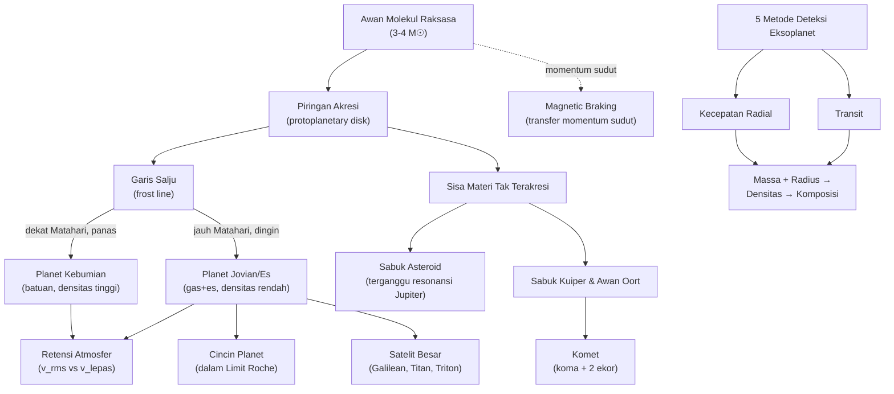

# BAB VII — TATASURYA

## Daftar Isi Bab Ini

1. [Presesi, Nutasi, Librasi](#1)
2. [Pembentukan dan Evolusi Tata Surya](#2)
3. [Struktur Orbit, Konfigurasi Planet, Periode Sinodis, Gerak Retrograde](#3)
4. [Survei Tata Surya: Kategori Planet dan Temperatur Kesetimbangan](#4)
5. [Planet Kebumian: Kerapatan, Interior, Proses Permukaan](#5)
6. [Planet Jovian dan Satelitnya](#6)
7. [Atmosfer Planet](#7)
8. [Benda Kecil Tata Surya](#8)
9. [Planet Luar-Surya (Eksoplanet)](#9)

---

<a name="1"></a>
## 1. Presesi, Nutasi, Librasi

### A. Konsep Inti

**Presesi** — Bumi tidak bulat sempurna (menggembung di ekuator akibat rotasi). Karena hampir semua anggota Tata Surya (terutama Bulan & Matahari) beredar dekat bidang ekliptika, mereka menarik tonjolan ekuator Bumi menghasilkan **torsi**. Karena Bumi berotasi (punya momentum sudut), torsi ini tidak mengubah kemiringan sumbu secara langsung, melainkan membuat sumbu **berputar mengelilingi kutub ekliptika** (seperti gasing yang goyah), membentuk kerucut penuh dalam $\approx26.000$ tahun — disebut **presesi**.

**Nutasi** — orbit Bulan sendiri miring terhadap ekliptika dan **berpresesi** dengan periode $18{,}6$ tahun, menghasilkan "goyangan kecil" tambahan pada presesi Bumi yang mulus — inilah nutasi (amplitudo hanya sepersekian arcmin).

**Librasi** — sudah dibahas di §V.6 (Bulan tampak menunjukkan $\approx59\%$ permukaannya meski rotasinya tersinkron terhadap Bumi).

```
[Sisipkan Diagram: Kerucut Presesi Sumbu Rotasi Bumi]
Deskripsi: Bola langit dengan kutub ekliptika di pusat/puncak.
Gambar sumbu rotasi Bumi saat ini mengarah ke dekat Polaris, lalu
lintasan melingkar (kerucut, radius sudut = obliquity ε≈23,5°)
yang akan dilalui kutub langit sepanjang siklus 26.000 tahun --
tandai titik posisi ~12.000 tahun mendatang dekat bintang Vega,
dan titik ~2000 SM dekat bintang Thuban (α Draconis).
```

### B. Rumus Penting

| Nama | Rumus | Keterangan |
|---|---|---|
| Laju presesi | $\approx50''/$tahun (bujur ekliptika bertambah) | Periode penuh $\approx26.000$ tahun |
| Perubahan deklinasi tahunan | $d\delta = n\cos\alpha$ | $n=d\lambda\sin\varepsilon\approx20{,}04''$/tahun (konstanta presesi) |
| Perubahan asensio rekta tahunan | $d\alpha = m+n\sin\alpha\tan\delta$ | $m=d\lambda\cos\varepsilon\approx3{,}07^s$/tahun |
| Periode presesi orbit Bulan (nodal) | $18{,}6$ tahun | Sumber nutasi |

### D. Intuisi dan Interpretasi

- Karena presesi terus-menerus menggeser posisi titik Aries (§II.2), **koordinat ekuatorial bintang berubah pelan seiring waktu** — inilah mengapa katalog bintang selalu mencantumkan **epoch** (mis. J2000.0) — koordinat $(\alpha,\delta)$ tanpa epoch tidak lengkap secara ilmiah.
- Bintang kutub berganti sepanjang sejarah manusia: $\sim2000$ SM Thuban (α Draconis), saat ini Polaris, $\sim12.000$ tahun mendatang akan mendekati Vega — siklus ini juga memengaruhi definisi "zodiak" (§II.3, pergeseran rasi zodiak astrologis vs astronomis).
- Presesi TIDAK mengubah kemiringan obliquity $\varepsilon$ secara signifikan (relatif konstan dalam presesi murni) — obliquity berubah lewat mekanisme terpisah (**nutasi** untuk variasi jangka pendek, **siklus Milanković** untuk variasi jangka sangat panjang $\sim41.000$ tahun, [Tambahan]).

### E. Contoh Soal OSN

**Soal:** Berapa lama waktu yang dibutuhkan titik Aries untuk bergeser $10°$ di sepanjang ekliptika akibat presesi (laju $50''$/tahun)?

**Penyelesaian:**
$$t = \frac{10°\times3600''/°}{50''/\text{tahun}} = \frac{36.000''}{50''/\text{tahun}}=720\text{ tahun}$$

---

<a name="2"></a>
## 2. Pembentukan dan Evolusi Tata Surya

### A. Konsep Inti

**Fakta kunci yang harus dijelaskan setiap teori kosmogoni yang serius:**
- Orbit planet hampir sebidang (koplanar) & hampir sejajar ekuator Matahari
- Orbit hampir lingkaran (eksentrisitas rendah)
- Semua planet mengorbit **searah** (berlawanan jarum jam dilihat dari kutub utara ekliptika), sama dengan arah rotasi Matahari
- Sebagian besar planet juga **berotasi** searah orbit (kecuali Venus & Uranus — retrograde)
- Planet memiliki **99% momentum sudut** total sistem tapi hanya **0,15% massa** total (Matahari sebaliknya: massa dominan, momentum sudut kecil) — **"masalah momentum sudut"** yang jadi tantangan utama teori pembentukan tata surya klasik.
- Perbedaan komposisi tajam planet kebumian (batuan/logam) vs planet Jovian (gas/es)

**Hipotesis Nebula (Kant 1755, Laplace 1796)** — Tata Surya terkondensasi dari awan gas raksasa berotasi. Model klasik ini awalnya **gagal menjelaskan distribusi momentum sudut** (mengapa massa didominasi Matahari tapi momentum sudut didominasi planet) — solusinya baru ditemukan di abad 20: **medan magnet & aliran gas dapat mentransfer momentum sudut secara efisien dari proto-Matahari ke piringan planet (magnetic braking)**, menyelesaikan tantangan klasik ini.

**Model modern (akresi bertahap):**
1. Awan molekul raksasa ($3$–$4\,M_\odot$) mulai runtuh gravitasi.
2. Bagian dalam berkondensasi lebih cepat → piringan gas-debu (*accretion disk*) mengelilingi proto-Matahari.
3. Partikel debu bertumbukan & menggumpal, mengendap ke satu bidang (bidang piringan).
4. Gumpalan membentuk **planetisimal** (ukuran meter hingga kilometer, mirip ukuran asteroid saat ini).
5. Planetisimal saling bertumbukan & bergabung (akresi) menjadi **protoplanet** seukuran planet.
6. Protoplanet cukup masif mulai mengumpulkan gas & debu sisa dari awan sekitarnya.
7. Angin Matahari kuat "meniup" sisa gas-debu keluar Tata Surya, mengakhiri fase pembentukan planet.

```
[Sisipkan Diagram: Tahapan Pembentukan Tata Surya (skema 7 panel)]
Deskripsi: Rangkaian 7 gambar berurutan: (a) awan gas besar berotasi
mulai runtuh, (b) bagian dalam terkondensasi jadi proto-Matahari
dengan piringan gas-debu di sekitarnya, (c) partikel debu bertumbukan
mengendap ke satu bidang datar, (d) partikel menggumpal jadi
planetisimal (ukuran asteroid), (e) planetisimal bergabung jadi
benda seukuran planet, (f) protoplanet mengumpulkan gas-debu sisa,
(g) angin Matahari meniup sisa gas, pembentukan planet selesai.
```

**Distribusi temperatur & "garis salju" (frost/snow line)** — piringan protoplanet punya gradien temperatur: dekat Matahari terlalu panas untuk es/gas menempel (hanya logam/batu mengembun, $T>1000$ K), lebih jauh cukup dingin untuk es mengembun ($T<160$ K) — inilah **penyebab fundamental** perbedaan komposisi planet kebumian (batuan, dekat Matahari) vs planet Jovian (gas+es, jauh dari Matahari, sekaligus cukup masif mengumpulkan gas hidrogen-helium melimpah sebelum angin Matahari meniupnya pergi).

**Hipotesis alternatif historis** (nilai sejarah/filosofis sains, [Tambahan konteks]): **teori tumbukan/pasang-surut** (Buffon, Jeans) — planet terbentuk dari materi yang "tercabik" dari Matahari akibat lintasan dekat bintang lain. Ditolak karena secara statistik sangat langka (perkiraan hanya beberapa kali kejadian di seluruh Galaksi selama umur alam semesta, dengan asumsi densitas bintang & kecepatan relatif tertentu) — bertentangan dengan observasi modern yang menunjukkan **sistem planet adalah hal umum** (§VII.9), bukan kejadian sangat langka.

### B. Rumus Penting

| Nama | Rumus | Keterangan |
|---|---|---|
| Temperatur kesetimbangan planet | $T = T_\odot\left(\dfrac{1-A}{4}\right)^{1/4}\left(\dfrac{R_\odot}{r}\right)^{1/2}$ | $A$: albedo Bond, $r$: jarak dari Matahari — diturunkan dari kesetimbangan energi masuk (diserap) = energi keluar (dipancarkan sbg benda hitam) |
| Hukum Titius-Bode (empiris, historis) | $a = 0{,}4+0{,}3\times2^n$ au, $n=-\infty,0,1,2,\dots$ | Cocok cukup baik untuk Merkurius–Uranus, GAGAL untuk Neptunus; nilai historis, bukan hukum fisis fundamental |
| Massa dari densitas piringan | $M=2\pi\displaystyle\int_{r_0}^{r_1}\rho(r)\,r\,dr$ | Estimasi massa minimum nebula matahari dari massa planet saat ini |

### C. Derivasi Singkat

**Temperatur kesetimbangan:** energi yang diserap planet (radius $R_p$, albedo $A$) dari Matahari $=(1-A)\times\pi R_p^2\times S_\odot(r)$ dengan $S_\odot(r)=L_\odot/4\pi r^2$ (§VI.5). Energi dipancarkan planet (sebagai benda hitam suhu $T$, luas permukaan $4\pi R_p^2$) $=4\pi R_p^2\sigma T^4$ (§I.7). Menyamakan (kesetimbangan energi):
$$(1-A)\pi R_p^2\frac{L_\odot}{4\pi r^2} = 4\pi R_p^2\sigma T^4$$
$$T^4 = \frac{(1-A)L_\odot}{16\pi\sigma r^2} = \frac{(1-A)}{4}\sigma T_\odot^4\frac{R_\odot^2}{r^2}\cdot\frac{1}{\sigma}$$
Menyederhanakan (memakai $L_\odot=4\pi R_\odot^2\sigma T_\odot^4$) menghasilkan rumus di atas.

### D. Intuisi dan Interpretasi

- Rumus temperatur kesetimbangan **sering TIDAK cocok** dengan temperatur aktual terukur planet — kasus ekstrem Venus (temperatur aktual $\sim735$ K jauh melebihi prediksi $\sim230$ K) akibat **efek rumah kaca** ($CO_2$ tebal menjebak radiasi inframerah) — pengingat penting bahwa model benda hitam sederhana mengabaikan atmosfer & panas internal.
- "Masalah momentum sudut" adalah contoh bagus bagaimana sains berkembang: fakta observasi (distribusi momentum sudut aneh) awalnya TIDAK terjelaskan model klasik, memaksa revisi teori (peran magnetic braking) — bukan berarti hipotesis nebula salah total, hanya perlu penyempurnaan mekanisme.

### E. Contoh Soal OSN

**Soal:** Hitung temperatur kesetimbangan Bumi (albedo $A=0{,}3$, jarak $1$ au) dan bandingkan dengan temperatur permukaan aktual ($\approx288$ K). Jelaskan penyebab selisihnya.

**Penyelesaian:**
$$T = 5778\times\left(\frac{1-0{,}3}{4}\right)^{1/4}\left(\frac{6{,}96\times10^8}{1{,}496\times10^{11}}\right)^{1/2}$$
$$=5778\times(0{,}175)^{1/4}\times(4{,}652\times10^{-3})^{1/2}=5778\times0{,}6468\times0{,}0682\approx255\text{ K}$$

Temperatur kesetimbangan ($255$ K $=-18°$C) jauh lebih rendah dari temperatur permukaan aktual ($288$ K $=15°$C) — selisih $\sim33$ K ini adalah **efek rumah kaca alami** Bumi (uap air, $CO_2$, metana menjebak sebagian radiasi inframerah yang seharusnya lolos ke angkasa) — tanpa efek ini, Bumi akan membeku total.

---

<a name="3"></a>
## 3. Struktur Orbit, Konfigurasi Planet, Periode Sinodis, Gerak Retrograde

### A. Konsep Inti

**Konfigurasi planet** — istilah posisi relatif planet terhadap Matahari & Bumi:

| Istilah | Berlaku untuk | Definisi |
|---|---|---|
| **Oposisi** | Planet superior (di luar orbit Bumi) | Bumi tepat di antara planet & Matahari (bujur planet-Matahari selisih $180°$) |
| **Konjungsi** | Planet superior | Planet di belakang Matahari (bujur sama) |
| **Konjungsi inferior** | Planet inferior (Merkurius, Venus) | Planet di antara Bumi & Matahari |
| **Konjungsi superior** | Planet inferior | Planet di belakang Matahari |
| **Elongasi maksimum** | Planet inferior | Sudut planet-Bumi-Matahari maksimum: $28°$ (Merkurius), $47°$ (Venus) |

```
[Sisipkan Diagram: Konfigurasi Planet — Oposisi, Konjungsi, Elongasi]
Deskripsi: Matahari di pusat. Bumi mengorbit di satu lingkaran.
Untuk PLANET SUPERIOR (mis. Mars, lingkaran orbit lebih besar dari
Bumi): tandai posisi "oposisi" (Bumi-Matahari-Mars segaris, Bumi
di tengah) dan "konjungsi" (Matahari di antara Bumi dan Mars).
Untuk PLANET INFERIOR (mis. Venus, lingkaran orbit lebih kecil dari
Bumi): tandai "konjungsi inferior" (Venus di antara Bumi-Matahari),
"konjungsi superior" (Matahari di antara Bumi-Venus), dan garis
singgung dari Bumi ke orbit Venus yang menunjukkan sudut elongasi
maksimum (~47°).
```

**Gerak retrograde** — planet superior, dilihat dari Bumi yang bergerak lebih cepat di orbit dalam, tampak "mundur" sesaat relatif bintang latar belakang saat mendekati oposisi (efek murni perspektif geometris — Bumi "menyalip" planet tersebut, analog mobil lebih cepat menyalip mobil lebih lambat di jalan tol membuat mobil lambat tampak "mundur" relatif latar belakang jauh).

### B. Rumus Penting

*(Rumus periode sinodis sudah diturunkan lengkap di §III.1 dan §IV.2 — di sini konteks aplikasinya untuk planet.)*

$$\frac{1}{P_{sinodis}} = \frac{1}{P_1}-\frac{1}{P_2}\quad(P_1<P_2,\text{ periode sideris masing-masing planet})$$

| Nama | Rumus | Keterangan |
|---|---|---|
| Elongasi maksimum planet inferior | $\sin\varepsilon_{max} = \dfrac{a_{planet}}{a_{Bumi}}$ | Dari geometri segitiga siku-siku Matahari-Bumi-planet saat garis pandang Bumi-planet menyinggung orbit planet |
| Sudut fase maksimum planet superior | Terkait geometri segitiga serupa | Mars: $41°$; Jupiter: $11°$; Neptunus: $2°$ (makin jauh planet, makin kecil rentang sudut fase teramati) |

### C. Derivasi Singkat

**Elongasi maksimum:** saat garis pandang Bumi-planet **menyinggung** (tangent) lingkaran orbit planet inferior, terbentuk segitiga siku-siku dengan sisi miring $=a_{Bumi}$ (jarak Matahari-Bumi) dan salah satu sisi $=a_{planet}$ (jarak Matahari-planet, radius orbit), sudut di Bumi $=\varepsilon_{max}$. Maka $\sin\varepsilon_{max}=a_{planet}/a_{Bumi}$ (definisi sinus segitiga siku-siku).

### E. Contoh Soal OSN

**Soal:** Hitung elongasi maksimum Venus ($a_{Venus}=0{,}723$ au) dan verifikasi kecocokan dengan nilai literatur ($47°$).

**Penyelesaian:**
$$\sin\varepsilon_{max} = \frac{0{,}723}{1} = 0{,}723 \Rightarrow \varepsilon_{max}=\arcsin(0{,}723)\approx46{,}3°$$
Konsisten dengan nilai literatur $\approx47°$ (selisih kecil akibat orbit tidak benar-benar lingkaran sempurna).

**Soal 2:** Periode sideris Mars $687$ hari. Berapa periode sinodisnya (interval antar-oposisi berturut-turut)?

**Penyelesaian:**
$$\frac1{P_{sin}}=\frac1{365{,}25}-\frac1{687}=0{,}002738-0{,}001456=0{,}001282$$
$$P_{sin}\approx780\text{ hari}\approx2{,}14\text{ tahun}$$

---

<a name="4"></a>
## 4. Survei Tata Surya: Kategori Planet

### A. Konsep Inti

Klasifikasi utama planet Tata Surya berdasarkan komposisi & struktur:

| Kategori | Anggota | Ciri Utama |
|---|---|---|
| **Planet kebumian (terrestrial)** | Merkurius, Venus, Bumi, Mars | Kecil, densitas tinggi ($\sim4$–$5{,}5$ g/cm³), permukaan padat batuan, sedikit/tanpa cincin & satelit, dekat Matahari |
| **Planet Jovian/raksasa gas** | Jupiter, Saturnus | Besar, densitas rendah ($\sim0{,}7$–$1{,}3$ g/cm³), dominan H/He, banyak satelit, punya cincin |
| **Raksasa es (ice giant)** | Uranus, Neptunus | Mirip Jovian tapi proporsi es (air, amonia, metana) lebih tinggi dari H/He |
| **Planet kerdil** [Tambahan, IAU 2006] | Pluto, Ceres, Eris, dll. | Cukup masif untuk bulat (kesetimbangan hidrostatik) TAPI belum "membersihkan" lingkungan orbitnya dari benda lain |

**Definisi resmi "planet" (IAU 2006)** $[\text{Tambahan}]$ — tiga syarat: (1) mengorbit Matahari, (2) massa cukup besar hingga bentuknya mendekati bola (kesetimbangan hidrostatik), (3) telah "membersihkan lingkungan" di sekitar orbitnya dari benda-benda lain. Pluto gagal syarat (3) → direklasifikasi jadi **planet kerdil** — keputusan yang masih kontroversial di kalangan sebagian astronom hingga kini.

### D. Intuisi dan Interpretasi

Batas tajam kebumian vs Jovian bukan kebetulan — langsung konsekuensi **garis salju** (§VII.2): planet kebumian terbentuk di zona terlalu panas untuk mengikat gas ringan (H, He) & es secara signifikan, sementara planet Jovian terbentuk cukup jauh untuk mengumpulkan es DAN cukup masif (inti es-batuan besar) untuk menarik gravitasi gas hidrogen-helium melimpah sebelum angin Matahari meniupnya pergi.

---

<a name="5"></a>
## 5. Planet Kebumian: Kerapatan, Interior, Proses Permukaan

### A. Konsep Inti

Struktur interior planet kebumian umumnya berlapis (**diferensiasi**, §VII.2): **inti** (logam besi-nikel, padat/cair tergantung planet), **mantel** (silikat), **kerak** (silikat lebih ringan, terluar) — hasil pemisahan gravitasi materi berat (tenggelam) dari materi ringan (mengapung) saat planet masih (sebagian) meleleh akibat panas akresi & peluruhan radioaktif (§I.4).

**Proses permukaan yang membentuk topografi:**
- **Kawah tumbukan (impact cratering)** — universal di semua benda permukaan padat tanpa atmosfer tebal/aktivitas geologis aktif (Bulan, Merkurius) — usia permukaan bisa diperkirakan dari **kepadatan kawah** (makin padat kawah, makin tua permukaan, makin sedikit proses "meremajakan" permukaan sejak itu).
- **Vulkanisme** — aktivitas gunung berapi meremajakan permukaan (Bumi, Venus, historis Mars).
- **Tektonik** — pergerakan lempeng kerak (SIGNIFIKAN hanya di Bumi di antara planet kebumian — salah satu keunikan Bumi).
- **Erosi** (angin, air) — signifikan di Bumi & (historis) Mars.

### D. Intuisi dan Interpretasi

- **Densitas rata-rata** memberi petunjuk komposisi interior tanpa perlu observasi langsung: densitas Bumi ($5514$ kg/m³) jauh lebih tinggi dari densitas rata-rata batuan permukaan ($\sim3000$ kg/m³) — mengindikasikan **inti logam padat** menyumbang densitas ekstra.
- Permukaan Merkurius & Bulan (dipenuhi kawah, minim vulkanisme baru) menunjukkan aktivitas geologis "beku" sejak miliaran tahun lalu — kontras Bumi & Venus yang masih aktif (permukaan relatif "muda").

---

<a name="6"></a>
## 6. Planet Jovian dan Satelitnya

### A. Konsep Inti — Ringkasan Data Kunci

| Planet | Radius ($R_\oplus$) | Massa ($M_\oplus$) | Densitas (g/cm³) | Ciri Khas |
|---|---|---|---|---|
| **Jupiter** | $11{,}2$ | $318$ | $1{,}33$ | Great Red Spot (badai antisiklonik raksasa, berlangsung $>300$ tahun); medan magnet terkuat di Tata Surya; $\geq95$ satelit dikenal (4 satelit Galilean terbesar: Io, Europa, Ganymede, Callisto); cincin tipis-samar |
| **Saturnus** | $9{,}4$ | $95$ | $0{,}69$ (**lebih ringan dari air!**) | Sistem cincin paling spektakuler (lebar $>60.000$ km, tebal hanya puluhan meter); satelit terbesar Titan (satu-satunya satelit dengan atmosfer tebal signifikan di Tata Surya) |
| **Uranus** | $4{,}0$ | $14{,}5$ | $1{,}27$ | Sumbu rotasi miring ekstrem ($98°$, hampir "berguling" mengorbit); cincin gelap tipis; komposisi es (air, amonia, metana) dominan dibanding H/He |
| **Neptunus** | $3{,}9$ | $17{,}1$ | $1{,}64$ | Angin terkencang Tata Surya (hingga $2100$ km/jam); satelit terbesar Triton beredar **retrograde** (mengindikasikan Triton kemungkinan tertangkap gravitasi, bukan terbentuk bersama Neptunus — mirip Sabuk Kuiper) |

**Cincin planet** — terdiri dari partikel es/batuan kecil, berada di dalam/dekat Limit Roche (§IV.3) planet induknya — konsisten dengan penjelasan klasik Roche (1848) bahwa materi di sana tidak bisa terkumpul jadi satelit besar akibat gaya pasang-surut.

**Satelit Galilean Jupiter** (ditemukan Galileo 1610, bukti kunci mendukung heliosentrisme — bukan semua benda mengorbit Bumi):
- **Io** — bulan tergunungapi paling aktif di Tata Surya (dipanaskan gesekan pasang-surut akibat resonansi orbit dengan Europa & Ganymede).
- **Europa** — permukaan es dengan indikasi kuat lautan air cair di bawahnya (dipanaskan pasang-surut) — target utama pencarian kehidupan mikroba ekstraterestrial.
- **Ganymede** — satelit terbesar di Tata Surya (lebih besar dari Merkurius), satu-satunya satelit dengan medan magnet sendiri.
- **Callisto** — permukaan paling terkawah (paling "tua"/tidak aktif geologis) di antara keempatnya.

### D. Intuisi dan Interpretasi

- Densitas Saturnus ($0{,}69$ g/cm³) **lebih rendah dari air** — sering dipakai sebagai fakta menarik ("Saturnus akan mengapung jika ada bak air cukup besar") untuk mengilustrasikan betapa dominannya komposisi hidrogen-helium ringan.
- Resonansi orbit satelit Galilean (Io:Europa:Ganymede $\approx1{:}2{:}4$ dalam periode orbit — **resonansi Laplace**) menjaga eksentrisitas orbit Io tetap tidak nol meski gaya pasang-surut seharusnya mensirkularkan orbitnya — inilah sumber energi pemanasan pasang-surut yang membuat Io tergunungapi ekstrem.
- Kemiringan ekstrem Uranus ($98°$) diduga akibat tumbukan raksasa di masa pembentukan awal — pengingat bahwa tumbukan besar bisa mengubah total orientasi rotasi sebuah planet.

---

<a name="7"></a>
## 7. Atmosfer Planet

### A. Konsep Inti

**Syarat retensi atmosfer** — planet mempertahankan gas atmosfernya jika kecepatan termal rata-rata molekul gas jauh lebih kecil dari **kecepatan lepas** planet (§IV.4): aturan praktis $v_{rms}<0{,}2\,v_e$ untuk retensi jangka panjang miliaran tahun.

$$v_{rms}=\sqrt{\frac{3k_BT}{m}}$$

Molekul lebih ringan (H₂, He) bergerak lebih cepat pada temperatur sama → lebih mudah lolos → inilah mengapa planet kebumian kecil (gravitasi lemah, $v_e$ kecil) kehilangan hidrogen-helium primordial mereka, sementara Jupiter-Saturnus (masif, $v_e$ besar, & jauh dari Matahari/dingin) berhasil mempertahankannya.

### D. Intuisi dan Interpretasi

Kombinasi $v_e$ (massa & radius planet) dan $T$ (jarak dari Matahari) menentukan komposisi atmosfer akhir — inilah **satu benang merah** yang menjelaskan sekaligus: mengapa Merkurius nyaris tanpa atmosfer (kecil + panas), mengapa Bumi mempertahankan N₂/O₂ tapi bukan H₂/He primordial, dan mengapa Jupiter-Saturnus tetap didominasi H/He hingga sekarang.

---

<a name="8"></a>
## 8. Benda Kecil Tata Surya

### A. Konsep Inti

- **Asteroid** — terkonsentrasi di **sabuk asteroid utama** (antara Mars-Jupiter, $\sim2$–$3{,}5$ au) — gagal membentuk planet akibat gangguan gravitasi kuat Jupiter (resonansi orbit mencegah akresi planetisimal jadi planet penuh, malah justru mengeksitasi/mengeluarkan materi — **Kirkwood gaps**, celah pada distribusi sumbu semi-mayor asteroid tepat pada resonansi sederhana dengan periode Jupiter).
- **Komet** — benda es-debu ("bola salju kotor") dari daerah dingin luar Tata Surya (**Sabuk Kuiper**, $30$–$50$ au; **Awan Oort**, ribuan-puluhan ribu au, sumber komet periode panjang) — mendekat Matahari menguapkan es membentuk **koma** (atmosfer gas-debu sementara) dan **dua jenis ekor**: ekor debu (melengkung, didorong tekanan radiasi, §VI.8) dan ekor ion/plasma (lurus, didorong angin Matahari, selalu menjauhi Matahari).
- **Meteoroid, meteor, meteorit** — istilah bertingkat: **meteoroid** = benda kecil di ruang angkasa; **meteor** = kilatan cahaya saat meteoroid terbakar masuk atmosfer ("bintang jatuh"); **meteorit** = sisa material yang benar-benar mencapai permukaan Bumi.
- **Trans-Neptunian Objects (TNO)** [Tambahan] — termasuk Pluto, Eris, dan populasi Sabuk Kuiper lainnya.

### D. Intuisi dan Interpretasi

- Distribusi massa Tata Surya sangat timpang: Matahari $99{,}80\%$, Jupiter $0{,}10\%$, komet $0{,}05\%$, planet lain $0{,}04\%$, sisanya (bulan, cincin, asteroid, debu) totalnya jauh $<0{,}01\%$ — angka ini berguna dihafal sebagai sanity-check cepat untuk soal estimasi.
- Meteoroid dari komet yang sama, tersebar sepanjang orbit komet, adalah sumber **hujan meteor periodik** (§V.1) — inilah mengapa hujan meteor tertentu (mis. Perseid, Leonid) muncul pada tanggal yang hampir sama setiap tahun, terkait dengan kapan Bumi melintasi lintasan orbit komet induknya.

---

<a name="9"></a>
## 9. Planet Luar-Surya (Eksoplanet)

### A. Konsep Inti

Eksoplanet pertama yang dikonfirmasi (1992) justru mengorbit **pulsar** (PSR B1257+12, sisa evolusi bintang, situasi tak terduga karena planet "seharusnya" hancur dalam proses supernova pembentuk pulsar — diduga planet generasi kedua terbentuk dari materi sisa ledakan). Eksoplanet pertama mengorbit bintang normal ditemukan 1995 (51 Pegasi b / β Pictoris — catatan: beberapa sumber merujuk 51 Pegasi b sebagai penemuan formal pertama).

**Lima metode deteksi eksoplanet utama:**

| Metode | Prinsip | Bias Deteksi |
|---|---|---|
| **Astrometri** | Mengukur pergeseran posisi bintang akibat barycenter sistem bintang-planet (§IV.3) | Tidak bergantung sudut inklinasi orbit, tapi presisi sangat sulit dicapai |
| **Kecepatan radial (Doppler)** | Goyangan kecepatan radial bintang akibat tarikan gravitasi planet, terdeteksi lewat pergeseran Doppler garis spektrum (§I.1) | Bias ke planet **masif** & orbit **dekat** (goyangan lebih besar); tidak bekerja jika orbit tegak lurus garis pandang |
| **Transit** | Peredupan periodik kecil saat planet lewat di depan bintang (mirip gerhana Matahari sebagian, §V.2) | Hanya bekerja jika orbit hampir sejajar garis pandang; misi Kepler (2009) menemukan >1000 planet lewat metode ini |
| **Microlensing gravitasi** | Bintang latar tampak sedikit lebih terang saat bintang planet lewat di depannya (lensa gravitasi, akan dibahas Bab XI); planet menambah efek penguatan | Kejadian sekali & singkat, sulit diulang untuk konfirmasi |
| **Pencitraan langsung (direct imaging)** | Memotret langsung planet (sangat sulit — cahaya planet tenggelam oleh silau bintang induk) | Bias kuat ke planet **sangat masif** & **jauh** dari bintang induknya |

### B. Rumus Penting

| Nama | Rumus | Keterangan |
|---|---|---|
| Kedalaman transit | $\Delta F/F = (R_p/R_*)^2$ | Fraksi cahaya bintang yang terhalang, langsung memberi rasio radius planet-bintang |
| Amplitudo kecepatan radial (aproksimasi, orbit sirkular, $i=90°$) | $K = \left(\dfrac{2\pi G}{P}\right)^{1/3}\dfrac{m_p\sin i}{(m_*+m_p)^{2/3}}$ | $K$: amplitudo kecepatan radial bintang, $P$: periode orbit |
| Massa minimum dari RV | $m_p\sin i$ | Metode Doppler HANYA memberi batas bawah massa (kecuali $i$ diketahui dari metode lain, mis. transit) |

### D. Intuisi dan Interpretasi

- Statistical bias adalah tema sentral astronomi eksoplanet: mayoritas eksoplanet yang ditemukan awal adalah **"hot Jupiter"** (planet masif, orbit sangat dekat bintang) BUKAN karena itu jenis planet paling umum di alam semesta, melainkan karena metode deteksi (RV & transit) **paling sensitif** justru pada kombinasi massa besar + orbit dekat (sinyal lebih kuat & periode lebih pendek, lebih cepat dikonfirmasi lewat pengulangan).
- Kombinasi metode **transit + kecepatan radial** pada planet yang sama memungkinkan penentuan **massa DAN radius** sekaligus → dari situ bisa dihitung **densitas** planet → memberi petunjuk komposisi (batuan vs gas) tanpa perlu mengunjungi planet tersebut sama sekali — salah satu contoh terbaik kekuatan astrofisika inferensial.
- Penemuan eksoplanet massal (>2000 dalam dua dekade terakhir data buku, dan terus bertambah pesat) mengonfirmasi bahwa pembentukan sistem planet adalah **proses normal** dalam evolusi bintang, bukan kejadian unik/langka — mendukung penolakan teori tumbukan bintang klasik (§VII.2) dan memvalidasi model akresi piringan modern.

### E. Contoh Soal OSN

**Soal:** Sebuah planet transit menyebabkan peredupan bintang induknya sebesar $1\%$. Jika radius bintang $=1{,}2\,R_\odot$, berapa radius planet (dalam $R_\oplus$)?

**Penyelesaian:**
$$\frac{\Delta F}{F}=\left(\frac{R_p}{R_*}\right)^2=0{,}01 \Rightarrow \frac{R_p}{R_*}=0{,}1$$
$$R_p = 0{,}1\times1{,}2\,R_\odot = 0{,}12\,R_\odot$$
Konversi ke radius Bumi ($R_\odot\approx109\,R_\oplus$):
$$R_p \approx0{,}12\times109\approx13\,R_\oplus$$
Ini sesuai kisaran radius planet mirip Jupiter/Saturnus (bukan planet kebumian) — konsisten dengan bias deteksi metode transit ke arah planet besar.

---

## Daftar Rumus Ringkas — Bab VII Tatasurya

**Presesi**
- Laju $\approx50''$/tahun; periode $\approx26.000$ tahun

**Pembentukan & Temperatur**
- $T=T_\odot\left[\dfrac{(1-A)}{4}\right]^{1/4}\sqrt{R_\odot/r}$
- Titius-Bode: $a=0{,}4+0{,}3\times2^n$ au (empiris, historis)

**Konfigurasi & Periode**
- $1/P_{sin}=1/P_1-1/P_2$
- $\sin\varepsilon_{max}=a_{planet}/a_{Bumi}$ (planet inferior)

**Atmosfer**
- Retensi atmosfer: $v_{rms}<0{,}2\,v_e$; $v_{rms}=\sqrt{3k_BT/m}$

**Eksoplanet**
- Transit: $\Delta F/F=(R_p/R_*)^2$
- RV: $K\propto m_p\sin i\,/(m_*+m_p)^{2/3}\,P^{-1/3}$

---

## Peta Konsep Bab VII



---

## Topik Paling Sering Muncul di OSN (Bab VII)

1. **Konfigurasi planet & periode sinodis** — sangat sering, terutama soal cerita "kapan planet X terlihat lagi"
2. **Temperatur kesetimbangan planet** — sering dikombinasi konsep efek rumah kaca (Venus vs Bumi)
3. **Retensi atmosfer** (kecepatan lepas vs kecepatan termal) — konseptual dan kuantitatif
4. **Metode deteksi eksoplanet** (terutama transit & RV, termasuk perhitungan kedalaman transit/amplitudo RV)
5. **Klasifikasi planet kebumian vs Jovian** dan alasan fisisnya (garis salju)
6. Presesi — terutama perhitungan waktu/sudut pergeseran

---

*Selanjutnya: Bab VIII — Bintang (unit jarak, magnitudo, luminositas-temperatur, struktur bintang, nukleosintesis, evolusi bintang, diagram H-R detail). Balas "lanjut" untuk melanjutkan ke Part 7.*
