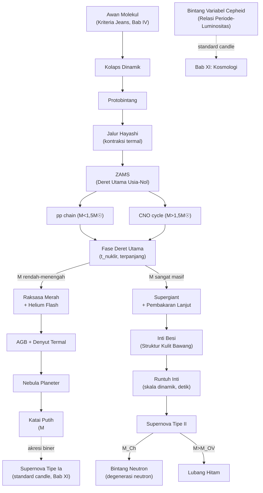

# BAB VIII — BINTANG

> **Catatan:** Magnitudo, hukum benda hitam, dan diagram H-R dasar sudah dibahas mendalam di Bab I (§I.3, §I.6, §I.7); di sini cross-reference singkat dan fokus pada materi baru: jarak bintang (paralaks), massa & radius bintang, bintang variabel, struktur bintang detail (nukleosintesis, skala waktu evolusi), dan seluruh siklus hidup bintang dari lahir hingga mati.

---

## Daftar Isi Bab Ini

1. [Satuan Jarak Bintang: Paralaks, Tahun Cahaya, Parsek](#1)
2. [Magnitudo, Warna, Luminositas (Cross-Reference Bab I)](#2)
3. [Penentuan Radius dan Massa Bintang](#3)
4. [Bintang Variabel dan Fisika Pulsasi](#4)
5. [Struktur Bintang: Kesetimbangan, Transportasi Energi, Syarat Batas](#5)
6. [Nukleosintesis Bintang](#6)
7. [Pembentukan Bintang dan Evolusi Pra-Deret Utama](#7)
8. [Evolusi Pasca-Deret Utama](#8)
9. [Keadaan Akhir Bintang: Katai Putih, Bintang Neutron, Lubang Hitam, Supernova](#9)

---

<a name="1"></a>
## 1. Satuan Jarak Bintang: Paralaks, Tahun Cahaya, Parsek

### A. Konsep Inti

**Paralaks trigonometri (paralaks tahunan, $\pi$)** — metode PALING FUNDAMENTAL mengukur jarak bintang: akibat gerak Bumi mengelilingi Matahari, bintang terdekat tampak "bergoyang" kecil relatif bintang latar sangat jauh sepanjang tahun, membentuk elips kecil (atau lingkaran/garis, tergantung posisi bintang relatif kutub ekliptika). **Paralaks** $\pi$ didefinisikan sebagai sudut yang disubtensikan radius orbit Bumi (1 au) dilihat dari bintang tersebut.

**Parsek (pc)** — didefinisikan tepat sebagai jarak di mana 1 au menyubtensikan sudut $1''$ (satu detik busur). Ini definisi yang **elegan secara langsung terhubung dengan pengukuran** — beda dengan tahun cahaya yang lebih intuitif tapi kurang praktis untuk observasi.

### B. Rumus Penting

| Nama | Rumus | Keterangan |
|---|---|---|
| **Jarak dari paralaks** | $r = 1/\pi$ | $r$ dalam pc, $\pi$ dalam arcsec — rumus paling sering dipakai di OSN |
| Konversi satuan | $1\text{ pc} = 206.265\text{ au} = 3{,}086\times10^{16}\text{ m} = 3{,}26\text{ tahun cahaya}$ | |
| 1 tahun cahaya | $9{,}46\times10^{15}$ m | Jarak tempuh cahaya dalam 1 tahun Julian |
| **Gerak diri (proper motion)** | $\mu = \sqrt{\mu_\alpha^2\cos^2\delta+\mu_\delta^2}$ | Komponen gerak tegak lurus garis pandang, arcsec/tahun |
| **Kecepatan tangensial** | $v_t = 4{,}74\,\mu\,r$ | $[v_t]=$km/s, $[\mu]=''/$tahun, $[r]=$pc |
| Kecepatan total | $v=\sqrt{v_r^2+v_t^2}$ | $v_r$ dari Doppler (§I.1), $v_t$ dari gerak diri + jarak |

### C. Derivasi Singkat

**$r=1/\pi$:** dari definisi parsek langsung — jika 1 au menyubtensikan $1''$ pada jarak 1 pc, maka pada jarak $r$ pc, sudut yang disubtensikan (untuk baseline sama 1 au) berbanding terbalik dengan jarak (geometri sudut kecil, $\theta\approx$ baseline/jarak): $\pi(''\text{)}\times r(\text{pc}) = 1\times1$, sehingga $r=1/\pi$.

**Kecepatan tangensial:** $v_t = \mu\times r$ (busur = sudut × jari-jari, untuk sudut kecil), lalu konversi satuan ($\mu$ dalam $''$/tahun → radian/tahun via $1\text{ rad}=206.265''$; $r$ dalam pc → km via $1\text{ pc}=3{,}086\times10^{13}$ km; tahun → detik via $1\text{ tahun}=3{,}156\times10^7$ s) menghasilkan faktor gabungan $\approx4{,}74$.

### D. Intuisi dan Interpretasi

- Paralaks adalah **satu-satunya** metode penentuan jarak bintang yang **murni geometris**, tidak bergantung asumsi model bintang apa pun — menjadikannya **fondasi** seluruh "tangga jarak kosmik" (*cosmic distance ladder*) yang dipakai untuk kalibrasi metode jarak lain yang lebih jauh jangkauannya (mis. modulus jarak lewat *standard candle*, Bab XI).
- Karena $r=1/\pi$, presisi pengukuran paralaks membatasi jangkauan metode ini — bintang terdekat (Proxima Centauri, $\pi=0{,}762''$) berjarak $1{,}31$ pc; untuk bintang jauh, $\pi$ jadi sangat kecil dan sulit diukur akurat dari Bumi (sebelum misi satelit astrometri seperti Hipparcos/Gaia, keterbatasan resolusi membatasi jangkauan paralaks hanya hingga ratusan pc).
- Bintang dengan gerak diri terbesar (Bintang Barnard, $10{,}3''$/tahun) menunjukkan bahwa gerak diri besar biasanya menandakan bintang **relatif dekat** (meski gerak diri juga bergantung kecepatan tangensial aktual bintang, bukan hanya jarak).

### E. Contoh Soal OSN

**Soal:** Bintang 61 Cygni memiliki paralaks $\pi=0{,}3''$ dan gerak diri total $\mu=5{,}2''$/tahun. Hitung (a) jaraknya dalam pc dan tahun cahaya, (b) kecepatan tangensialnya.

**Penyelesaian (a):**
$$r = 1/\pi = 1/0{,}3 = 3{,}33\text{ pc} = 3{,}33\times3{,}26\approx10{,}9\text{ tahun cahaya}$$

**Penyelesaian (b):**
$$v_t = 4{,}74\times\mu\times r = 4{,}74\times5{,}2\times3{,}33\approx82{,}1\text{ km/s}$$

---

<a name="2"></a>
## 2. Magnitudo, Warna, Luminositas — Cross-Reference

*(Sudah dibahas lengkap di Bab I: skala magnitudo Pogson §I.3, modulus jarak §I.3, indeks warna & kelas spektrum §I.7, diagram H-R §I.6. Bagian ini murni pengingat aplikasi konteks Bab VIII.)*

**Rentang nilai kunci untuk bintang** (dari observasi, hafalan berguna):
- Temperatur efektif: $2000$–$40.000$ K
- Luminositas: $10^{-4}$–$10^6\,L_\odot$
- Radius: $\sim0{,}01\,R_\odot$ (katai putih) hingga ribuan $R_\odot$ (maharaksasa)
- Densitas rata-rata: $\sim10^{-4}$ kg/m³ (raksasa, sangat renggang) hingga $\sim10^9$ kg/m³ (katai putih, sangat padat)

---

<a name="3"></a>
## 3. Penentuan Radius dan Massa Bintang

### A. Konsep Inti

**Radius** ditentukan lewat beberapa cara:
1. **Interferometri langsung** (mengukur diameter sudut) — hanya untuk beberapa lusin bintang terdekat/terbesar.
2. **Bintang biner gerhana** (*eclipsing binary*) — dari durasi gerhana & kecepatan orbit (§IX).
3. **Tidak langsung** dari $L=4\pi R^2\sigma T_{eff}^4$ (§I.6) — metode paling umum, hanya butuh luminositas & temperatur efektif.

**Massa** — HANYA bisa ditentukan **secara langsung dan akurat** lewat **sistem bintang biner** (Hukum Kepler III bentuk Newton, §IV.2, detail penuh di Bab IX) — bintang tunggal TIDAK punya cara langsung mengukur massa. Untuk bintang tunggal, massa diestimasi lewat **relasi massa-luminositas** (kalibrasi empiris dari bintang biner).

### B. Rumus Penting

| Nama | Rumus | Keterangan |
|---|---|---|
| Garis radius konstan di diagram H-R | (§I.6) $R/R_\odot = \sqrt{(L/L_\odot)}/(T/T_\odot)^2$ | Berguna membaca radius langsung dari posisi di diagram H-R |
| **Relasi massa-luminositas** | $L\propto M^\alpha$, $\alpha\approx3{,}5$ (rentang $3$–$4$ tergantung rentang massa) | Empiris, dikalibrasi dari bintang biner, HANYA valid untuk bintang **deret utama** |
| Diameter sudut → radius (jika jarak diketahui) | $R = \theta\,d/2$ | $\theta$: diameter sudut (radian), $d$: jarak |

### D. Intuisi dan Interpretasi

- Relasi massa-luminositas dengan eksponen $\alpha\approx3{,}5$ (bukan linear!) menjelaskan mengapa bintang masif **membakar bahan bakarnya jauh lebih boros** meski punya cadangan bahan bakar lebih banyak — konsekuensi langsung: **umur bintang berbanding terbalik dengan pangkat tinggi massanya** ($t\propto M/L\propto M^{1-\alpha}\propto M^{-2{,}5}$ perkiraan kasar) — bintang masif hidup **jauh lebih singkat** meski "lebih besar", bukan lebih lama (lihat §VIII.7, Tabel skala waktu).
- Relasi ini **HANYA berlaku deret utama** — sekali bintang meninggalkan deret utama (raksasa, katai putih, dst.), hubungan $L$-$M$ berubah drastis karena struktur internal & sumber energi sudah berbeda.

### E. Contoh Soal OSN

**Soal:** Sebuah bintang deret utama memiliki massa $4\,M_\odot$. Perkirakan luminositasnya (dalam $L_\odot$) memakai relasi massa-luminositas dengan $\alpha=3{,}5$, dan estimasi kasar umur deret utamanya relatif Matahari (asumsi $t_\odot\approx10^{10}$ tahun).

**Penyelesaian:**
$$L/L_\odot = (M/M_\odot)^{3{,}5} = 4^{3{,}5}\approx128$$
$$\frac{t}{t_\odot} \approx \frac{M/L}{M_\odot/L_\odot} = \frac{4}{128}\approx0{,}03125 \Rightarrow t\approx0{,}03\times10^{10}=3\times10^8\text{ tahun}$$

Bintang $4\,M_\odot$ hanya berumur $\sim300$ juta tahun di deret utama — jauh lebih singkat dari Matahari ($\sim10$ miliar tahun) meski massanya "hanya" 4× lebih besar — ilustrasi tajam kekuatan skala pangkat $3{,}5$.

---

<a name="4"></a>
## 4. Bintang Variabel dan Fisika Pulsasi

### A. Konsep Inti

**Bintang variabel** — bintang dengan kecerlangan berubah terhadap waktu. Secara ketat, SEMUA bintang bervariasi (berevolusi), tapi istilah ini biasanya untuk variasi yang **teramati dalam skala waktu manusia** (detik hingga tahun). Kategori utama:
- **Variabel ekstrinsik** — variasi akibat faktor eksternal/geometris: bintang biner gerhana (Bab IX), bintang berbintik (rotasi memutar area terang/gelap ke arah pengamat).
- **Variabel intrinsik (pulsasi)** — bintang benar-benar berubah ukuran & luminositas secara periodik, akibat ketidakstabilan struktur internal.

**Bintang variabel Cepheid** — kelas pulsasi paling penting secara astronomis: hubungan **periode-luminositas** ketat memungkinkan Cepheid dipakai sebagai **standard candle** (penentu jarak galaksi jauh, lihat Bab X-XI) — makin panjang periode pulsasi, makin tinggi luminositas intrinsiknya, hubungan yang ditemukan Henrietta Leavitt (1908).

**Mekanisme pulsasi (mekanisme katup-$\kappa$, *kappa mechanism*)** $[\text{Tambahan, standar astrofisika}]$ — di lapisan tertentu (zona ionisasi parsial helium), opasitas ($\kappa$) justru **meningkat** saat gas terkompresi (berlawanan perilaku "normal" opasitas yang biasanya menurun saat gas memanas) — menciptakan katup termodinamika alami: kompresi → opasitas naik → energi tertahan → tekanan naik → gas mengembang lagi → siklus berulang → osilasi self-sustained (tidak teredam).

### B. Rumus Penting

| Nama | Rumus | Keterangan |
|---|---|---|
| Relasi Periode-Luminositas Cepheid (bentuk umum) | $M_V = -2{,}81\log_{10}P - 1{,}43$ (aproksimasi umum, kalibrasi bervariasi antar sumber) | $P$: periode pulsasi dalam hari |
| Hubungan periode-densitas (Q-relasi pulsasi) | $P\sqrt{\bar\rho/\bar\rho_\odot} \approx \text{konstan}$ | Periode pulsasi berbanding terbalik akar densitas rata-rata bintang |

### D. Intuisi dan Interpretasi

- Relasi periode-densitas menjelaskan MENGAPA relasi periode-luminositas Cepheid berfungsi: bintang lebih masif & lebih terang cenderung punya densitas rata-rata lebih rendah (radius lebih besar relatif massa) → periode pulsasi lebih panjang — inilah jembatan fisis yang menghubungkan "yang mudah diukur" (periode, dari kurva cahaya) dengan "yang diinginkan" (luminositas intrinsik, untuk menghitung jarak lewat modulus jarak §I.3).
- Karena Cepheid adalah bintang **terang** (raksasa/maharaksasa, terlihat hingga jarak sangat jauh), metode ini bisa dipakai mengukur jarak galaksi lain — perpanjangan langsung "tangga jarak kosmik" melampaui jangkauan paralaks (§VIII.1).

---

<a name="5"></a>
## 5. Struktur Bintang: Kesetimbangan, Transportasi Energi, Syarat Batas

### A. Konsep Inti (Rangkuman + Perluasan dari §I.5)

Empat/lima persamaan struktur bintang (§I.5) — kesetimbangan hidrostatik, konservasi massa, konservasi energi (luminositas), transpor energi — membutuhkan **syarat batas (boundary conditions)** untuk diselesaikan menjadi model bintang lengkap:
- Di pusat ($r=0$): $m(0)=0$, $L(0)=0$ (tidak ada massa/luminositas "negatif" di dalam pusat).
- Di permukaan ($r=R$): $P\to0$, $T\to T_{eff}$ (menyambung ke kondisi atmosfer, §VIII terkait spektrum bintang, Bab I).

**Tiga skala waktu evolusi bintang** — konsep krusial untuk memahami PROSES mana yang mendominasi di tahap evolusi berbeda:

| Skala Waktu | Definisi | Rumus (estimasi) | Nilai untuk Matahari |
|---|---|---|---|
| **Dinamik ($t_d$)** | Waktu jatuh bebas jika tekanan tiba-tiba hilang | $t_d\approx\sqrt{R^3/GM}$ | $\sim0{,}5$ jam |
| **Termal/Kelvin-Helmholtz ($t_t$)** | Waktu radiasi menghabiskan energi termal (energi potensial gravitasi) tanpa sumber nuklir | $t_t\approx\dfrac{0{,}5\,GM^2/R}{L} \approx\dfrac{(M/M_\odot)^2}{(R/R_\odot)(L/L_\odot)}\times2\times10^7\text{ tahun}$ | $\sim2\times10^7$ tahun |
| **Nuklir ($t_n$)** | Waktu menghabiskan seluruh bahan bakar fusi yang tersedia | Terkait fraksi massa yang bisa difusi ($\sim10\%$ massa H total menjadi He) | $\sim10^{10}$ tahun (Matahari) |

**Urutan normal:** $t_d \ll t_t \ll t_n$ — inilah yang membenarkan pendekatan **kesetimbangan kuasi-statik** dalam model struktur bintang deret utama (perubahan struktur jauh lebih lambat dari waktu untuk "menyeimbangkan diri" secara dinamik/termal).

### C. Derivasi Singkat

**Skala waktu dinamik** diturunkan dari Kepler III (§IV.2) untuk orbit "jatuh" dengan sumbu semi-mayor $\approx R/2$ (jarak jatuh dari permukaan ke pusat):
$$t_d \approx \frac{1}{2}\times2\pi\sqrt{\frac{(R/2)^3}{GM}} \approx\sqrt{\frac{R^3}{GM}}$$

**Skala waktu termal** dari Teorema Virial (§IV.4/9): energi kinetik termal $\approx\tfrac12$ energi potensial gravitasi $|U|\approx GM^2/R$; waktu untuk meradiasikan energi ini dengan laju $L$ adalah $t_t\approx\frac{0{,}5\,GM^2/R}{L}$.

### D. Intuisi dan Interpretasi

- Skala waktu termal Matahari ($\sim2\times10^7$ tahun) secara historis pernah dipakai (abad 19, sebelum fusi nuklir dipahami) sebagai **estimasi usia Matahari** (hipotesis kontraksi Kelvin-Helmholtz) — hasilnya jauh lebih pendek dari usia geologis Bumi yang sudah diketahui saat itu (miliaran tahun dari bukti geologi) — kontradiksi ini menjadi salah satu petunjuk penting bahwa **harus ada sumber energi lain** (fusi nuklir) yang jauh lebih tahan lama, akhirnya dipahami penuh di abad 20.
- Selama fase **evolusi menuju deret utama (pra-deret utama, §VIII.7)**, bintang berkontraksi pada skala waktu **termal** (jauh lebih lambat dari dinamik, tapi jauh lebih cepat dari nuklir) — ini alasan fase kontraksi protobintang "hanya" berlangsung jutaan tahun, sementara fase deret utama berlangsung miliaran tahun.

### E. Contoh Soal OSN

**Soal:** Perkirakan skala waktu dinamik Matahari menggunakan $M_\odot=1{,}989\times10^{30}$ kg, $R_\odot=6{,}96\times10^8$ m.

**Penyelesaian:**
$$t_d\approx\sqrt{\frac{R^3}{GM}} = \sqrt{\frac{(6{,}96\times10^8)^3}{6{,}674\times10^{-11}\times1{,}989\times10^{30}}}$$
$$=\sqrt{\frac{3{,}372\times10^{26}}{1{,}328\times10^{20}}}=\sqrt{2{,}539\times10^6}\approx1594\text{ s}\approx0{,}44\text{ jam}$$

Konsisten dengan nilai literatur ($\sim0{,}5$ jam) — menunjukkan betapa "kaku"/stabilnya struktur bintang terhadap gangguan dinamik sesaat.

---

<a name="6"></a>
## 6. Nukleosintesis Bintang

### A. Konsep Inti

**Rantai proton-proton (pp chain)** — mekanisme fusi dominan untuk bintang bermassa $\lesssim1{,}5\,M_\odot$ (termasuk Matahari), mengubah 4 inti hidrogen jadi 1 inti helium secara bertahap.

$$\text{ppI: } \begin{cases}{}^1H+{}^1H\to{}^2H+e^++\nu_e\\{}^2H+{}^1H\to{}^3He+\gamma\\{}^3He+{}^3He\to{}^4He+2\,{}^1H\end{cases}$$

Cabang ppII dan ppIII (melalui $^7$Be dan $^7$Li atau $^8$B) adalah jalur alternatif minoritas — di Matahari, $91\%$ energi via ppI.

**Reaksi paling lambat** (langkah pertama, $^1H+{}^1H\to{}^2H$) punya **waktu reaksi rata-rata $10^{10}$ tahun** per proton pada kondisi pusat Matahari — justru KELAMBATAN inilah yang membuat Matahari bersinar stabil miliaran tahun (jika reaksi ini cepat, Matahari sudah lama habis terbakar).

**Siklus CNO (carbon cycle)** — dominan untuk bintang $\gtrsim1{,}5\,M_\odot$ (temperatur inti lebih tinggi, $>20$ juta K). Karbon-12 bertindak sebagai **katalis** (dikonsumsi lalu diregenerasi di akhir siklus), bukan bahan bakar:
$${}^{12}C\to{}^{13}N\to{}^{13}C\to{}^{14}N\to{}^{15}O\to{}^{15}N\to{}^{12}C+{}^4He$$
Laju reaksi CNO **jauh lebih sensitif terhadap temperatur** dibanding pp chain — inilah mengapa CNO mendominasi hanya di bintang cukup masif (inti lebih panas).

**Reaksi triple-alpha** — setelah hidrogen inti habis & inti berkontraksi, temperatur naik $>10^8$ K, memungkinkan fusi helium jadi karbon lewat perantara $^8$Be (sangat tidak stabil, meluruh dalam $2{,}6\times10^{-16}$ detik — butuh tumbukan hampir simultan 3 partikel):
$${}^4He+{}^4He\leftrightarrow{}^8Be,\qquad {}^8Be+{}^4He\to{}^{12}C+\gamma$$

**Pembakaran lanjut** (bintang sangat masif, $\gtrsim8$–$15\,M_\odot$): pembakaran karbon, oksigen, silikon berturut-turut pada temperatur makin tinggi, berpuncak pada pembentukan **besi (Fe)** — titik akhir fusi eksotermik (§I.4, energi ikat per nukleon maksimum di sekitar Fe-56) — unsur lebih berat dari besi TIDAK bisa dihasilkan lewat fusi biasa (butuh proses lain: tangkapan neutron cepat/lambat, terjadi saat supernova atau merger bintang neutron, [Tambahan]).

```
[Sisipkan Diagram: Struktur "Kulit Bawang" (Onion-Shell) Bintang Sangat Masif Sebelum Supernova]
Deskripsi: Potongan melintang bintang masif (>15 M☉) di akhir hidupnya,
menunjukkan lapisan konsentris dari luar ke dalam: H (belum terbakar),
He, C, O, Ne, Si, dan inti Fe di pusat (sudah tidak bisa fusi lebih
lanjut). Setiap lapisan mewakili "kulit pembakaran" (shell burning)
unsur tersebut, dengan temperatur meningkat ke arah pusat.
```

### D. Intuisi dan Interpretasi

- Fakta bahwa energi ikat per nukleon memuncak di besi (§I.4) adalah **penjelasan tunggal** untuk kenapa fusi berhenti di besi: fusi besi jadi unsur lebih berat justru **menyerap** energi, bukan melepaskannya — begitu inti bintang masif didominasi besi, tidak ada lagi sumber energi fusi untuk menahan gravitasi → runtuh (§VIII.9).
- Manusia (dan semua kehidupan berbasis karbon) secara harfiah terbuat dari "abu bintang" — karbon, oksigen, dan unsur lain yang menyusun tubuh kita disintesis dalam inti bintang generasi sebelumnya lewat proses-proses di atas, lalu tersebar ke ruang antarbintang lewat supernova/angin bintang — salah satu fakta paling puitis sekaligus terverifikasi kuat secara empiris dalam astrofisika.

### E. Contoh Soal OSN

**Soal (konseptual):** Mengapa siklus CNO jauh lebih sensitif terhadap temperatur dibanding pp chain, dan apa konsekuensinya untuk struktur internal bintang masif?

**Jawaban:** Reaksi CNO melibatkan inti dengan muatan lebih besar ($Z=6$–$8$) dibanding pp chain ($Z=1$), sehingga **penghalang Coulomb** (tolak-menolak elektrostatik antar inti bermuatan positif) jauh lebih tinggi — laju reaksi sangat bergantung kemampuan partikel menembus penghalang ini lewat efek terowongan kuantum, yang sangat sensitif terhadap energi kinetik (temperatur). Konsekuensinya: pembangkitan energi CNO **sangat terkonsentrasi** di inti terdalam/terpanas, menghasilkan gradien temperatur curam yang memicu **konveksi di inti** bintang masif (berbeda dari Matahari yang punya inti radiatif & selubung konvektif — lihat §I.5 dan §VI.1).

---

<a name="7"></a>
## 7. Pembentukan Bintang dan Evolusi Pra-Deret Utama

### A. Konsep Inti

**Tahapan pembentukan bintang:**
1. **Awan molekul** runtuh gravitasi (dipicu gangguan eksternal — gelombang kejut supernova terdekat, tumbukan awan, dsb. — lihat kriteria Jeans, §IV.4).
2. **Kolaps bebas (free-fall)** pada skala waktu **dinamik** — awan jatuh nyaris transparan terhadap radiasinya sendiri (opasitas rendah), sehingga energi potensial yang dilepas langsung terpancar keluar tanpa menaikkan temperatur signifikan.
3. Densitas pusat meningkat → opasitas naik → radiasi mulai "terperangkap" → temperatur mulai naik → tekanan meningkat → **kontraksi melambat** di pusat (sementara bagian luar masih jatuh bebas) — inilah titik kelahiran **protobintang**.
4. Temperatur naik bertahap memicu disosiasi molekul H₂ ($1800$ K), ionisasi H ($10^4$ K), ionisasi He ($10^5$ K) — masing-masing menyerap energi & memperlambat sesaat kenaikan temperatur (mirip titik didih menahan kenaikan temperatur air mendidih).
5. Begitu gas (hampir) terionisasi penuh, kontraksi berhenti sesaat saat mencapai **kesetimbangan hidrostatik** — protobintang "mendarat" di **jalur Hayashi (Hayashi track)** dalam diagram H-R.

**Jalur Hayashi** — lokasi di diagram H-R (garis hampir vertikal, temperatur permukaan hampir konstan) tempat bintang **berkonveksi penuh** berada; bintang di sebelah KANAN jalur ini (lebih dingin pada luminositas sama) TIDAK bisa berada dalam kesetimbangan — akan runtuh cepat (skala dinamik) hingga mencapai jalur Hayashi.

**Evolusi menuju deret utama:** setelah mencapai jalur Hayashi, bintang berevolusi pada **skala waktu termal** (§VIII.5) — bergerak hampir vertikal turun (radius mengecil, luminositas turun) di jalur Hayashi, lalu (untuk bintang cukup masif) berbelok ke kiri saat opasitas inti menurun & transpor radiatif mulai efisien mengambil alih dari konveksi, akhirnya mencapai **ZAMS (Zero-Age Main Sequence)** — titik saat fusi hidrogen inti stabil dimulai, menandai "kelahiran resmi" bintang deret utama.

```
[Sisipkan Diagram: Jalur Evolusi Pra-Deret Utama di Diagram H-R]
Deskripsi: Diagram H-R standar (sumbu-x log T terbalik/menurun ke
kanan, sumbu-y log L). Gambar beberapa jalur untuk massa protobintang
berbeda (mis. 0,5, 1, 3, 9 M☉): masing-masing dimulai dari kanan-atas
diagram (redup, tapi memanas cepat -- fase kolaps dinamik, digambar
dengan panah cepat), lalu turun hampir vertikal mengikuti Jalur
Hayashi (garis referensi vertikal ditandai terpisah), kemudian
berbelok ke kiri menuju garis deret utama (ZAMS, garis diagonal
standar) di mana jalur evolusi masing-masing massa berhenti.
```

**Skala waktu kontraksi pra-deret utama** (Tabel 12.1 buku sumber, ilustrasi rentang nilai):
| Massa ($M_\odot$) | Waktu kontraksi ke deret utama (juta tahun) |
|---|---|
| $30$ | $0{,}02$ |
| $9$ | $0{,}2$ |
| $3$ | $3$ |
| $1$ | $50$ |
| $0{,}5$ | $200$ |

### D. Intuisi dan Interpretasi

- Bintang **masif** berkontraksi menuju deret utama **jauh lebih cepat** dari bintang bermassa rendah — konsisten dengan pola umum "bintang masif melakukan segalanya lebih cepat" (juga berlaku untuk umur total hidupnya di deret utama, §VIII.3) — akibat gravitasi permukaan lebih kuat mempercepat skala waktu dinamik & termal.
- Fenomena **objek Herbig-Haro** (semburan gas berkecepatan tinggi dari bintang yang baru terbentuk, menghasilkan gelombang kejut bercahaya saat menabrak medium sekitar) adalah bukti observasional langsung proses akresi & pelepasan momentum sudut berlebih selama pembentukan bintang.

---

<a name="8"></a>
## 8. Evolusi Pasca-Deret Utama

### A. Konsep Inti

Sekali hidrogen inti habis, struktur bintang berubah drastis, bergantung massa awal:

- **Bintang bermassa rendah-menengah** (mirip Matahari): inti helium inert (tak berfusi) mengerut, hidrogen mulai berfusi di **kulit (shell)** di sekitarnya → selubung luar mengembang & mendingin → bintang menjadi **raksasa merah (red giant)**, bergerak ke kanan-atas diagram H-R. Saat inti cukup panas ($10^8$ K), triple-alpha helium menyala (**helium flash** — nyala mendadak untuk bintang bermassa rendah, karena inti terdegenerasi) → bintang turun sesaat ke **horizontal branch/red clump**. Setelah helium inti juga habis, kulit ganda (H+He) berfusi → **Asymptotic Giant Branch (AGB)**, fase sangat tidak stabil dengan denyutan termal (*thermal pulses*) & kehilangan massa besar-besaran lewat angin bintang.
- **Bintang sangat masif** ($\gtrsim8$–$15\,M_\odot$): cukup panas untuk membakar berurutan C, Ne, O, Si hingga membentuk inti besi (§VIII.6, struktur "kulit bawang") — berujung **runtuh inti & supernova** (§VIII.9).

### D. Intuisi dan Interpretasi

- Fase raksasa merah adalah **konsekuensi langsung** hilangnya sumber fusi di inti: tanpa tekanan radiasi/gas dari fusi menahan gravitasi, inti terpaksa mengerut (melepas energi potensial, memanaskan kulit sekitarnya) sementara selubung luar, menerima lebih banyak energi dari kulit pembakaran yang makin panas, justru **mengembang** — hasil paradoks "inti mengerut, selubung mengembang" inilah yang membuat raksasa merah punya radius sangat besar tapi luminositas permukaan (per satuan luas) rendah (temperatur permukaan rendah, §I.7).
- Nasib akhir bintang murni ditentukan oleh **massa** — analog "takdir yang ditentukan sejak lahir": bintang bermassa rendah berakhir relatif "tenang" (katai putih), bintang sangat masif berakhir dramatis (supernova, §VIII.9).

---

<a name="9"></a>
## 9. Keadaan Akhir Bintang: Katai Putih, Bintang Neutron, Lubang Hitam, Supernova

### A. Konsep Inti

**Massa Chandrasekhar** $M_{Ch}\approx1{,}2$–$1{,}4\,M_\odot$ — batas massa maksimum yang bisa ditopang oleh **tekanan degenerasi elektron** (konsekuensi Prinsip Larangan Pauli — elektron, sebagai fermion, tidak bisa menempati keadaan kuantum sama, menghasilkan tekanan bahkan pada temperatur nol mutlak, TIDAK terkait tekanan termal biasa).

**Massa Oppenheimer-Volkoff** $M_{OV}\approx1{,}5$–$2\,M_\odot$ — batas serupa untuk **tekanan degenerasi neutron**.

**Tiga kemungkinan keadaan akhir** (bergantung massa sisa inti setelah kehilangan massa selama evolusi):

| Keadaan Akhir | Syarat Massa Inti Sisa | Mekanisme Penopang | Ciri |
|---|---|---|---|
| **Katai putih (white dwarf)** | $<M_{Ch}$ | Tekanan degenerasi elektron | Radius $\sim R_\oplus$, densitas $\sim10^9$ kg/m³, mendingin perlahan jadi "katai hitam" (belum ada di alam semesta — waktu pendinginan lebih lama dari usia alam semesta saat ini) |
| **Bintang neutron** | $M_{Ch}<M<M_{OV}$ | Tekanan degenerasi neutron | Radius $\sim10$ km, densitas $\sim10^{17}$–$10^{18}$ kg/m³ (setara nukleus atom!) |
| **Lubang hitam** | $>M_{OV}$ | Tidak ada — keruntuhan gravitasi tak terhingga | Radius Schwarzschild (Bab XI/Lampiran relativitas) |

**Supernova tipe II (runtuh inti, core-collapse)** — terjadi pada bintang sangat masif ($\gtrsim8\,M_\odot$) saat inti besi melebihi $M_{Ch}$: inti runtuh dalam **skala waktu dinamik** (hitungan detik!), foto-disosiasi inti besi (menyerap energi, mempercepat keruntuhan — mirip mekanisme disosiasi molekul mempercepat kolaps protobintang, §VIII.7, tapi arah sebaliknya: di sini mempercepat kolaps, bukan memperlambat), proton+elektron bergabung jadi neutron (melepas neutrino dalam jumlah sangat besar) → inti neutron sangat padat "memantulkan" material yang jatuh → gelombang kejut meledakkan lapisan luar bintang → **supernova**. Sisa inti menjadi bintang neutron (atau lubang hitam jika massa sisa $>M_{OV}$).

**Supernova tipe Ia** [Tambahan, penting untuk Bab XI Kosmologi] — mekanisme BERBEDA: katai putih dalam sistem biner menyerap materi dari bintang pendamping hingga massa melebihi $M_{Ch}$ → **seluruh** katai putih meledak dalam fusi termonuklir tak terkendali (bukan hanya runtuh inti) — karena SEMUA supernova tipe Ia meledak pada massa pemicu yang HAMPIR SAMA persis ($\approx M_{Ch}$), luminositas puncaknya sangat konsisten → dipakai sebagai **standard candle** kosmologis terpenting (Bab XI).

**Nebula planeter** — untuk bintang bermassa rendah-menengah (tidak cukup masif meledak supernova): selubung luar terlepas perlahan (angin AGB, §VIII.8) membentuk cangkang gas bercahaya (terionisasi oleh radiasi UV inti panas yang tersisa) mengelilingi inti yang menyusut menjadi katai putih — TIDAK ADA hubungan dengan "planet" secara harfiah (nama historis dari kemiripan bentuk bulat teleskop awal).

```
[Sisipkan Diagram: Diagram Alur Nasib Akhir Bintang Berdasarkan Massa]
Deskripsi: Diagram alur/flowchart dari kiri (massa awal bintang kecil)
ke kanan (massa awal besar): <8 M☉ → raksasa merah → AGB → nebula
planeter → katai putih (jika massa inti sisa <M_Ch). 8-15 M☉ (kira-
kira) hingga puluhan M☉ → supergiant → supernova tipe II → bintang
neutron (jika M_Ch < massa sisa < M_OV) ATAU lubang hitam (jika massa
sisa > M_OV). Cabang terpisah: katai putih dalam sistem biner yang
menyerap massa pendamping → melebihi M_Ch → supernova tipe Ia
(meledak total, tidak menyisakan bintang neutron/lubang hitam).
```

### D. Intuisi dan Interpretasi

- Tekanan degenerasi adalah fenomena **murni kuantum**, TIDAK bergantung temperatur — inilah mengapa katai putih bisa terus ada & stabil meski mendingin hingga mendekati nol mutlak (kontras gas ideal biasa yang tekanannya akan hilang saat $T\to0$).
- Perbedaan MENDASAR supernova tipe Ia (ledakan termonuklir total, TANPA sisa bintang kompak) vs tipe II (runtuh inti, MENYISAKAN bintang neutron/lubang hitam) adalah pembeda kunci yang sering jadi jebakan konseptual soal OSN — perhatikan juga bahwa klasifikasi "Tipe I/II" aslinya berdasarkan **spektrum** (ada/tidaknya garis hidrogen; nomenklatur detail penuh dibahas Bab IX-X terkait), sementara mekanisme fisis (termonuklir vs runtuh inti) adalah interpretasi fisis di baliknya.
- Konsistensi luminositas puncak supernova Ia (karena pemicu selalu dekat $M_{Ch}$) menjadikannya "mercusuar standar" yang sangat presisi untuk mengukur jarak kosmologis sangat jauh — kunci penemuan **percepatan ekspansi alam semesta** (Bab XI).

### E. Contoh Soal OSN

**Soal (konseptual):** Jelaskan mengapa massa Chandrasekhar muncul sebagai batas maksimum yang TAJAM (bukan gradual), tidak seperti kebanyakan besaran fisis lain yang biasanya berubah kontinu.

**Jawaban:** Tekanan degenerasi elektron berasal dari Prinsip Larangan Pauli murni kuantum — begitu densitas cukup tinggi (elektron "dipaksa" ke keadaan energi/momentum semakin tinggi karena keadaan rendah sudah terisi penuh), elektron menjadi **relativistik** pada massa mendekati $M_{Ch}$. Persamaan keadaan gas degenerate relativistik memberikan **tepat satu** massa maksimum di mana tekanan degenerasi TIDAK LAGI CUKUP menahan gravitasi berapa pun radiusnya diperkecil (berbeda dari gas degenerate non-relativistik yang tekanannya naik tak terhingga saat radius mengecil) — inilah yang menghasilkan batas tajam, bukan transisi gradual, konsekuensi langsung transisi rezim non-relativistik→relativistik dalam persamaan keadaan gas terdegenerasi.

---

## Daftar Rumus Ringkas — Bab VIII Bintang

**Jarak & Gerak**
- $r=1/\pi$ (pc, arcsec); $1$ pc $=3{,}26$ ly $=206.265$ au
- $v_t=4{,}74\,\mu\,r$

**Massa-Luminositas & Radius**
- $L\propto M^{3{,}5}$ (deret utama); $t\propto M/L$

**Skala Waktu**
- $t_d\approx\sqrt{R^3/GM}$
- $t_t\approx\dfrac{0{,}5GM^2/R}{L}\approx\dfrac{(M/M_\odot)^2}{(R/R_\odot)(L/L_\odot)}\times2\times10^7$ tahun

**Nukleosintesis**
- pp chain: $4\,{}^1H\to{}^4He+2e^++2\nu_e+\gamma$ (dominan $M\lesssim1{,}5M_\odot$)
- CNO: sama produk akhir, katalis $^{12}C$ (dominan $M\gtrsim1{,}5M_\odot$)
- Triple-alpha: $3\,{}^4He\to{}^{12}C+\gamma$ (via $^8Be$)

**Keadaan Akhir**
- $M_{Ch}\approx1{,}4\,M_\odot$ (batas katai putih)
- $M_{OV}\approx1{,}5$–$2\,M_\odot$ (batas bintang neutron)

---

## Peta Konsep Bab VIII



---

## Topik Paling Sering Muncul di OSN (Bab VIII)

1. **Paralaks & jarak ($r=1/\pi$)** — hampir selalu muncul, sering dikombinasikan modulus jarak (Bab I)
2. **Relasi massa-luminositas & estimasi umur bintang** — sangat sering, terutama perbandingan umur bintang berbeda massa
3. **Nukleosintesis** (pp chain vs CNO, kondisi dominasi masing-masing) — konseptual & kadang kuantitatif
4. **Nasib akhir bintang** (katai putih/bintang neutron/lubang hitam, syarat massa Chandrasekhar/OV) — sangat sering, termasuk soal konseptual perbedaan SN Ia vs II
5. **Diagram H-R & evolusi bintang** (jalur pra-deret utama, raksasa merah, AGB) — sering muncul sebagai soal interpretasi diagram
6. Bintang variabel Cepheid & relasi periode-luminositas — terutama konteks penentuan jarak (lintas Bab X-XI)

---

*Selanjutnya: Bab IX — Sistem Bintang (bintang ganda, penentuan massa lewat kurva cahaya & kecepatan radial, teknik eksoplanet lanjutan, gugus bintang). Balas "lanjut" untuk melanjutkan ke Part 8.*
