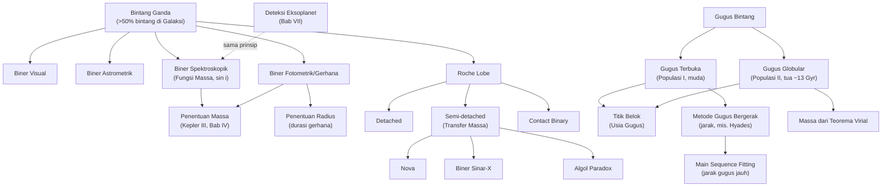

# BAB IX — SISTEM BINTANG

---

## Daftar Isi Bab Ini

1. [Jenis Bintang Ganda](#1)
2. [Penentuan Massa Bintang Ganda: Kurva Cahaya dan Kecepatan Radial](#2)
3. [Interacting Binaries dan Sistem Ganda Pekuliar](#3)
4. [Teknik Eksoplanet dalam Konteks Sistem Bintang](#4)
5. [Gugus Bintang: Klasifikasi dan Struktur](#5)
6. [Penentuan Massa, Umur, Luminositas, dan Jarak Gugus](#6)

---

<a name="1"></a>
## 1. Jenis Bintang Ganda

### A. Konsep Inti

Lebih dari separuh bintang di Galaksi berada dalam sistem multipel (biner atau lebih) — bintang ganda BUKAN kasus langka, melainkan **hasil umum** proses pembentukan bintang (fragmentasi awan molekul saat runtuh, §VIII.7). Empat kelas bintang ganda berdasarkan METODE deteksi (bukan sifat fisis intrinsik berbeda — satu sistem biner yang sama bisa masuk beberapa kategori sekaligus tergantung geometri & instrumen):

| Jenis | Cara Deteksi | Ciri |
|---|---|---|
| **Biner visual (visual binary)** | Kedua komponen **teramati terpisah langsung** (pemisahan sudut $\gtrsim0{,}1''$) | Orbit relatif bisa diukur langsung selama puluhan tahun pengamatan; orbit YANG TERAMATI adalah **proyeksi** orbit sebenarnya ke bidang langit |
| **Biner astrometrik (astrometric binary)** | Hanya **satu komponen terlihat**, tapi gerak diri (§VIII.1) berosilasi/bergelombang, mengindikasikan pendamping tak terlihat | Sirius B (katai putih) pertama kali disimpulkan lewat metode ini (1830-an) sebelum ditemukan visual beberapa dekade kemudian |
| **Biner spektroskopik (spectroscopic binary)** | Garis spektrum **terbelah dua** (jika kedua komponen cukup terang) atau bergeser periodik (Doppler, §I.1) meski tampak sebagai bintang tunggal di teleskop | Ditemukan lewat pergeseran/pembelahan garis periodik; TIDAK bisa membedakan orientasi orbit dalam ruang tanpa info tambahan |
| **Biner fotometrik/gerhana (photometric/eclipsing binary)** | Kecerlangan total sistem **berubah periodik** akibat satu komponen menggerhanai (menghalangi) komponen lain | HANYA terjadi jika bidang orbit hampir sejajar garis pandang pengamat (kebetulan geometris) |

```
[Sisipkan Diagram: Orbit Relatif Biner Visual — Proyeksi ke Bidang Langit]
Deskripsi: Elips orbit relatif sebenarnya (dalam bidang orbit, dengan
Matahari/bintang primer di fokus) digambar miring dalam ruang 3D,
lalu diproyeksikan ke bidang langit (bidang datar tegak lurus garis
pandang) menjadi elips YANG TERAMATI (bentuk berbeda, fokus proyeksi
primer TIDAK lagi tepat di fokus elips teramati). Ini menjelaskan
mengapa penentuan orbit biner visual perlu koreksi geometris proyeksi
sebelum bisa menerapkan Hukum Kepler III dengan benar.
```

### D. Intuisi dan Interpretasi

- Kunci memahami klasifikasi ini: **bukan jenis biner yang berbeda secara fisis**, melainkan **cara kita mendeteksinya** yang berbeda, bergantung jarak sistem dari Bumi, pemisahan sudut komponen, dan kebetulan orientasi orbit relatif garis pandang — analog cara kita mengklasifikasi metode deteksi eksoplanet (§VII.9) berdasarkan teknik pengamatan, bukan jenis planetnya.
- Biner **gerhana** memberikan informasi PALING LENGKAP (radius, massa, kadang temperatur relatif kedua komponen — §VIII.3) karena mengombinasikan info fotometri (kurva cahaya) DAN spektroskopi (kecepatan radial) sekaligus — inilah "laboratorium alami" terbaik untuk menguji teori struktur & evolusi bintang.

---

<a name="2"></a>
## 2. Penentuan Massa Bintang Ganda: Kurva Cahaya dan Kecepatan Radial

### A. Konsep Inti

*(Bintang biner adalah SATU-SATUNYA cara langsung & akurat menentukan massa bintang — lihat §VIII.3.)* Prinsip dasar: kedua komponen mengorbit **barycenter bersama** (§IV.3) mengikuti Hukum Kepler (§IV.2), memenuhi $m_1a_1=m_2a_2$ (definisi barycenter) dan $P^2=\dfrac{4\pi^2}{G(m_1+m_2)}a^3$ dengan $a=a_1+a_2$.

### B. Rumus Penting

| Nama | Rumus | Keterangan |
|---|---|---|
| Rasio massa dari rasio jarak ke barycenter | $\dfrac{a_1}{a_2}=\dfrac{m_2}{m_1}$ | Dari definisi barycenter (§IV.3) |
| Sumbu semi-mayor relatif | $a=a_1+a_2$ | |
| Massa total (Kepler III) | $m_1+m_2 = \dfrac{a^3}{P^2}$ (satuan au-tahun-$M_\odot$) | Butuh $a$ dalam au — perlu jarak sistem (paralaks) + pemisahan sudut |
| **Kecepatan radial terobservasi** | $v = v_0\sin i$ | $v_0$: kecepatan orbit sejati, $i$: inklinasi (sudut antara garis pandang dan NORMAL bidang orbit) |
| Kecepatan orbit sejati (orbit sirkular) | $v_{0,1}=\dfrac{2\pi a_1}{P}$ | |
| **Fungsi massa (mass function)** | $\dfrac{m_2^3\sin^3 i}{(m_1+m_2)^2} = \dfrac{v_1^3 P}{2\pi G}$ | Besaran yang BISA ditentukan murni dari observasi spektroskopik (tanpa tahu $i$) |
| Kedalaman gerhana (biner fotometrik, radius sama) | $m_A-m_{tot} = 2{,}5\log_{10}\left(1+\left(\dfrac{T_B}{T_A}\right)^4\right)$ | Untuk gerhana primer (komponen lebih terang tertutup); analog untuk gerhana sekunder |

### C. Derivasi Singkat

**Fungsi massa** diturunkan dengan mensubstitusi $a_1=am_2/(m_1+m_2)$ (dari definisi barycenter) ke $v_1=2\pi a_1\sin i/P$ (kecepatan radial teramati), lalu menyelesaikan untuk $a$ dan mensubstitusikannya ke Kepler III — menghasilkan kombinasi $m_2^3\sin^3i/(m_1+m_2)^2$ yang **hanya** melibatkan besaran terukur ($v_1$, $P$) di ruas kanan — inilah sebabnya disebut "fungsi massa": ia BUKAN massa sebenarnya, melainkan kombinasi tertentu yang bisa diekstrak observasi murni, dengan massa sejati baru diperoleh jika $i$ diketahui dari sumber lain (mis. sistem tersebut kebetulan JUGA biner gerhana, memberi $i\approx90°$).

### D. Intuisi dan Interpretasi

- Faktor $\sin^3 i$ adalah **sumber ambiguitas fundamental** metode kecepatan radial (berlaku sama untuk deteksi eksoplanet lewat RV, §VII.9) — tanpa informasi independen tentang inklinasi, hanya **batas bawah** massa yang bisa ditentukan (karena $\sin i\leq1$, massa sebenarnya $\geq$ nilai yang diekstrak dari fungsi massa dengan asumsi $\sin i=1$).
- Sistem biner **gerhana + spektroskopik ganda** (kedua komponen terlihat spektrumnya DAN saling menggerhanai) memberikan kasus IDEAL: gerhana memastikan $i\approx90°$ (menghilangkan ambiguitas $\sin i$), sehingga massa MUTLAK kedua komponen bisa ditentukan sekaligus radius (dari durasi gerhana × kecepatan orbit) — kombinasi data terkaya dalam astrofisika bintang observasional.

### E. Contoh Soal OSN

*(Lihat juga Contoh Soal Bab IV §4.2 gaya pola serupa.)* **Soal:** Sistem biner spektroskopik memiliki periode $P=10$ tahun dan kecepatan orbit teramati komponen 1, $v_1=20$ km/s (asumsi orbit sirkular, $i=90°$ dari info gerhana tambahan). Jika rasio massa $m_1/m_2=2$, tentukan massa masing-masing komponen (dalam $M_\odot$, gunakan pendekatan Newtonian sederhana).

**Penyelesaian:** Dari fungsi massa dengan $\sin i=1$:
$$\frac{m_2^3}{(m_1+m_2)^2}=\frac{v_1^3P}{2\pi G}$$
Konversi ke satuan praktis (au, tahun, $M_\odot$) mempermudah, tapi untuk estimasi cepat gunakan pendekatan berbasis Kepler III langsung: pertama cari $a_1$ dari $v_1=2\pi a_1/P$ (dalam au jika $v_1$ dikonversi au/tahun: $20$ km/s $\approx4{,}22$ au/tahun):
$$a_1 = \frac{v_1P}{2\pi}=\frac{4{,}22\times10}{2\pi}\approx6{,}72\text{ au}$$
Dengan $m_1/m_2=2 \Rightarrow a_1/a_2=m_2/m_1=1/2 \Rightarrow a_2=2a_1=13{,}44$ au, $a=a_1+a_2=20{,}16$ au.
$$m_1+m_2=\frac{a^3}{P^2}=\frac{20{,}16^3}{10^2}\approx819\,M_\odot$$

**Catatan:** hasil ini tidak realistis secara fisis (massa terlalu besar untuk bintang biasa) — murni untuk ilustrasi alur perhitungan; soal OSN nyata biasanya memakai angka kecepatan & periode yang menghasilkan massa realistis ($0{,}1$–$50\,M_\odot$). **Kesalahan umum:** lupa bahwa $v_1$ yang diberikan biasanya SUDAH termasuk $\sin i$ (perlu dibagi $\sin i$ dulu untuk dapat $v_0$ jika $i\neq90°$); tertukar rasio $a_1/a_2$ dengan $m_1/m_2$ (keduanya berbanding TERBALIK).

---

<a name="3"></a>
## 3. Interacting Binaries dan Sistem Ganda Pekuliar

### A. Konsep Inti

**Ellipsoidal variables** — biner fotometrik TANPA gerhana sungguhan: salah satu komponen terdistorsi bentuk elipsoidal akibat gaya pasang-surut (§IV.4) pendampingnya, sehingga luas penampang yang teramati berubah seiring fase orbit → variasi kecerlangan halus tanpa gerhana tajam.

**Roche lobe** $[\text{Tambahan, konsep standar biner dekat}]$ — daerah di sekitar tiap bintang dalam sistem biner dekat di mana materi masih terikat gravitasi bintang tersebut (dibatasi oleh permukaan ekipotensial kritis yang bertemu di titik Lagrange $L_1$ antara kedua bintang, §IV.4). Klasifikasi biner dekat berdasarkan sejauh mana komponen "mengisi" Roche lobe masing-masing:
- **Detached** — kedua komponen lebih kecil dari Roche lobe masing-masing (tidak ada transfer massa).
- **Semi-detached** — satu komponen tepat mengisi penuh Roche lobe-nya, materi mulai mengalir ke pendamping lewat titik $L_1$ (**transfer massa**).
- **Contact binary** — kedua komponen sama-sama melebihi/mengisi Roche lobe, berbagi selubung gas bersama (*common envelope*).

**Nova & sistem katai putih akresi** [Tambahan, terkait §VIII.9] — dalam biner semi-detached dengan katai putih, materi (kaya hidrogen) dari bintang pendamping terakumulasi di permukaan katai putih hingga memicu fusi termonuklir eksplosif di permukaan (**nova klasik**, BUKAN menghancurkan bintang, bisa berulang) — berbeda dari **supernova tipe Ia** (katai putih melebihi $M_{Ch}$, hancur total, §VIII.9).

**Biner sinar-X (X-ray binaries)** — sistem dengan bintang kompak (bintang neutron/lubang hitam) menarik materi dari pendamping; materi yang jatuh membentuk **piringan akresi** sangat panas ($T\sim10^6$–$10^7$ K) yang memancarkan sinar-X kuat — salah satu cara utama mendeteksi lubang hitam & bintang neutron secara tidak langsung.

### D. Intuisi dan Interpretasi

- **Algol paradox** $[\text{Tambahan, contoh klasik]}$ — dalam sistem biner Algol, komponen bermassa LEBIH RENDAH justru berevolusi LEBIH CEPAT (sudah jadi subraksasa/raksasa) — berlawanan intuisi dari relasi massa-luminositas (§VIII.3, bintang masif berevolusi lebih cepat). Penjelasannya: komponen tersebut AWALNYA lebih masif (berevolusi cepat sesuai ekspektasi), tapi setelah mengisi Roche lobe-nya, SEBAGIAN besar massanya sudah ditransfer ke pendamping — sehingga sekarang tampak bermassa rendah meski riwayat evolusinya sebagai bintang bermassa tinggi. Ini menekankan pentingnya **riwayat transfer massa**, bukan hanya massa SAAT INI, dalam memahami evolusi biner dekat.
- Interaksi biner dekat (transfer massa, common envelope) dapat secara drastis mengubah lintasan evolusi kedua bintang dibanding jika mereka berevolusi sendirian — salah satu alasan astrofisika biner adalah subbidang riset aktif tersendiri.

---

<a name="4"></a>
## 4. Teknik Eksoplanet dalam Konteks Sistem Bintang

*(Metode deteksi eksoplanet lengkap sudah dibahas di §VII.9 — astrometri, kecepatan radial, transit, microlensing, pencitraan langsung. Semua prinsip fisisnya adalah PERLUASAN LANGSUNG teknik bintang ganda di atas: planet diperlakukan sebagai "komponen biner bermassa sangat kecil".)*

**Perbedaan kunci planet vs biner bintang** dalam konteks deteksi:
- Rasio massa planet:bintang jauh lebih ekstrem ($\sim10^{-3}$ atau lebih kecil) dibanding biner bintang biasa ($\sim0{,}1$–$1$) → amplitudo sinyal (goyangan RV, kedalaman transit) jauh lebih kecil → butuh presisi instrumen jauh lebih tinggi.
- Fungsi massa (§IX.2) berlaku SAMA persis untuk planet — inilah mengapa metode RV untuk eksoplanet HANYA memberi $m_p\sin i$ (batas bawah massa), identik dengan keterbatasan biner spektroskopik tunggal.

---

<a name="5"></a>
## 5. Gugus Bintang: Klasifikasi dan Struktur

### A. Konsep Inti

**Dua kelas utama gugus bintang** — perbedaannya sangat fundamental (bukan hanya ukuran), mencerminkan populasi & sejarah berbeda dalam Galaksi:

| Karakteristik | Gugus Terbuka (Open Cluster) | Gugus Bola (Globular Cluster) |
|---|---|---|
| Jumlah bintang | Puluhan–ribuan | $\sim10^5$–$10^6$ |
| Bentuk | Tidak beraturan, longgar | Bulat simetris, terkonsentrasi ke pusat |
| Lokasi di Galaksi | Terkonsentrasi di piringan/bidang galaksi | Tersebar di halo (bola), hingga $\gtrsim35$ kpc dari pusat |
| Usia | Muda–menengah ($\lesssim$ beberapa miliar tahun) | Sangat tua ($\sim13\times10^9$ tahun — mendekati usia alam semesta!) |
| Metalisitas (kelimpahan unsur berat) | Tinggi (mirip Matahari, Populasi I) | Rendah ($\sim1\%$ atau kurang nilai Matahari, Populasi II) |
| Diagram warna-magnitudo | Deret utama panjang hingga bintang panas/terang, sedikit raksasa | Deret utama HANYA bintang redup-merah, ada giant branch & **horizontal branch** menonjol |
| Contoh | Hyades, Pleiades | M3, M5, M13 |
| Jumlah di Bima Sakti | Ribuan | $150$–$200$ |

```
[Sisipkan Diagram: Diagram Warna-Magnitudo Skematik — Gugus Terbuka vs Globular]
Deskripsi: Dua diagram H-R/warna-magnitudo berdampingan. KIRI (gugus
terbuka muda): deret utama panjang dari bintang biru-panas (kiri
atas) hingga merah-redup (kanan bawah), titik "turn-off" (belok
menuju raksasa) berada TINGGI di deret utama (dekat bintang panas)
karena usia muda. KANAN (gugus globular tua): deret utama HANYA
tersisa bagian bawah (bintang merah-redup), titik turn-off berada
SANGAT RENDAH (dekat area bintang mirip Matahari atau lebih dingin),
dengan cabang raksasa (giant branch) menjulang ke atas-kanan dan
horizontal branch mendatar di tengah diagram.
```

### D. Intuisi dan Interpretasi

- Perbedaan metalisitas tajam (Populasi I vs II) adalah **jejak sejarah kimia Galaksi**: gugus globular terbentuk sangat awal (saat Galaksi masih muda, sebelum banyak generasi bintang memperkaya medium antarbintang dengan unsur berat hasil nukleosintesis, §VIII.6), sementara gugus terbuka terbentuk lebih baru dari medium yang sudah "diperkaya" bintang-bintang generasi sebelumnya (Bab X).
- Karena semua anggota gugus terbentuk (hampir) bersamaan dari awan yang sama, mereka menyediakan **populasi bintang seusia & sekomposisi** — laboratorium alami sempurna untuk menguji teori evolusi bintang (§VIII) dengan mengontrol variabel usia & komposisi, menyisakan hanya **massa awal** sebagai variabel bebas utama.

---

<a name="6"></a>
## 6. Penentuan Massa, Umur, Luminositas, dan Jarak Gugus

### A. Konsep Inti

**Titik belok (turn-off point)** — titik di deret utama tempat bintang mulai "membelok" menuju cabang raksasa pada diagram warna-magnitudo gugus — **penanda usia paling andal**: karena bintang lebih masif meninggalkan deret utama lebih cepat (§VIII.3), posisi titik belok (makin redup/dingin untuk gugus makin tua) langsung memberi estimasi usia lewat perbandingan dengan model evolusi bintang teoretis.

**Metode "moving cluster" (gugus bergerak)** — untuk gugus DEKAT (mis. Hyades) di mana anggota-anggotanya punya vektor kecepatan ruang hampir sama (paralel) relatif Matahari: akibat efek perspektif, gerak diri seluruh anggota tampak **konvergen** menuju satu titik di langit (**convergent point**) — dari sudut konvergensi $\theta$ dan kecepatan radial $v_r$ (Doppler), jarak setiap bintang anggota bisa dihitung TANPA memerlukan paralaks langsung.

**Main sequence fitting** — untuk gugus LEBIH JAUH (di luar jangkauan paralaks langsung): bandingkan diagram warna-magnitudo GUGUS TARGET (memakai magnitudo SEMU) dengan diagram gugus KALIBRASI TERDEKAT/diketahui jaraknya (memakai magnitudo ABSOLUT, mis. Hyades) — pergeseran vertikal yang diperlukan agar kedua deret utama "berimpit" langsung memberi **modulus jarak** gugus target.

**Massa gugus dari Teorema Virial** (§IV.9 [Tambahan pengantar Virial], lihat juga §XI) — dari kecepatan bintang anggota yang teramati (dispersi kecepatan) & ukuran gugus, Teorema Virial $\langle T\rangle=-\tfrac12\langle U\rangle$ memberi estimasi massa total gugus TANPA perlu menjumlahkan massa bintang satu-per-satu — metode yang sama berlaku untuk estimasi massa gugus galaksi (Bab X) & kluster galaksi (Bab XI).

### B. Rumus Penting

| Nama | Rumus | Keterangan |
|---|---|---|
| **Jarak dari metode gugus bergerak** | $r = \dfrac{v_r}{\mu}\tan\theta$ | $v_r$: kecepatan radial (km/s), $\mu$: gerak diri ($''$/tahun, perlu konversi satuan seperti §VIII.1), $\theta$: sudut dari titik konvergen |
| **Main sequence fitting (modulus jarak)** | $m_{V,0}-M_V = 5\log_{10}(r/10\text{pc})$ | Sama seperti §I.3, diterapkan pada titik-titik deret utama gugus |
| **Estimasi massa gugus (Virial, kasar)** | $M\approx\dfrac{\langle v^2\rangle R}{G}$ | $\langle v^2\rangle$: rerata kuadrat kecepatan bintang anggota, $R$: radius gugus (estimasi kasar dari $\langle T\rangle=-\tfrac12\langle U\rangle$, $T=\tfrac12M\langle v^2\rangle$, $U\approx-GM^2/R$) |
| Kecepatan lepas gugus | $v_e=\sqrt{2GM/R}$ | Untuk membandingkan stabilitas (§E) |

### D. Intuisi dan Interpretasi

- Kesepakatan antara usia gugus globular ($\sim13\times10^9$ tahun) dan usia alam semesta dari model kosmologi (Bab XI, $\sim13{,}8\times10^9$ tahun) adalah salah satu **konfirmasi silang independen** paling meyakinkan dalam astrofisika modern — dua metode benar-benar berbeda (evolusi bintang vs ekspansi kosmologis) menghasilkan angka yang konsisten.
- Metode gugus bergerak historis SANGAT PENTING sebagai kalibrator jarak Hyades ($\sim40$–$46$ pc) sebelum satelit astrometri presisi tinggi (Hipparcos, Gaia) tersedia — dan Hyades sendiri kemudian menjadi ANCHOR (jangkar) untuk main sequence fitting gugus lain yang lebih jauh — ilustrasi konkret "tangga jarak kosmik" (§VIII.1) bekerja tahap demi tahap.

### E. Contoh Soal OSN

**Soal:** Sebuah gugus bola memiliki diameter $40$ pc dan berisi $10^5$ bintang bermassa rata-rata $1\,M_\odot$. Estimasi kecepatan rata-rata bintang anggota menggunakan Teorema Virial (asumsi jarak rata-rata antar pasangan bintang $\approx$ radius gugus).

**Penyelesaian:** Massa total $M=10^5\,M_\odot=1{,}989\times10^{35}$ kg, radius $R=20$ pc $=6{,}17\times10^{17}$ m.

Energi potensial (estimasi kasar, $n(n-1)/2\approx n^2/2$ pasangan, masing-masing berjarak $\approx R$):
$$U\approx-\frac{GM^2}{R}=-\frac{6{,}674\times10^{-11}\times(1{,}989\times10^{35})^2}{6{,}17\times10^{17}}\approx-4{,}28\times10^{42}\text{ J}$$

Dari Virial, $\langle T\rangle=-\tfrac12U$, dan $\langle T\rangle=\tfrac12 M\langle v^2\rangle$:
$$\frac12M\langle v^2\rangle = \frac12\times4{,}28\times10^{42} \Rightarrow \langle v^2\rangle = \frac{4{,}28\times10^{42}}{1{,}989\times10^{35}}\approx2{,}15\times10^7\text{ m}^2/\text{s}^2$$
$$v_{rms}\approx4640\text{ m/s}\approx4{,}6\text{ km/s}$$

Nilai ini konsisten dengan orde besaran dispersi kecepatan gugus globular nyata ($\sim5$–$15$ km/s) — konfirmasi kasar bahwa gugus globular adalah sistem **terikat gravitasi** dan stabil (kecepatan bintang jauh di bawah kecepatan lepas sistem).

---

## Daftar Rumus Ringkas — Bab IX Sistem Bintang

**Biner**
- $a_1/a_2 = m_2/m_1$; $a=a_1+a_2$
- $m_1+m_2=a^3/P^2$ (au-tahun-$M_\odot$)
- $v=v_0\sin i$
- Fungsi massa: $\dfrac{m_2^3\sin^3i}{(m_1+m_2)^2}=\dfrac{v_1^3P}{2\pi G}$

**Gugus**
- Moving cluster: $r=(v_r/\mu)\tan\theta$
- Main sequence fitting: $m_{V,0}-M_V=5\log_{10}(r/10\text{pc})$
- Massa Virial: $M\approx\langle v^2\rangle R/G$

---

## Peta Konsep Bab IX



---

## Topik Paling Sering Muncul di OSN (Bab IX)

1. **Penentuan massa biner** (Kepler III + rasio $a_1/a_2=m_2/m_1$) — hampir selalu muncul
2. **Kurva cahaya biner gerhana** — perhitungan kedalaman gerhana dari rasio temperatur/radius
3. **Fungsi massa & ambiguitas $\sin i$** — konseptual, sering dikaitkan RV eksoplanet
4. **Titik belok deret utama & usia gugus** — sangat sering, terutama interpretasi diagram warna-magnitudo
5. **Perbedaan gugus terbuka vs globular** — konseptual (Populasi I/II, lokasi, usia)
6. Teorema Virial untuk massa gugus — kuantitatif tingkat lanjut

---

*Selanjutnya: Bab X — Galaksi Bima Sakti dan Ekstragalaksi (medium antarbintang, struktur Bima Sakti, klasifikasi galaksi, kurva rotasi, galaksi aktif). Balas "lanjut" untuk melanjutkan ke Part 9.*
