# BAB X — GALAKSI BIMA SAKTI DAN EKSTRAGALAKSI

*(Part 9 dari seri Ringkasan OSN Astronomi — lihat Part 1 untuk daftar isi keseluruhan)*

---

## Daftar Isi Bab Ini

1. [Medium Antarbintang: HI, H₂/CO, HII, Debu](#1)
2. [Struktur Bima Sakti: Populasi Bintang dan Metode Penentuan Usia/Jarak](#2)
3. [Komponen Galaksi: Halo, Bulge, Disk](#3)
4. [Kurva Rotasi dan Materi Gelap](#4)
5. [Klasifikasi Galaksi: Morfologi dan Warna](#5)
6. [Menentukan Jarak, Massa, dan Luminositas Galaksi](#6)
7. [Galaksi Aktif dan Luminositas Eddington](#7)

---

<a name="1"></a>
## 1. Medium Antarbintang: HI, H₂/CO, HII, Debu

### A. Konsep Inti

**Medium antarbintang (interstellar medium/ISM)** — gas & debu yang mengisi ruang antar bintang, terdiri dari beberapa fase dengan temperatur & densitas sangat berbeda:

- **HI (hidrogen netral)** — fase paling luas tersebar, temperatur $\sim100$ K, terdeteksi lewat **garis 21 cm** — transisi hyperfine (pembalikan spin elektron relatif spin proton dalam atom hidrogen netral, transisi terlarang sangat lambat, waktu hidup keadaan tereksitasi $\sim10^7$ tahun, tapi tetap terdeteksi karena jumlah atom H sangat besar di ruang antarbintang). Garis 21 cm krusial karena **menembus debu** (radio, tidak diserap ekstingsi seperti cahaya tampak, §I.3) — memungkinkan pemetaan struktur SELURUH Galaksi termasuk daerah yang tak teramati optis.
- **H₂ (hidrogen molekuler)** — di awan molekul dingin & padat ($T\sim10$–$20$ K), tempat pembentukan bintang (§VIII.7) berlangsung. H₂ SULIT dideteksi langsung (molekul simetris, tanpa momen dipol, tanpa garis rotasi kuat) — sebagai gantinya astronom memakai **molekul CO** sebagai **tracer/pelacak** (CO punya garis emisi kuat pada gelombang radio/mm, dan kelimpahannya berkorelasi baik dengan H₂).
- **HII (hidrogen terionisasi)** — daerah gas terionisasi oleh radiasi UV kuat bintang panas (tipe O/B, §I.7) di dekatnya — disebut **nebula emisi/daerah HII**, memancarkan garis emisi (§I.2) termasuk Hα (memberi warna merah khas nebula seperti Orion).
- **Debu antarbintang** — partikel padat kecil (silikat, karbon, ukuran submikron), bertanggung jawab atas **ekstingsi & pemerahan** cahaya bintang (§I.3) — juga berperan penting sebagai **katalis** pembentukan molekul H₂ (permukaan butir debu menyediakan tempat bereaksi bagi atom H yang sulit bergabung di ruang bebas).
- **Absorpsi antarbintang** — selain kontinum (ekstingsi debu, §I.3), medium juga menghasilkan **garis absorpsi tajam** dalam spektrum bintang jauh dari atom/ion/molekul di sepanjang garis pandang (Na I, Ca II, dll.) — dibedakan dari garis absorpsi fotosfer bintang itu sendiri karena SANGAT SEMPIT (gas antarbintang jauh lebih dingin & renggang, pelebaran Doppler termal & tekanan minimal, §I.2).

### B. Rumus Penting

| Nama | Rumus | Keterangan |
|---|---|---|
| Panjang gelombang garis 21 cm | $\lambda=21{,}1$ cm ($\nu=1420{,}4$ MHz) | Transisi hyperfine H netral |
| Kecepatan radial dari garis 21 cm | $v_r=c\,\Delta\lambda/\lambda_0$ | Standar Doppler (§I.1), dipakai memetakan gerak gas |

### D. Intuisi dan Interpretasi

- Karena garis 21 cm menembus debu, ia menjadi **alat utama pemetaan struktur spiral Bima Sakti** — ironisnya kita justru lebih tahu struktur skala besar Galaksi dari radio ketimbang cahaya tampak, karena kita berada DI DALAM piringan berdebu yang menghalangi pandangan optis ke pusat Galaksi & sisi jauhnya.
- Rantai deteksi H₂ lewat CO adalah contoh klasik **tracer tidak langsung** dalam astrofisika — pola serupa nanti muncul lagi untuk deteksi materi gelap (§X.4, terdeteksi lewat efek gravitasinya, bukan langsung).

---

<a name="2"></a>
## 2. Struktur Bima Sakti: Populasi Bintang dan Metode Penentuan Usia/Jarak

### A. Konsep Inti

**Klasifikasi populasi bintang** (terkait langsung §IX.5 gugus terbuka vs globular):

| Populasi | Lokasi | Metalisitas | Usia | Contoh |
|---|---|---|---|---|
| **Populasi I** | Disk/piringan, terutama lengan spiral | Tinggi (mirip Matahari) | Muda | Bintang O/B, gugus terbuka, gas & debu |
| **Populasi II** | Halo, bulge, gugus globular | Rendah | Tua | Bintang RR Lyrae, gugus globular |
| Populasi intermediate | Disk tebal | Sedang | Sedang | |

**Metode penentuan jarak bintang di Bima Sakti** (rangkuman lintas-bab, dari terdekat ke terjauh):
1. **Paralaks trigonometri** (§VIII.1) — langsung, hingga ratusan pc (Gaia: hingga puluhan kpc untuk bintang terang).
2. **Metode gugus bergerak** (§IX.6) — untuk gugus terbuka dekat (mis. Hyades).
3. **Main sequence fitting** (§IX.6) — gugus lebih jauh.
4. **Paralaks spektroskopik** — dari tipe spektral & kelas luminositas (garis absorpsi, §I.2, §I.7), tentukan magnitudo absolut $M$ lewat kalibrasi diagram H-R, lalu modulus jarak $m-M$ (§I.3) memberi jarak — TIDAK memerlukan paralaks sudut sungguhan (nama historis agak menyesatkan), berguna hingga beberapa kpc.
5. **RR Lyrae** — bintang variabel Populasi II (mirip Cepheid, §VIII.4, tapi luminositas hampir seragam $M_V\approx0{,}6$ untuk semua anggota kelas ini, tidak seperti Cepheid yang butuh relasi periode-luminositas) — standard candle andal untuk gugus globular & struktur halo.

### D. Intuisi dan Interpretasi

- Perbedaan usia & metalisitas Populasi I vs II adalah **rekaman sejarah kimia Galaksi** (§IX.5): Populasi II terbentuk sangat awal dari gas primordial miskin logam, Populasi I terbentuk belakangan dari gas yang sudah diperkaya generasi bintang sebelumnya lewat nukleosintesis & supernova (§VIII.6, §VIII.9).
- "Tangga jarak" di dalam Bima Sakti (paralaks → gugus bergerak → main sequence fitting → paralaks spektroskopik/RR Lyrae) adalah **miniatur** dari tangga jarak kosmik skala penuh yang akan diperluas ke galaksi lain (Cepheid, §X.6) dan alam semesta terjauh (supernova Ia, Bab XI) — SETIAP anak tangga dikalibrasi oleh anak tangga sebelumnya yang lebih dekat & lebih terpercaya.

---

<a name="3"></a>
## 3. Komponen Galaksi: Halo, Bulge, Disk

### A. Konsep Inti

Struktur Bima Sakti (representatif galaksi spiral pada umumnya) terdiri dari beberapa komponen dengan sifat dinamik & populasi berbeda:

- **Disk (piringan)** — struktur pipih tempat sebagian besar bintang Populasi I & gas/debu berada, memperlihatkan **struktur spiral** (lengan spiral, tempat pembentukan bintang aktif), berotasi teratur (§X.4).
- **Bulge (tonjolan pusat)** — konsentrasi bintang padat & (relatif) tua di pusat Galaksi, bentuk lebih menyerupai elipsoidal/bola dibanding disk pipih; banyak galaksi spiral (termasuk Bima Sakti) memiliki bulge **berbentuk batang (bar)** — struktur memanjang menyerupai "tongkat" melintasi pusat.
- **Halo** — komponen bola sangat besar mengelilingi seluruh Galaksi, berisi bintang Populasi II tua (termasuk gugus globular, §IX.5) dengan kepadatan sangat rendah; TIDAK berotasi teratur seperti disk (orbit bintang halo cenderung acak arahnya, disebut *pressure-supported* alih-alih *rotation-supported*).
- **Halo materi gelap** — komponen TAK TERLIHAT (§X.4) yang mendominasi massa total Galaksi, jauh lebih luas dari halo bintang, terdeteksi hanya lewat efek gravitasinya pada kurva rotasi.

```
[Sisipkan Diagram: Potongan Melintang Struktur Bima Sakti]
Deskripsi: Potongan melintang galaksi spiral dilihat dari samping.
Tengah: bulge (elipsoidal padat, kadang dengan struktur batang).
Mengelilingi bulge secara pipih memanjang ke kedua sisi: disk dengan
lengan spiral (dilihat dari atas akan tampak spiral, di sini tampak
sebagai garis tipis memanjang horizontal). Mengelilingi semuanya:
halo bola sangat besar (jauh melebihi radius disk), diisi titik-titik
jarang mewakili bintang halo & gugus globular tersebar. Tandai
Matahari pada posisinya di disk, ~8 kpc dari pusat.
```

### D. Intuisi dan Interpretasi

Perbedaan dinamik disk (rotasi teratur) vs halo (orbit acak) adalah **jejak sejarah pembentukan** — model modern menunjukkan halo terbentuk lebih dulu dari kolaps awan gas awal (& akresi galaksi kerdil satelit yang "ditelan" seiring waktu), sementara disk terbentuk belakangan dari gas yang sempat kehilangan momentum sudut acak (didisipasi lewat tumbukan gas) dan mengendap ke bidang rotasi rata — mirip konsep piringan akresi protoplanet (§VII.2) tapi pada skala galaksi.

---

<a name="4"></a>
## 4. Kurva Rotasi dan Materi Gelap

### A. Konsep Inti

**Kurva rotasi** — kecepatan orbit sirkular $V(R)$ sebagai fungsi jarak dari pusat galaksi $R$ — diukur lewat pergeseran Doppler garis 21 cm (§X.1) gas HI di berbagai posisi galaksi.

**Konstanta Oort** $A,B$ — parameter lokal yang mengkuantifikasi **rotasi diferensial** Bima Sakti di sekitar posisi Matahari (analog konsep rotasi diferensial Matahari §VI.4, tapi untuk skala galaksi):

**Penemuan mengejutkan:** jika massa Galaksi terkonsentrasi di dalam radius Matahari (seperti diasumsikan awal, mirip Tata Surya di mana $V\propto1/\sqrt R$ mengikuti hukum Kepler), kurva rotasi seharusnya **menurun** di luar radius tersebut. **Observasi menunjukkan sebaliknya: kurva rotasi tetap datar (flat) atau bahkan sedikit naik hingga jarak sangat jauh dari pusat** — ini BUKTI KUAT keberadaan **materi gelap (dark matter)**: massa yang tidak terdeteksi lewat radiasi elektromagnetik apa pun, namun memberikan pengaruh gravitasi nyata.

### B. Rumus Penting

| Nama | Rumus | Keterangan |
|---|---|---|
| **Konstanta Oort A** | $A = \dfrac12\left[\dfrac{V_0}{R_0}-\left(\dfrac{dV}{dR}\right)_{R_0}\right]$ | $\approx15$ km/s/kpc |
| **Konstanta Oort B** | $B = -\dfrac12\left[\dfrac{V_0}{R_0}+\left(\dfrac{dV}{dR}\right)_{R_0}\right]$ | $\approx-10$ km/s/kpc |
| Kecepatan sudut lokal | $A-B=\omega_0=V_0/R_0$ | Kombinasi kedua konstanta |
| Kecepatan radial (formula Oort) | $v_r\approx Ar\sin2l$ | $l$: bujur galaktik (§II.2), $r$: jarak bintang dari Matahari (untuk $r\ll R_0$) |
| Gerak diri (formula Oort) | $\mu\approx A\cos2l+B$ | |
| **Massa dalam radius $R_0$ (asumsi Kepler, DIBANTAH observasi)** | $M=R_0V_0^2/G$ | Untuk $R_0=8{,}5$ kpc, $V_0=220$ km/s: $M\approx1{,}9\times10^{41}$ kg $\approx10^{11}\,M_\odot$ — HANYA massa dalam radius Matahari, BUKAN massa total Galaksi |
| Kecepatan lepas lokal | $v_e=V_0\sqrt2\approx310$ km/s | Dari §IV.4 |

### C. Derivasi Singkat

Formula Oort diturunkan dengan ekspansi Taylor kecepatan sudut $\omega(R)$ di sekitar posisi Matahari $R_0$ (mirip prinsip linearisasi lokal), lalu memproyeksikan kecepatan relatif (radial & tangensial) bintang di sekitar Matahari ke arah bujur galaktik $l$ — hasil akhirnya adalah kurva sinus ganda karakteristik $Ar\sin2l$ untuk kecepatan radial, yang **terkonfirmasi observasi** dan menjadi bukti kuat pertama rotasi diferensial Galaksi (Oort, 1927).

### D. Intuisi dan Interpretasi

- Kurva rotasi datar adalah salah satu **bukti observasional paling langsung & meyakinkan** keberadaan materi gelap — TANPA perlu asumsi model kosmologi rumit, hanya perlu Hukum Kepler/Newton biasa (§IV) diterapkan pada data kecepatan orbit gas di berbagai radius.
- Rasio materi gelap:materi biasa di galaksi besar $\approx5{:}1$ — angka ini konsisten dengan penentuan independen dari kosmologi (Bab XI, dari CMB & struktur skala besar) — konfirmasi silang lain yang memperkuat keyakinan terhadap keberadaan materi gelap meski hakikat partikelnya belum diketahui.
- Perbandingan dengan §IV.2 (Kepler III): kurva rotasi galaksi BUKAN Keplerian ($V\propto R^{-1/2}$) di daerah luar — ini pengingat penting bahwa hukum Kepler murni hanya berlaku untuk sistem dengan massa terkonsentrasi di pusat (seperti Tata Surya); untuk sistem dengan massa tersebar (galaksi dengan halo materi gelap meluas), $V(R)$ bisa tetap datar/konstan.

### E. Contoh Soal OSN

**Soal:** Verifikasi estimasi massa Bima Sakti dalam radius Matahari menggunakan $R_0=8{,}5$ kpc, $V_0=220$ km/s.

**Penyelesaian:**
$$M = \frac{R_0V_0^2}{G} = \frac{(8{,}5\times3{,}086\times10^{19}\text{ m})\times(2{,}2\times10^5\text{ m/s})^2}{6{,}674\times10^{-11}}$$
$$=\frac{2{,}623\times10^{20}\times4{,}84\times10^{10}}{6{,}674\times10^{-11}}\approx1{,}90\times10^{41}\text{ kg}\approx9{,}6\times10^{10}\,M_\odot$$

Konsisten dengan nilai literatur ($\sim10^{11}\,M_\odot$) — **catatan penting**: ini HANYA estimasi massa di DALAM radius Matahari (dengan asumsi Keplerian yang sebetulnya TIDAK berlaku persis, lihat diskusi §D) — massa TOTAL Galaksi (termasuk halo materi gelap meluas) diperkirakan jauh lebih besar, bisa mencapai $10^{12}\,M_\odot$ atau lebih.

---

<a name="5"></a>
## 5. Klasifikasi Galaksi: Morfologi dan Warna

### A. Konsep Inti

**Deret Hubble (Hubble Sequence/"Tuning Fork")** — skema klasifikasi galaksi berdasarkan morfologi (Edwin Hubble, 1926), masih dipakai luas hingga kini meski tidak mencerminkan urutan evolusi sebenarnya (istilah "early/late type" adalah **warisan historis keliru** — TIDAK berarti galaksi elips berevolusi menjadi spiral atau sebaliknya):

| Tipe | Ciri | Sub-klasifikasi |
|---|---|---|
| **Elips (E)** | Bentuk elips halus, densitas menurun teratur ke luar, sedikit/tanpa gas-debu, tanpa struktur spiral | $E0$ (bulat) hingga $E7$ (sangat pipih), $n=10(1-b/a)$ |
| **Lentikular (S0)** | Peralihan E-Spiral: punya disk pipih TAPI tanpa struktur spiral & minim gas | — |
| **Spiral normal (S)** | Disk dengan lengan spiral jelas + bulge pusat | $Sa$ (bulge besar, lengan rapat) → $Sb$ → $Sc$ (bulge kecil, lengan longgar) |
| **Spiral berbatang (SB)** | Sama seperti S, tapi dengan struktur batang jelas melintasi bulge | $SBa,SBb,SBc$ |
| **Iregular (Irr)** | Tanpa bentuk simetris jelas, sering kaya gas & pembentukan bintang aktif | Irr I (masih ada struktur samar), Irr II (benar-benar tak beraturan) |
| **cD (giant elliptical)** [Tambahan Hubble] | Elips raksasa dengan halo bintang sangat luas, biasa ditemukan di PUSAT kluster galaksi | — |

**Klasifikasi berdasarkan warna** (terkait populasi bintang dominan, §I.7): galaksi elips & S0 cenderung **merah** (populasi tua, tanpa pembentukan bintang baru signifikan — sering disebut "*red and dead*"); galaksi spiral & irregular cenderung **lebih biru** (populasi campuran, ada pembentukan bintang aktif dari bintang O/B panas berumur pendek, §VIII.3).

### D. Intuisi dan Interpretasi

- Istilah "early type" (elips, S0) vs "late type" (spiral, irregular) BUKAN mencerminkan urutan evolusi individual galaksi (kesalahpahaman umum) — melainkan sekadar posisi dalam skema klasifikasi Hubble; sebetulnya, pemahaman modern menunjukkan galaksi elips SERINGKALI terbentuk dari **merger (penggabungan)** dua galaksi spiral — jadi dalam beberapa hal justru "lebih berevolusi", berlawanan dengan konotasi nama "early".
- Korelasi morfologi-warna (elips merah/mati vs spiral biru/aktif) berhubungan erat dengan kandungan gas: galaksi elips telah "menghabiskan" atau kehilangan sebagian besar gas dinginnya (bahan pembentuk bintang baru, §VIII.7), sementara galaksi spiral mempertahankan reservoir gas di disknya.

---

<a name="6"></a>
## 6. Menentukan Jarak, Massa, dan Luminositas Galaksi

### A. Konsep Inti

**Perluasan tangga jarak kosmik ke galaksi lain** (lanjutan §X.2, §VIII.4):
- **Cepheid** (§VIII.4) — dapat diresolusi & diukur periodenya hingga jarak $\sim20$–$30$ Mpc dengan teleskop modern (mis. Hubble Space Telescope) — kalibrator utama jarak galaksi terdekat (termasuk Andromeda).
- **Tully-Fisher relation** $[\text{Tambahan}]$ — untuk galaksi spiral: luminositas berkorelasi dengan lebar garis 21 cm (yang mencerminkan kecepatan rotasi maksimum $V_{max}$, §X.4) — $L\propto V_{max}^\alpha$ ($\alpha\approx4$) — memungkinkan estimasi luminositas INTRINSIK murni dari kecepatan rotasi (mudah diukur dari lebar garis spektrum), lalu modulus jarak (§I.3) memberi jarak.
- **Supernova Ia** (§VIII.9) — standard candle untuk jarak sangat jauh (hingga miliaran tahun cahaya), dibahas detail Bab XI.

**Penentuan massa galaksi** — sama prinsipnya dengan §X.4 (dari kurva rotasi, Hukum Kepler/Newton) atau Teorema Virial (§IX.6) untuk galaksi elips (yang tidak berotasi teratur, memakai dispersi kecepatan bintang alih-alih kecepatan rotasi).

**Penentuan luminositas** — begitu jarak $r$ diketahui (dari metode manapun di atas) dan magnitudo semu $m$ terukur, modulus jarak (§I.3) langsung memberi magnitudo absolut $M$, lalu luminositas dari $M_{bol}-M_{bol,\odot}=-2{,}5\log_{10}(L/L_\odot)$.

### E. Contoh Soal OSN

**Soal (konseptual):** Jelaskan mengapa Cepheid TIDAK bisa dipakai sebagai standard candle untuk menentukan jarak kluster galaksi yang sangat jauh (miliaran tahun cahaya), padahal relasi periode-luminositasnya sangat akurat.

**Jawaban:** Keterbatasan bukan pada AKURASI relasi periode-luminositas itu sendiri, melainkan pada **keterlihatan (detectability)**: Cepheid, meski terang untuk ukuran bintang tunggal ($10^3$–$10^4\,L_\odot$), pada jarak miliaran tahun cahaya akan memiliki fluks yang jauh di bawah batas deteksi teleskop manapun (hukum kuadrat-terbalik, §I.1) — DAN pada jarak sejauh itu, individual bintang di galaksi lain tidak lagi bisa **diresolusi** secara terpisah (bercampur jadi cahaya galaksi keseluruhan). Untuk jarak sejauh itu, dibutuhkan objek jauh lebih terang seperti supernova Ia ($\sim10^{10}\,L_\odot$, sebanding luminositas satu galaksi penuh) — inilah alasan setiap anak tangga jarak kosmik punya JANGKAUAN TERBATAS, dan tangga harus terus "diestafetkan" ke standard candle yang lebih terang untuk jarak lebih jauh.

---

<a name="7"></a>
## 7. Galaksi Aktif dan Luminositas Eddington

### A. Konsep Inti

**Galaksi aktif (Active Galactic Nuclei/AGN)** — galaksi dengan inti memancarkan energi jauh melebihi yang bisa dijelaskan oleh populasi bintang biasa — sumber energi paling meyakinkan: **akresi materi ke lubang hitam supermasif** ($M>10^8\,M_\odot$) di pusat galaksi, mirip mekanisme biner sinar-X (§IX.3) tapi pada skala jauh lebih masif.

**Klasifikasi utama AGN:**
- **Galaksi Seyfert** — spiral dengan inti sangat terang, garis emisi lebar (menunjukkan gas berkecepatan tinggi dekat inti); tipe 1 (garis sangat lebar) vs tipe 2 (garis lebih sempit, kemungkinan gas padat dekat inti terhalang/tersembunyi).
- **Galaksi radio** — umumnya elips, pemancar radio kuat (radiasi sinkrotron non-termal dari elektron relativistik dalam medan magnet, §I.8), sering menunjukkan struktur **jet** dan **lobus ganda** simetris terhadap inti.
- **Quasar (quasi-stellar object/QSO)** — AGN paling ekstrem & jauh, tampak seperti titik seperti bintang (nyaris tak teresolusi) karena sangat jauh & inti sangat dominan dibanding cahaya galaksi induknya, dengan **redshift sangat besar** (quasar pertama, 3C273, redshift $z=0{,}16$).
- **Gerak superluminal** — dalam pengamatan resolusi tinggi (VLBI) jet AGN, komponen tampak bergerak **lebih cepat dari kecepatan cahaya** — ini adalah **ilusi geometris relativistik** (bukan pelanggaran relativitas): terjadi ketika jet bergerak sangat cepat ($v\to c$) hampir segaris arah pandang, sehingga cahaya dari posisi lebih belakangan "menyusul" cahaya dari posisi sebelumnya lebih cepat dari laju gerak sebenarnya proyeksi ke bidang langit.

**Luminositas Eddington** $[\text{Tambahan, konsep fundamental fisika akresi}]$ — luminositas MAKSIMUM yang bisa dipancarkan objek bermassa $M$ dalam kesetimbangan (tekanan radiasi keluar menyeimbangkan tarikan gravitasi ke dalam pada materi terionisasi di sekitarnya) — batas fundamental laju akresi & luminositas lubang hitam/bintang.

### B. Rumus Penting

| Nama | Rumus | Keterangan |
|---|---|---|
| **Luminositas Eddington** | $L_{Edd} = \dfrac{4\pi GMm_pc}{\sigma_T}$ | $m_p$: massa proton, $\sigma_T$: penampang hamburan Thomson elektron |
| Bentuk praktis | $L_{Edd}\approx 3{,}2\times10^4\,(M/M_\odot)\,L_\odot$ | Untuk komposisi hidrogen murni terionisasi |

### C. Derivasi Singkat

Pada kesetimbangan Eddington, gaya tekanan radiasi ke luar pada elektron (via hamburan Thomson, $F_{rad}=\sigma_T F/c$ dengan $F$ fluks radiasi, mirip §VI.8 tekanan radiasi) menyeimbangkan gaya gravitasi ke dalam pada **pasangan proton-elektron** (materi terionisasi netral secara elektrik bergerak bersama, meski gaya radiasi utamanya bekerja pada elektron karena penampang hamburannya jauh lebih besar dari proton):
$$\frac{\sigma_T}{c}\cdot\frac{L_{Edd}}{4\pi r^2} = \frac{GMm_p}{r^2}$$
Sederhanakan ($r^2$ saling coret di kedua ruas):
$$L_{Edd}=\frac{4\pi GMm_pc}{\sigma_T}$$

### D. Intuisi dan Interpretasi

- Luminositas Eddington memberi **batas atas laju pertumbuhan** lubang hitam supermasif — jika akresi melebihi laju ini, tekanan radiasi akan "meniup keluar" materi yang jatuh alih-alih membiarkannya terakresi, secara alami membatasi laju pertumbuhan (meski dalam praktiknya, akresi non-spheris/piringan bisa melampaui batas ini secara lokal).
- Rasio luminositas AGN teramati terhadap $L_{Edd}$ (disebut *Eddington ratio*) menjadi parameter penting mengkarakterisasi seberapa "aktif" AGN tersebut — quasar paling terang sering mendekati/melampaui batas Eddington, menandakan akresi sangat efisien/cepat.
- Fenomena AGN adalah pengingat bahwa objek se-"diam" lubang hitam sekalipun (yang secara definisi tidak memancar apa pun langsung, Bab XI) bisa menjadi sumber energi paling terang di alam semesta LEWAT mekanisme tidak langsung (akresi) — bukan dari lubang hitamnya sendiri, melainkan dari materi yang jatuh ke dalamnya.

### E. Contoh Soal OSN

**Soal:** Hitung luminositas Eddington untuk lubang hitam supermasif bermassa $10^8\,M_\odot$, dan bandingkan dengan luminositas total Bima Sakti ($\sim2\times10^{10}\,L_\odot$).

**Penyelesaian:**
$$L_{Edd}\approx3{,}2\times10^4\times10^8\,L_\odot = 3{,}2\times10^{12}\,L_\odot$$

Ini **160 kali lebih terang** dari luminositas total Bima Sakti ($3{,}2\times10^{12}/2\times10^{10}\approx160$) — mengilustrasikan mengapa quasar (AGN mendekati batas Eddington) bisa mengalahkan kecerlangan SELURUH galaksi induknya yang berisi ratusan miliar bintang, hanya dari region kecil di sekitar lubang hitam pusat.

---

## Daftar Rumus Ringkas — Bab X

**Medium Antarbintang**
- Garis 21 cm: $\lambda=21{,}1$ cm (transisi hyperfine HI)

**Kurva Rotasi**
- $A\approx15$, $B\approx-10$ km/s/kpc; $A-B=V_0/R_0$
- $v_r\approx Ar\sin2l$; $\mu\approx A\cos2l+B$
- $M(<R_0)=R_0V_0^2/G$ (asumsi Kepler, batas bawah massa sebenarnya)

**Klasifikasi Galaksi**
- Elips: $n=10(1-b/a)$, $E0$–$E7$
- Hubble sequence: E → S0 → Sa/SBa → Sb/SBb → Sc/SBc → Irr

**AGN**
- $L_{Edd}=4\pi GMm_pc/\sigma_T \approx3{,}2\times10^4(M/M_\odot)L_\odot$

---

## Peta Konsep Bab X

```mermaid
graph TD
    ISM["Medium Antarbintang"] --> HI["HI (garis 21cm)<br/>menembus debu"]
    ISM --> H2CO["H2 (tracer: CO)<br/>awan molekul dingin"]
    ISM --> HII["HII (nebula emisi)<br/>dekat bintang O/B"]
    ISM --> Debu["Debu<br/>(ekstingsi + katalis H2)"]
    H2CO --> Pembentukan["Pembentukan Bintang<br/>(Bab VIII)"]
    Populasi["Populasi Bintang"] --> PopI["Populasi I<br/>(disk, muda, kaya logam)"]
    Populasi --> PopII["Populasi II<br/>(halo, tua, miskin logam)"]
    PopI --> Disk["Komponen Disk<br/>+ Lengan Spiral"]
    PopII --> Halo["Komponen Halo<br/>+ Gugus Globular"]
    Bulge["Komponen Bulge/Bar"] --> StrukturGalaksi["Struktur Total Bima Sakti"]
    Disk --> StrukturGalaksi
    Halo --> StrukturGalaksi
    HI --> KurvaRotasi["Kurva Rotasi<br/>(garis 21cm Doppler)"]
    KurvaRotasi -->|datar, tak sesuai Kepler| MateriGelap["Materi Gelap<br/>(halo tak terlihat)"]
    KlasifikasiHubble["Deret Hubble"] --> Elips["Elips (E0-E7)"]
    KlasifikasiHubble --> Spiral["Spiral (Sa-Sc, SBa-SBc)"]
    KlasifikasiHubble --> Irregular["Irregular"]
    JarakGalaksi["Jarak Galaksi Lain"] --> CepheidJauh["Cepheid (<30 Mpc)"]
    JarakGalaksi --> TullyFisher["Tully-Fisher (spiral)"]
    JarakGalaksi --> SNIa["Supernova Ia (>Bab XI)"]
    LubangHitamSupermasif["Lubang Hitam Supermasif"] --> AGN["Galaksi Aktif (AGN)"]
    AGN --> Seyfert["Seyfert (spiral)"]
    AGN --> RadioGalaxy["Galaksi Radio (elips)"]
    AGN --> Quasar["Quasar (paling jauh/ekstrem)"]
    AGN --> EddingtonLim["Luminositas Eddington<br/>(batas akresi)"]
```



---

## Topik Paling Sering Muncul di OSN (Bab X)

1. **Kurva rotasi & bukti materi gelap** — sangat sering, konseptual maupun perhitungan massa dari $M=RV^2/G$
2. **Garis 21 cm HI** — konseptual (mengapa penting, kenapa menembus debu) dan kuantitatif (Doppler)
3. **Klasifikasi Hubble galaksi** — terutama identifikasi tipe dari deskripsi/gambar
4. **Konstanta Oort** — perhitungan langsung $v_r, \mu$ dari formula
5. **Populasi I vs II** — konseptual, terkait metalisitas & usia
6. Galaksi aktif & luminositas Eddington — level lanjut, sering konseptual (mengapa quasar sangat terang)

---

*Selanjutnya: Bab XI — Kosmologi (ekspansi alam semesta, hukum Hubble, model kosmologi standar, CMB, struktur skala besar, supernova Ia sebagai standard candle). Balas "lanjut" untuk melanjutkan ke Part 10.*
