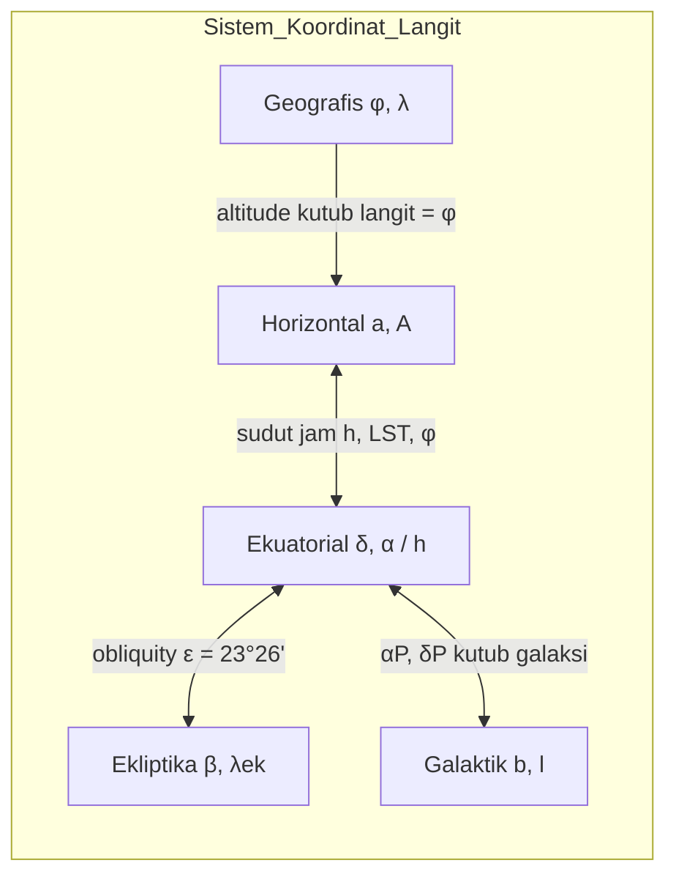
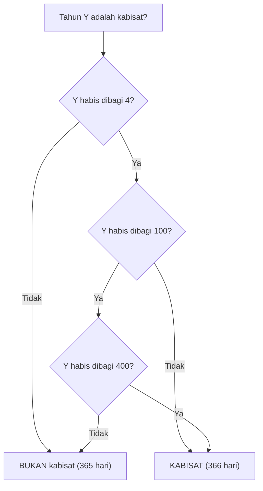
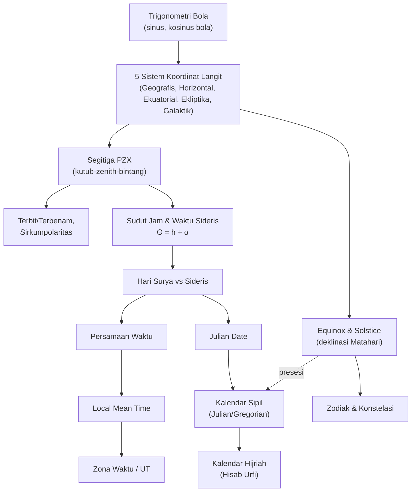

# BAB II — ASTRONOMI BOLA & BAB III — SISTEM WAKTU DAN KALENDAR

*(Part 2 dari seri Ringkasan OSN Astronomi — lihat Part 1 untuk daftar isi keseluruhan)*

> **Catatan format:** Bab ini sangat geometris. Karena Markdown tidak bisa menggambar bola langit 3D, saya sisipkan diagram alur `mermaid` untuk hal yang bersifat prosedural/hierarkis (alur transformasi koordinat, logika kalender), dan **placeholder eksplisit** `[Sisipkan Diagram ...]` di titik-titik krusial tempat kamu (atau saya lewat tool visualisasi terpisah jika diminta) perlu menambahkan gambar bola langit sebenarnya. Setiap placeholder saya lengkapi deskripsi tertulis rinci tentang apa yang harus digambar, sehingga tetap bisa dipelajari tanpa gambarnya.

---

## Daftar Isi Bab Ini

**Bab II — Astronomi Bola**
1. [Trigonometri Bola](#ii1)
2. [Koordinat Langit dan Transformasinya](#ii2)
3. [Equinox, Solstice, Bintang Sirkumpolar, Zodiak](#ii3)

**Bab III — Sistem Waktu dan Kalendar**
1. [Waktu Sideris vs Waktu Surya](#iii1)
2. [Persamaan Waktu (Equation of Time)](#iii2)
3. [Julian Date](#iii3)
4. [Zona Waktu dan Universal Time](#iii4)
5. [Local Mean Time](#iii5)
6. [Kalendar: Julian, Gregorian, Hijriah, Cina](#iii6)
7. [Konversi Kalendar Hijriah (Hisab Urfi) ↔ Masehi](#iii7)

---

# BAB II — ASTRONOMI BOLA

<a name="ii1"></a>
## 1. Trigonometri Bola

### A. Konsep Inti

Semua posisi benda langit "ditempelkan" secara konseptual pada permukaan dalam sebuah bola raksasa berpusat di pengamat — **bola langit (celestial sphere)**. Karena jarak bintang diabaikan (dianggap tak berhingga), yang penting hanyalah **arah**, sehingga posisi benda langit cukup dinyatakan dengan dua sudut, seperti koordinat lintang-bujur di permukaan bola.

Untuk memindah-mindahkan (transformasi) sudut antar sistem koordinat berbeda, kita butuh **trigonometri bola**: geometri pada permukaan bola, bukan bidang datar.

**Konsep dasar:**
- **Lingkaran besar (great circle)** — perpotongan bola dengan bidang yang melalui pusat bola (radiusnya = radius bola). Contoh: ekuator langit, ekliptika, horizon.
- **Lingkaran kecil (small circle)** — perpotongan bola dengan bidang yang TIDAK melalui pusat. Contoh: lingkaran deklinasi konstan (paralel lintang langit).
- **Segitiga bola** — dibentuk oleh tiga busur lingkaran besar. Berbeda dari segitiga datar: **jumlah sudutnya > 180°**, dan luasnya berbanding lurus dengan **kelebihan bola (spherical excess)** $E = A+B+C-180°$.

```
[Sisipkan Diagram: Segitiga Bola Umum]
Deskripsi: Bola dengan tiga titik A, B, C di permukaannya, dihubungkan
oleh tiga busur lingkaran besar (sisi a=BC, b=CA, c=AB, huruf kecil
sesuai sudut pusat/sisi di seberang titik berhuruf besar yang sama).
Tunjukkan sudut A, B, C di setiap titik sudut sebagai sudut antara
dua busur yang bertemu di titik tersebut.
```

### B. Rumus Penting

| Nama | Rumus | Variabel | Kapan dipakai |
|---|---|---|---|
| **Aturan Sinus Bola** | $\dfrac{\sin a}{\sin A}=\dfrac{\sin b}{\sin B}=\dfrac{\sin c}{\sin C}$ | huruf besar = sudut, huruf kecil = sisi (sudut pusat) di seberangnya | Mengaitkan sisi & sudut berlawanan |
| **Aturan Kosinus Bola (sisi)** | $\cos a = \cos b\cos c+\sin b\sin c\cos A$ | | Mencari sisi ketiga dari 2 sisi + sudut apitnya (mirip aturan kosinus datar) |
| **Aturan Sinus-Kosinus** | $\cos b\sin a = \sin b\cos c\cos A + \cos b\sin c$ *(lihat catatan)* | — | Transformasi sistem koordinat (dipakai di §II.2) |
| **Kelebihan bola** | $E = A+B+C-180°$ | $E$: dalam radian utk rumus luas | Selalu $E>0$ di segitiga bola nyata |
| **Luas segitiga bola** | $\text{Luas} = E\,r^2$ | $r$: radius bola, $E$ dalam radian | |
| **Limit segitiga datar** | Untuk sisi kecil: $\sin a\to a,\ \cos a\to 1-\tfrac12 a^2$ | | Mengecek rumus bola tereduksi ke rumus datar |

> **Catatan notasi:** Buku sumber menuliskan bentuk lengkap sistem tiga persamaan (persamaan 2.7 di *Fundamental Astronomy*):
> $$\sin B\sin a=\sin A\sin b$$
> $$\cos B\sin a = -\cos A\sin b\cos c+\cos b\sin c$$
> $$\cos a = \cos A\sin b\sin c+\cos b\cos c$$
> Persamaan kedua ini yang disebut **"sine-cosine formula"** dan menjadi mesin utama semua transformasi koordinat langit di §II.2 — hafalkan strukturnya, bukan hanya hasil akhirnya, karena permutasi siklik $(a,b,c)\to(A,B,C)$ menghasilkan variasi lain yang setara.

### C. Derivasi Singkat

Cara paling elegan (dipakai buku sumber): bangun dua kerangka koordinat Cartesian $Oxyz$ dan $Ox'y'z'$ yang saling terkait lewat rotasi sebesar sudut $\chi$ terhadap sumbu $x$. Nyatakan posisi titik $C$ pada segitiga bola dalam kedua kerangka menggunakan sudut $(\psi,\theta)$ dan $(\psi',\theta')$. Dengan memilih sumbu $z$ menuju titik sudut $A$ dan sumbu $z'$ menuju titik sudut $B$, sudut-sudut $\psi,\theta,\psi',\theta',\chi$ dapat dinyatakan dalam sisi/sudut segitiga ($a,b,c,A,B$). Substitusi ke persamaan rotasi koordinat menghasilkan tiga rumus di atas.

**Rumus luas** diturunkan dengan memperpanjang ketiga sisi segitiga menjadi lingkaran besar penuh: ini membelah bola menjadi beberapa "irisan" (*lune*) bersudut $A$, $B$, $C$, plus segitiga asli dan bayangan antipodalnya. Menjumlahkan luas semua irisan (yang totalnya = luas bola penuh + $4\times$luas segitiga) menghasilkan $\text{Luas}=(A+B+C-\pi)r^2$.

### D. Intuisi dan Interpretasi

- Trigonometri bola **mereduksi menjadi trigonometri datar** untuk segitiga sangat kecil (sisi $\ll$ radius) — cek intuisi: astronomi bola untuk lapangan pandang sempit (mis. teleskop) hampir selalu bisa didekati datar.
- Kelebihan bola $E$ adalah **ukuran kelengkungan yang "dirasakan"** segitiga tersebut — segitiga yang menutupi seperempat bola (oktan) punya $E=90°=\pi/2$ rad, sehingga sudut-sudutnya sendiri masing-masing $90°$ (total $270°$, kelebihan $90°$).
- Dalam praktik OSN, **rumus kosinus sisi** paling sering dipakai untuk soal "cari jarak sudut antar dua titik di langit/Bumi jika koordinat keduanya diketahui" — pola soal yang sangat umum (lihat contoh di bawah).

### E. Contoh Soal OSN

**Soal:** Kota A punya lintang $\varphi_1=60°$ LU, bujur $\lambda_1=25°$ BT. Kota B punya lintang $\varphi_2=28{,}7°$ LU, bujur $\lambda_2=17{,}9°$ BB. Hitung jarak sudut antara kedua kota di permukaan Bumi.

**Penyelesaian:** Bentuk segitiga bola dengan titik puncak di kutub utara $N$, dan titik $A$, $B$ sebagai dua kota. Sisi $NA = 90°-\varphi_1$, sisi $NB=90°-\varphi_2$, sudut puncak di $N$ = selisih bujur $= \lambda_2-\lambda_1$. Gunakan aturan kosinus sisi:
$$\cos a = \cos(\lambda_2-\lambda_1)\sin(90°-\varphi_1)\sin(90°-\varphi_2)+\cos(90°-\varphi_1)\cos(90°-\varphi_2)$$
$$= \cos(\lambda_2-\lambda_1)\cos\varphi_1\cos\varphi_2+\sin\varphi_1\sin\varphi_2$$

Selisih bujur $=17{,}9°-(-25°)$... hati-hati tanda: jika $\lambda_1=25°$BT $=+25°$ dan $\lambda_2=17{,}9°$BB$=-17{,}9°$, maka $\lambda_2-\lambda_1=-42{,}9°$, $\cos(-42{,}9°)=0{,}7325$.
$$\cos a = 0{,}7325\times\cos60°\times\cos28{,}7° + \sin60°\times\sin28{,}7°$$
$$=0{,}7325\times0{,}5\times0{,}8771+0{,}8660\times0{,}4802 \approx 0{,}7372$$
$$a=\arccos(0{,}7372)\approx42{,}5°$$

Jarak di permukaan Bumi $= R_\oplus\times a(\text{rad}) = 6400\text{ km}\times0{,}7419 \approx 4748$ km.

**Kesalahan umum:** lupa mengonversi jarak zenit/lintang ke $90°-\varphi$ pada rumus (karena sisi segitiga adalah **sudut pusat**, bukan lintang langsung); lupa konversi derajat↔radian saat menghitung luas atau saat mengalikan sudut dengan radius.

---

<a name="ii2"></a>
## 2. Koordinat Langit dan Transformasinya

### A. Konsep Inti

Setiap sistem koordinat langit didefinisikan oleh: **bidang acuan** (yang memotong bola langit membentuk lingkaran besar "ekuator" sistem tsb.) dan **titik nol** (arah referensi di sepanjang lingkaran itu). Lima sistem utama dalam silabus:

| Sistem | Bidang Acuan | Kutub | Titik Nol (sumbu 0°) | Koordinat |
|---|---|---|---|---|
| **Geografis** (Bumi) | Ekuator Bumi | Kutub Utara/Selatan Bumi | Meridian Greenwich | Lintang $\varphi$, Bujur $\lambda$ |
| **Horizontal** | Horizon (bidang singgung Bumi di lokasi pengamat) | Zenith / Nadir | Utara atau Selatan (konvensi berbeda-beda!) | Altitud $a$ (atau jarak zenit $z=90°-a$), Azimut $A$ |
| **Ekuatorial** | Ekuator langit (perpanjangan ekuator Bumi) | Kutub Langit Utara/Selatan | Titik Aries (vernal equinox) ATAU meridian pengamat | Deklinasi $\delta$, Asensio rekta $\alpha$ (tetap) / Sudut jam $h$ (berubah) |
| **Ekliptika** | Bidang orbit Bumi (ekliptika) | Kutub Ekliptika | Titik Aries | Lintang ekliptika $\beta$, Bujur ekliptika $\lambda_{ek}$ |
| **Galaktik** | Bidang Galaksi Bima Sakti | Kutub Galaksi Utara/Selatan | Arah ke pusat Galaksi (Sagitarius) | Lintang galaktik $b$, Bujur galaktik $l$ |

**Mengapa perlu 5 sistem?** Setiap sistem "nyaman" untuk konteks berbeda:
- **Horizontal** — natural untuk pengamat (altitude/azimuth langsung terlihat), tapi berubah tiap saat karena rotasi Bumi & beda untuk tiap lokasi → **tidak** cocok untuk katalog.
- **Ekuatorial** — $(\alpha,\delta)$ nyaris tetap (hanya berubah lambat oleh presesi/nutasi) → **standar katalog bintang**.
- **Ekliptika** — natural untuk anggota Tata Surya (planet, asteroid bergerak dekat bidang ini).
- **Galaktik** — natural untuk mempelajari struktur Bima Sakti.



```
[Sisipkan Diagram: Bola Langit dengan Kelima Sistem Koordinat]
Deskripsi: Bola langit dengan pengamat di pusat. Tunjukkan:
(1) Bidang horizon (mendatar) dengan zenith di atas, nadir di bawah,
    titik Utara-Timur-Selatan-Barat di horizon.
(2) Bidang ekuator langit dimiringkan sebesar φ (lintang pengamat)
    terhadap horizon, dengan Kutub Langit Utara pada altitude = φ.
(3) Bidang ekliptika dimiringkan sebesar ε≈23,5° terhadap ekuator
    langit, berpotongan di titik Aries (♈, vernal equinox) dan
    titik Libra (autumnal equinox).
Tunjukkan satu bintang X dengan garis-garis proyeksi ke masing-masing
bidang acuan, dan sudut-sudut a, A, δ, α/h, β, λek digambar secara
eksplisit dari bintang tersebut.
```

### B. Rumus Penting — Transformasi Horizontal ↔ Ekuatorial

Kunci: gunakan **segitiga bola paralaktik / "segitiga nautika"** dengan tiga titik sudut **Kutub Langit (P), Zenith (Z), Bintang (X)** — sering disebut **segitiga PZX**.

```
[Sisipkan Diagram: Segitiga Bola PZX]
Deskripsi: Bola langit dengan tiga titik: P (Kutub Langit Utara),
Z (Zenith pengamat), X (posisi bintang). Sisi PZ = 90°-φ (colatitude
pengamat). Sisi ZX = z = jarak zenit bintang (90°-a). Sisi PX =
90°-δ (co-declination bintang). Sudut di P = h (sudut jam bintang).
Sudut di Z = 360°-A atau A tergantung konvensi (azimut diukur dari
Utara/Selatan). Sudut di X = sudut paralaktik q (jarang dipakai
langsung di OSN Penyisihan, tapi penting utk polarimetri/spektroskopi
resolusi tinggi).
Ini adalah SATU diagram paling penting di seluruh Bab Astronomi Bola —
hampir semua rumus transformasi horizontal-ekuatorial diturunkan dari
segitiga ini.
```

| Nama | Rumus | Keterangan |
|---|---|---|
| **Ekuatorial → Horizontal** | $\sin a = \sin\delta\sin\varphi+\cos\delta\cos\varphi\cos h$ | $h$: sudut jam objek |
| | $\cos A\cos a = -\cos\delta\sin\varphi\cos h + \sin\delta\cos\varphi$ *(konvensi azimut dari Selatan, lihat catatan)* | |
| | $\sin A\cos a = -\cos\delta\sin h$ | |
| **Horizontal → Ekuatorial** | $\sin\delta = \sin a\sin\varphi+\cos a\cos\varphi\cos A$ | |
| | $\cos h\cos\delta = \cos a\cos\varphi-\sin a\sin\varphi\cos A$ | |
| | $\sin h\cos\delta = -\cos a\sin A$ | |
| **Altitude puncak (kulminasi atas)** | $a_{max}=90°-\varphi+\delta$ (jika kulminasi di selatan zenith) | Saat $h=0$ |
| **Altitude kulminasi bawah** | $a_{min}=\delta+\varphi-90°$ | Saat $h=12^h$ |
| **Kondisi terbit/terbenam** | $\cos h = -\tan\delta\tan\varphi$ | Saat $a=0$ (dikoreksi refraksi: $a\approx-34'$ untuk titik pusat, $-50'$ untuk piringan Matahari) |

> **Peringatan konvensi:** Buku sumber mengukur azimut **searah jarum jam dari SELATAN** (konvensi astronomi klasik) — banyak buku lain (geografi, navigasi) mengukur dari **UTARA**. Selalu cek definisi soal!

### B (lanjutan). Rumus Transformasi Ekuatorial ↔ Ekliptika

| Nama | Rumus |
|---|---|
| Ekuatorial → Ekliptika | $\sin\lambda_{ek}\cos\beta=\sin\delta\sin\varepsilon+\cos\delta\cos\varepsilon\sin\alpha$ |
| | $\cos\lambda_{ek}\cos\beta = \cos\delta\cos\alpha$ |
| | $\sin\beta = \sin\delta\cos\varepsilon-\cos\delta\sin\varepsilon\sin\alpha$ |
| Ekliptika → Ekuatorial | $\sin\alpha\cos\delta = -\sin\beta\sin\varepsilon+\cos\beta\cos\varepsilon\sin\lambda_{ek}$ |
| | $\cos\alpha\cos\delta=\cos\lambda_{ek}\cos\beta$ |
| | $\sin\delta = \sin\beta\cos\varepsilon+\cos\beta\sin\varepsilon\sin\lambda_{ek}$ |

dengan $\varepsilon\approx23°26'$ **obliquity ekliptika** (kemiringan sumbu rotasi Bumi terhadap bidang orbitnya).

### B (lanjutan). Rumus Transformasi Ekuatorial ↔ Galaktik

$$\sin(l_N-l)\cos b = \cos\delta\sin(\alpha-\alpha_P)$$
$$\sin b = \cos\delta\cos\delta_P\cos(\alpha-\alpha_P)+\sin\delta\sin\delta_P$$

dengan kutub galaksi utara di $\alpha_P=12^h51{,}4^m$, $\delta_P=27°08'$, dan $l_N=123{,}0°$.

### C. Derivasi Singkat

Semua rumus transformasi di atas adalah **kasus khusus** dari sistem persamaan sinus-kosinus bola (§II.1) dengan substitusi sudut yang berbeda-beda tergantung pasangan sistem koordinat yang ditransformasi (memindahkan sumbu $z$/$z'$ ke kutub sistem masing-masing). Sebagai contoh untuk horizontal↔ekuatorial, substitusi $\psi=90°-A$, $\theta=a$, $\psi'=90°-h$, $\theta'=\delta$, $\chi=90°-\varphi$ ke persamaan umum (2.5) langsung menghasilkan seluruh rumus horizontal↔ekuatorial di atas — **tidak perlu dihafal terpisah**, cukup hafal template umum + substitusi sudutnya per sistem.

### D. Intuisi dan Interpretasi

- **Sudut jam waktu sideris:** $\Theta = h+\alpha$ — hubungan paling penting yang menjembatani "kapan" (waktu sideris) dan "di mana" (koordinat objek). Ini kunci untuk merencanakan kapan objek tertentu bisa diamati.
- Ketinggian kutub langit di atas horizon **selalu sama dengan lintang geografis pengamat** ($a_{\text{kutub}}=\varphi$) — cara cepat menentukan lintang tanpa instrumen canggih (metode klasik para pelaut).
- Bintang sirkumpolar (lihat §II.3) langsung bisa diprediksi dari rumus altitude kulminasi: bintang dengan $\delta>90°-\varphi$ tidak pernah terbenam.

### E. Contoh Soal OSN

**Soal:** Di Yogyakarta ($\varphi\approx-7{,}8°$), sebuah bintang punya deklinasi $\delta=+20°$. Berapa altitude maksimum bintang tersebut saat kulminasi atas?

**Penyelesaian:** Karena $\delta>\varphi$, bintang berkulminasi di sebelah **utara** zenith (untuk pengamat di lintang selatan/rendah dengan $\delta>\varphi$), sehingga:
$$a_{max}=90°+\varphi-\delta = 90°+(-7{,}8°)-20°=62{,}2°$$

**Kesalahan umum:** salah memilih rumus $90°-\varphi+\delta$ vs $90°+\varphi-\delta$ — tentukan dulu apakah bintang berkulminasi di utara atau selatan zenith dengan membandingkan $\delta$ terhadap $\varphi$; kesalahan tanda di sini sangat sering terjadi terutama untuk pengamat di lintang rendah/khatulistiwa seperti Indonesia.

---

<a name="ii3"></a>
## 3. Equinox, Solstice, Bintang Sirkumpolar, Konstelasi, dan Zodiak

### A. Konsep Inti

**Equinox (ekuinoks)** — momen (dan juga *titik* di langit) saat Matahari, dalam gerak semunya sepanjang ekliptika, memotong ekuator langit. Ada dua per tahun:
- **Vernal equinox (♈, titik Aries)** — Matahari bergerak dari selatan ke utara ekuator langit (sekitar 20/21 Maret). Ini **titik nol** sistem koordinat ekuatorial DAN ekliptika.
- **Autumnal equinox** — Matahari dari utara ke selatan (sekitar 22/23 September).
Pada kedua momen ini, $\delta_\odot=0$, siang-malam hampir sama panjang di seluruh Bumi.

**Solstice (titik balik/soltisium)** — saat Matahari mencapai deklinasi ekstrem:
- **Summer solstice** (~21 Juni): $\delta_\odot=+\varepsilon\approx+23{,}5°$ — siang terpanjang di belahan utara.
- **Winter solstice** (~21 Desember): $\delta_\odot=-\varepsilon$ — siang terpendek di belahan utara.

```
[Sisipkan Diagram: Orbit Bumi Mengelilingi Matahari dengan 4 Titik Musim]
Deskripsi: Elips orbit Bumi mengelilingi Matahari (fokus di Matahari).
Tandai 4 posisi Bumi: vernal equinox (Maret), summer solstice (Juni),
autumnal equinox (September), winter solstice (Desember). Pada tiap
posisi, gambar sumbu rotasi Bumi (dimiringkan konstan 23,5° terhadap
normal bidang orbit, SEJAJAR untuk semua posisi -- ini kunci konsep
yang sering disalahpahami siswa, arah sumbu TIDAK berubah mengikuti
orbit). Tunjukkan belahan mana yang condong ke Matahari di tiap titik.
```

**Bintang sirkumpolar (circumpolar star)** — bintang yang tidak pernah terbenam (selalu di atas horizon) bagi pengamat di lintang tertentu. Syarat: $\delta>90°-|\varphi|$ (belahan yang sama dengan pengamat). Sebaliknya, bintang dengan $\delta<-(90°-|\varphi|)$ (belahan berlawanan) tidak pernah terbit — **selalu tak terlihat**.

> **Kasus khusus Indonesia:** Karena sebagian besar wilayah Indonesia berada sangat dekat khatulistiwa ($\varphi\approx0°$), praktis **tidak ada bintang sirkumpolar** dan **tidak ada bintang yang selalu tak terlihat** — hampir semua bintang di langit terbit dan terbenam sepanjang tahun. Ini keunggulan geografis untuk pengamatan langit penuh, sering muncul sebagai poin konseptual di soal OSN regional.

**Konstelasi** — pembagian langit menjadi 88 daerah resmi (ditetapkan IAU 1930) berdasarkan pola bintang yang tampak, warisan budaya kuno (Yunani, Arab, Cina, dll.). **Berbeda dengan asterisma** (pola bintang informal, mis. Big Dipper bukan konstelasi resmi, hanya bagian dari konstelasi Ursa Major).

**Zodiak** — 12 (secara astrologis) atau 13 (secara astronomis, termasuk Ophiuchus) konstelasi yang dilalui ekliptika (jalur semu Matahari). Karena presesi (§II lanjutan bab perturbasi koordinat, akan detail di Bab VII), posisi tanda zodiak astrologis SUDAH TIDAK sejajar dengan konstelasi aktual bernama sama — pergeseran akumulatif ~1° per 72 tahun.

### B. Rumus Penting

| Nama | Rumus | Keterangan |
|---|---|---|
| Syarat sirkumpolar | $\delta > 90°-\lvert\varphi\rvert$ (belahan sama tanda dengan $\varphi$) | Bintang tak pernah terbenam |
| Syarat tak pernah terbit | $\delta < -(90°-\lvert\varphi\rvert)$ | Bintang tak pernah terlihat dari lokasi tsb |
| Deklinasi Matahari (aproksimasi) | $\delta_\odot \approx \varepsilon\sin\lambda_{ek,\odot}$, dengan $\lambda_{ek,\odot}\approx\dfrac{360°}{365{,}25}(n+10)$ | $n$ = hari sejak 1 Januari; aproksimasi kasar untuk estimasi cepat |

### D. Intuisi dan Interpretasi

- Equinox/solstice bukan disebabkan jarak Bumi-Matahari berubah (elipsitas orbit Bumi kecil, $e\approx0{,}0167$) — melainkan **kemiringan sumbu rotasi Bumi (23,5°) yang arahnya tetap** sepanjang orbit. Inilah kesalahpahaman paling umum di kalangan awam yang wajib diluruskan.
- Panjang siang bergantung pada berapa lama busur diurnal (lintasan harian) bintang/Matahari berada di atas horizon — dapat dihitung dari sudut jam terbit/terbenam $h_0=\arccos(-\tan\delta\tan\varphi)$; panjang siang $=2h_0$ (dalam satuan waktu).
- Zodiak 13 (dengan Ophiuchus) adalah fakta astronomis murni geometris (ekliptika memang melewati batas resmi konstelasi Ophiuchus), sedangkan pembagian 12 tanda zodiak astrologi adalah konvensi kuno yang tidak lagi cocok dengan posisi bintang riil akibat presesi.

### E. Contoh Soal OSN

**Soal:** Berapa lama siang hari (busur diurnal Matahari di atas horizon) di Yogyakarta ($\varphi=-7{,}8°$) saat winter solstice ($\delta_\odot=-23{,}5°$)?

**Penyelesaian:**
$$\cos h_0 = -\tan\delta\tan\varphi = -\tan(-23{,}5°)\tan(-7{,}8°) = -(-0{,}4348)(-0{,}1370)=-0{,}0596$$
$$h_0 = \arccos(-0{,}0596)\approx93{,}4° = 6{,}227^h$$
Panjang siang $=2h_0\approx12{,}45^h \approx 12$ jam 27 menit.

**Interpretasi:** karena Yogyakarta dekat khatulistiwa, variasi panjang siang sepanjang tahun sangat kecil (di sini hanya sedikit lebih panjang dari 12 jam meski winter solstice) — kontras jauh dengan lintang tinggi yang variasinya ekstrem (siang/malam kutub).

---

# BAB III — SISTEM WAKTU DAN KALENDAR

<a name="iii1"></a>
## 1. Waktu Sideris vs Waktu Surya

### A. Konsep Inti

Ada dua "jam kosmik" alami berdasarkan rotasi Bumi, tergantung acuan yang dipakai:

- **Waktu sideris (sidereal time, $\Theta$)** — diukur relatif bintang tetap (titik Aries). Satu hari sideris = waktu antara dua kulminasi atas berturut-turut titik Aries = periode rotasi Bumi **sebenarnya** relatif bintang jauh $\approx23^h56^m4^s$.
- **Waktu surya (solar time)** — diukur relatif Matahari. Satu hari surya (synodic) = waktu antara dua kulminasi Matahari = **24 jam** (didefinisikan begitu).

**Mengapa beda?** Selama Bumi berotasi sekali penuh (1 hari sideris), Bumi juga sudah bergerak ~1° sepanjang orbitnya mengelilingi Matahari, sehingga Bumi harus berotasi sedikit lebih jauh lagi agar Matahari kembali berkulminasi — hari surya jadi **lebih panjang** ~3 menit 56 detik dari hari sideris.

```
[Sisipkan Diagram: Geometri Hari Sideris vs Hari Surya]
Deskripsi: Dua posisi Bumi mengorbit Matahari, posisi A dan posisi B
(sedikit bergeser di orbit, mewakili pergerakan Bumi selama ~1 hari).
Pada posisi A, gambar arah "Bumi menghadap ke bintang jauh (Aries)"
dan arah "Bumi menghadap ke Matahari" -- keduanya sejajar/paralel
(karena bintang jauh tak terhingga jauhnya). Pada posisi B (Bumi
sudah berotasi 360° relatif Aries DAN bergeser di orbit), tunjukkan
bahwa arah ke Aries sudah kembali ke arah semula tapi arah ke Matahari
BELUM (karena posisi Bumi berubah) -- Bumi harus berotasi sedikit lagi
(~1°, digambar sebagai sudut kecil ε pada diagram) agar Matahari
kembali berkulminasi. Sudut kecil inilah yang setara dengan selisih
3 menit 56 detik.
```

### B. Rumus Penting

| Nama | Rumus | Keterangan |
|---|---|---|
| Hubungan sudut jam-asensiorekta-waktu sideris | $\Theta = h+\alpha$ | Persamaan paling fundamental Bab III |
| Konversi hari surya-sideris | $24^h_{\text{surya}} = 24^h3^m56{,}56^s_{\text{sideris}}$ | Jam sideris "berlari lebih cepat" |
| Periode sideris vs sinodis (rotasi planet) | $\dfrac1\tau = \dfrac1{\tau_*}-\dfrac1P$ (rotasi searah orbit) atau $\dfrac1\tau=\dfrac1{\tau_*}+\dfrac1P$ (retrograd) | $\tau_*$: periode rotasi sideris, $\tau$: hari sinodis (matahari), $P$: periode orbit |
| Tahun tropis | $365{,}2422$ hari (equinox ke equinox) | Basis kalender sipil |
| Tahun sideris | $365{,}2564$ hari (relatif bintang tetap) | Beda dengan tropis akibat presesi |

### C. Derivasi Singkat

Dari geometri di atas: jika periode orbit $P$ dan hari sideris $\tau_*$, maka dalam waktu $P$ jumlah hari sideris adalah $P/\tau_*$, dan jumlah hari surya (sinodis) adalah $P/\tau$. Untuk rotasi searah orbit (prograde), jumlah hari sideris **satu lebih banyak** dari hari sinodis dalam satu periode orbit penuh (karena "kejar-mengejar" arah rotasi vs revolusi):
$$\frac{P}{\tau_*}-\frac{P}{\tau}=1 \;\Rightarrow\; \frac1\tau=\frac1{\tau_*}-\frac1P$$
Untuk Bumi: $P=365{,}2564$ hari sideris (~), $\tau=1$ hari surya $\Rightarrow \tau_*=0{,}99727$ hari surya $=23^h56^m4^s$ ✓ konsisten dengan definisi di atas.

### D. Intuisi dan Interpretasi

- Rumus periode sideris-sinodis ini **rumus umum** yang juga berlaku untuk periode orbit-rotasi planet lain (Bab VII Tatasurya) — sangat sering dipakai lintas-bab di OSN, terutama untuk menghitung periode rotasi planet dari periode sinodis fenomena yang teramati (mis. pergerakan bintik permukaan).
- Karena jam sideris "lebih cepat", posisi bintang yang sama akan terbit ~4 menit lebih awal setiap malam berikutnya — inilah alasan konstelasi musiman berubah sepanjang tahun (mis. Orion terlihat di malam hari saat musim tertentu, tak terlihat di musim lain karena "terbit" bersamaan Matahari).

### E. Contoh Soal OSN

**Soal:** Jika periode orbit Venus mengelilingi Matahari adalah 224,7 hari dan periode rotasi Venus (sideris) adalah 243 hari (retrograde), berapa lama satu hari matahari (sinodis) di Venus?

**Penyelesaian:** Karena retrograde, gunakan $\dfrac1\tau=\dfrac1{\tau_*}+\dfrac1P$ dengan tanda disesuaikan (rotasi retrograde berarti $\tau_*$ dianggap negatif dalam konvensi tanda, atau langsung pakai rumus retrograde):
$$\frac1\tau = \frac1{243}+\frac1{224{,}7} = 0{,}004115+0{,}004450=0{,}008565$$
$$\tau \approx 116{,}75 \text{ hari Bumi}$$
(Nilai riil ≈ 116,75 hari — cocok! Ini contoh klasik OSN/IOAA yang sangat sering muncul.)

---

<a name="iii2"></a>
## 2. Persamaan Waktu (Equation of Time)

### A. Konsep Inti

Waktu Matahari sejati (*apparent solar time*, dibaca langsung dari jam matahari/sundial) **tidak mengalir merata** sepanjang tahun, karena dua efek independen:

1. **Orbit Bumi elips** (Hukum Kepler II) — Bumi bergerak lebih cepat di dekat perihelion (Januari) dan lebih lambat di aphelion (Juli), sehingga laju pergerakan semu Matahari sepanjang ekliptika tidak konstan.
2. **Matahari bergerak sepanjang ekliptika, bukan ekuator** — bahkan jika kecepatan sepanjang ekliptika konstan, proyeksi geraknya ke asensio rekta (yang menentukan waktu) tetap tidak seragam karena kemiringan ekliptika terhadap ekuator ($\varepsilon$).

Untuk mengatasi ini, didefinisikan **Matahari rata-rata (mean sun)** fiktif yang bergerak dengan kecepatan sudut konstan sepanjang ekuator langit, menyelesaikan satu putaran penuh dalam satu tahun tropis. **Waktu Matahari rata-rata (mean solar time)** inilah dasar jam sipil kita.

**Persamaan waktu** = selisih antara waktu Matahari sejati dan waktu Matahari rata-rata.

```
[Sisipkan Diagram: Kurva Analemma / Grafik Persamaan Waktu Sepanjang Tahun]
Deskripsi: Grafik sumbu-x = bulan (Jan-Des), sumbu-y = E.T. dalam
menit, berbentuk kurva berosilasi dengan dua puncak dan dua lembah
tidak simetris sepanjang tahun. Tandai nilai ekstrem: sekitar
+16 menit (awal November) dan sekitar -14 menit (pertengahan
Februari), serta titik potong nol di sekitar April, Juni, September,
Desember. (Alternatif: bentuk analemma "angka 8" jika sumbu-y diganti
deklinasi Matahari, sumbu-x tetap E.T. -- bentuk klasik yang sering
terlihat pada globe/foto time-lapse Matahari.)
```

### B. Rumus Penting

| Nama | Rumus | Keterangan |
|---|---|---|
| Definisi Persamaan Waktu | $E.T. = T_{\text{sejati}} - T_M$(rata-rata) | Bisa positif (jam matahari mendahului) atau negatif |
| Waktu Matahari rata-rata | $T_M = h_M + 12^h$ | $h_M$: sudut jam Matahari rata-rata; $+12^h$ agar pergantian tanggal di tengah malam |
| Rentang nilai E.T. | $-14^m \lesssim E.T. \lesssim +16^m$ | Ekstrem sekitar pertengahan Februari (min) dan awal November (maks) |

### D. Intuisi dan Interpretasi

- Persamaan waktu adalah **alasan matematis** mengapa waktu terbit/terbenam Matahari "tercepat"/"terlambat" tidak persis jatuh di titik solstice/equinox — pergeseran ini kombinasi efek elipsitas orbit dan obliquity, masing-masing berkontribusi dengan periode dan fase berbeda (jumlah dua gelombang sinusoidal berbeda periode menghasilkan kurva analemma yang tidak simetris).
- Sundial (jam matahari) selalu menunjukkan waktu sejati lokal — untuk mengetahui waktu sipil (jam tangan), harus dikurangi $E.T.$ (dan juga dikoreksi bujur lokal terhadap meridian zona waktu, lihat §III.4–5).

### E. Contoh Soal OSN

**Soal (konseptual):** Jelaskan mengapa hari dengan siang terpanjang (summer solstice) TIDAK selalu bertepatan dengan hari matahari terbit paling awal.

**Jawaban:** Waktu terbit Matahari bergantung pada KOMBINASI deklinasi Matahari (menentukan panjang busur diurnal) DAN persamaan waktu (menentukan pergeseran waktu kulminasi sejati terhadap jam sipil rata-rata). Saat solstice, deklinasi Matahari mencapai ekstrem (memaksimalkan/meminimalkan panjang siang), tapi $E.T.$ pada tanggal tersebut belum tentu nol atau ekstrem — sehingga waktu kulminasi (dan karenanya waktu terbit) sejati bergeser dari yang "diharapkan" jika hanya mempertimbangkan panjang siang saja.

---

<a name="iii3"></a>
## 3. Julian Date

### A. Konsep Inti

Karena bulan dan tahun kalender sipil punya panjang tidak seragam (28–31 hari per bulan, tahun kabisat, dst.), astronom memakai **Julian Date (JD)** — penomoran hari berurutan tanpa jeda, sangat memudahkan perhitungan selisih waktu antar dua peristiwa astronomis, berapa pun jauhnya.

- JD = 0 dimulai tengah hari (**12:00 UT**, bukan tengah malam!) pada 1 Januari 4713 SM (kalender Julian proleptik) — tanggal ini dipilih murni karena matematis nyaman (awal siklus gabungan beberapa siklus kalender kuno), bukan punya makna astronomis khusus.
- Epoch standar J2000.0 = JD 2.451.545,0 = 1 Januari 2000, 12:00 UT.
- **Modified Julian Date (MJD)** $=JD-2.400.000{,}5$ — angka lebih kecil dan mulai tengah malam, lebih praktis untuk komputasi modern.

### B. Rumus Penting

Untuk tahun $y$, bulan $m$ ($1$–$12$), tanggal $d$ (Julian Date pada tengah hari):
$$J = 367y - \left\lfloor 7\left(y+\lfloor(m+9)/12\rfloor\right)/4\right\rfloor - \left\lfloor3\left(\lfloor(y+(m-9)/7)/100\rfloor+1\right)/4\right\rfloor + \lfloor275m/9\rfloor + d + 1.721.029$$

(⌊ ⌋ = pembulatan ke bawah/pembagian bulat, bagian desimal dibuang, termasuk untuk bilangan negatif.)

**Konversi Julian Century** (dipakai untuk formula sidereal time, presesi, dll.):
$$T = \frac{J-2.451.545{,}0}{36.525}$$

**Hari dalam seminggu:** sisa bagi $J/7$ pada JD tengah hari: $0=$Senin, $1=$Selasa, ..., $5=$Sabtu, $6=$Minggu.

### C. Derivasi Singkat

Rumus di atas adalah algoritma kalender-ke-JD hasil rekayasa matematis (bukan diturunkan dari prinsip fisis) yang menangani pergantian antara sistem kabisat Julian dan Gregorian secara otomatis lewat suku koreksi abad ($\lfloor y/100\rfloor$ dst.) — cukup **dipakai sebagai algoritma**, bukan dihafal derivasinya. Yang penting dipahami: strukturnya memetakan tiga variabel diskret (tahun, bulan, tanggal) yang "tidak rata" menjadi satu bilangan bulat berurutan.

### D. Intuisi dan Interpretasi

- JD dimulai tengah hari (bukan tengah malam) karena tradisi astronom observasional: malam pengamatan (yang melewati tengah malam) tetap punya SATU nomor JD yang sama sepanjang sesi pengamatan tersebut — memudahkan pencatatan data.
- Perbedaan dua JD langsung memberi selisih hari — sangat berguna untuk menghitung fase bulan, periode variabel bintang, usia peristiwa astronomis, dll., tanpa harus menghitung manual jumlah hari per bulan/tahun kabisat.

### E. Contoh Soal OSN

**Soal:** Hitung Julian Date untuk 1 Januari 1990 (tengah hari).

**Penyelesaian** (mengikuti algoritma): $y=1990$, $m=1$, $d=1$.
$$J = 367(1990) - \left\lfloor7\left(1990+\lfloor10/12\rfloor\right)/4\right\rfloor - \left\lfloor3\left(\lfloor(1990+(1-9)/7)/100\rfloor+1\right)/4\right\rfloor+\lfloor275/9\rfloor+1+1.721.029$$
$$= 730.330 - 3482 - 15 + 30 + 1 + 1.721.029 = 2.447.893$$

Karena $2.447.893 = 7\times349.699$ (habis dibagi 7, sisa 0), maka 1 Januari 1990 adalah hari **Senin** — cocok dengan fakta sejarah.

**Kesalahan umum:** lupa bahwa pembagian dalam rumus adalah pembagian bulat (integer division, dibulatkan ke bawah termasuk untuk hasil negatif — BUKAN dibulatkan ke nol); tertukar antara JD pada tengah hari vs JD pada 0 UT (selisih 0,5 hari, sering jadi jebakan soal).

---

<a name="iii4"></a>
## 4. Zona Waktu dan Universal Time

### A. Konsep Inti

**Universal Time (UT)** — waktu Matahari rata-rata di meridian Greenwich (bujur $0°$), acuan waktu sipil internasional. Karena rotasi Bumi $360°=24$ jam, tiap $15°$ bujur setara 1 jam.

Dunia dibagi menjadi ~24 **zona waktu**, masing-masing nominal $15°$ lebar, memakai waktu lokal meridian tengahnya (kelipatan $15°$) — meski batas politik/administratif sering membuat zona waktu tidak persis mengikuti garis bujur (contoh: Indonesia punya 3 zona WIB/WITA/WIT meski secara astronomis rentang bujurnya bisa mencakup lebih dari 3×15°).

**Hierarki waktu presisi tinggi (astronomi modern):**
- **UT1** — waktu berbasis rotasi Bumi aktual (tidak seragam sempurna, melambat perlahan).
- **TAI (International Atomic Time)** — berbasis osilasi atom cesium, sangat stabil.
- **UTC (Coordinated Universal Time)** — basis jam sipil dunia; berjalan sama laju dengan TAI tapi disesuaikan **detik kabisat (leap second)** agar tidak menyimpang >0,9 detik dari UT1.
- **TT (Terrestrial Time)**, dulu disebut TDT — dipakai untuk tabel efemeris planet; $TT=TAI+32{,}184^s$.

### B. Rumus Penting

| Nama | Rumus |
|---|---|
| Konversi bujur↔waktu | $1^h = 15°$; $1^m=15'$; $1^s=15''$ |
| Waktu zona (perkiraan) | $\text{Zona} = \text{round}(\lambda/15°)$ jam dari UT |
| TT dari UTC | $TT=UTC+32{,}184^s+\Delta AT$, dengan $\Delta AT=TAI-UTC$ (jumlah detik kabisat kumulatif) |
| Airmass (terkait §I ekstingsi, dipakai jg utk observasi) | $X=\sec z$ |

### D. Intuisi dan Interpretasi

- Leap second ada karena rotasi Bumi **melambat** secara perlahan (akibat gesekan pasang-surut, lihat Bab IV/V) — jam atom (super presisi & konstan) perlu "direm" sesekali agar tetap sinkron dengan hari matahari yang makin panjang, meski sangat sedikit.
- Untuk soal OSN tingkat Penyisihan, cukup memahami UT sebagai "waktu Greenwich" dan bisa mengonversi ke WIB (UT+7) dsb.; detail TAI/UTC/TT biasanya hanya muncul di level lebih lanjut (Seleksi/IOAA).

### E. Contoh Soal OSN

**Soal:** Pukul berapa UT ketika di Yogyakarta (WIB, UT+7) menunjukkan pukul 20:00?

**Penyelesaian:** $UT = 20{:}00 - 7{:}00 = 13{:}00$ UT.

---

<a name="iii5"></a>
## 5. Local Mean Time

### A. Konsep Inti

**Local Mean Time (LMT)** — waktu Matahari rata-rata di bujur lokal PENGAMAT (berbeda dari waktu zona, yang memakai bujur meridian tengah zona). Selisih LMT dan waktu zona murni akibat selisih bujur lokal terhadap meridian acuan zona.

### B. Rumus Penting

$$\text{LMT} = \text{UT} + \frac{\lambda(\text{BT positif})}{15°}\text{ jam}$$
$$\text{Waktu zona} = \text{UT}+\text{offset zona (jam bulat, kadang setengah/perempat jam)}$$
$$\text{LMT} - \text{Waktu zona sipil} = \frac{\lambda_{\text{lokal}}-\lambda_{\text{meridian zona}}}{15°}\text{ jam}$$

### D. Intuisi dan Interpretasi

Kota-kota di ujung barat suatu zona waktu punya LMT lebih lambat dari waktu sipil zona (Matahari "terlambat" berkulminasi dibanding jam tangan), sementara kota di ujung timur zona sebaliknya "lebih cepat". Efek ini yang membuat Matahari terbit terasa "lebih pagi" atau "lebih siang" dibanding harapan intuitif di berbagai kota dalam satu zona waktu yang sama.

### E. Contoh Soal OSN

**Soal:** Yogyakarta terletak di bujur $\lambda\approx110{,}4°$BT, sementara meridian acuan WIB adalah $105°$BT (UT+7). Berapa selisih LMT Yogyakarta terhadap waktu WIB resmi?

**Penyelesaian:**
$$\Delta t = \frac{110{,}4°-105°}{15°} = \frac{5{,}4°}{15°}=0{,}36^h\approx21{,}6\text{ menit}$$
Matahari di Yogyakarta berkulminasi (tengah hari sejati lokal) sekitar **22 menit lebih awal** daripada pukul 12:00 WIB.

---

<a name="iii6"></a>
## 6. Kalendar: Julian, Gregorian, Hijriah, dan Cina

### A. Konsep Inti

Masalah dasar semua sistem kalender: hari, bulan (sinodis, siklus fase Bulan $\approx29{,}53$ hari), dan tahun (tropis, $\approx365{,}2422$ hari) **tidak saling kelipatan bulat**. Setiap kalender adalah kompromi berbeda untuk mengatasi ini.

| Kalender | Basis | Aturan kabisat | Panjang tahun rata-rata |
|---|---|---|---|
| **Julian** (45 SM, Julius Caesar/Sosigenes) | Surya (matahari) | Setiap tahun kelipatan 4 adalah kabisat (366 hari) | 365,25 hari |
| **Gregorian** (1582, Paus Gregorius XIII) | Surya | Kelipatan 4 = kabisat, KECUALI kelipatan 100 (bukan kabisat), KECUALI LAGI kelipatan 400 (tetap kabisat) | 365,2425 hari |
| **Hijriah** | Lunar murni (12 bulan sinodis, tanpa penyesuaian musim) | Bervariasi: **Hisab Urfi** (aturan aritmetik tetap) vs **Hisab Hakiki/rukyat** (berbasis posisi/observasi bulan sabit aktual) | ≈354,37 hari (11 hari lebih pendek dari tahun surya) |
| **Cina** [Tambahan] | Lunisolar (bulan lunar + penyesuaian periodik agar tetap sinkron musim) | Bulan kabisat (leap month) disisipkan ~setiap 2–3 tahun mengikuti aturan solar term (24 titik matahari) | ≈354–355 hari (tahun biasa), ≈384 hari (tahun dg bulan kabisat) |


*(Diagram alur di atas: logika penentuan tahun kabisat Gregorian — berlaku umum untuk kalender sipil termasuk Indonesia.)*

### B. Rumus Penting

| Nama | Rumus/Aturan |
|---|---|
| Kabisat Julian | $Y \mod 4 = 0$ |
| Kabisat Gregorian | $(Y\mod4=0)$ AND ($Y\mod100\neq0$ ATAU $Y\mod400=0$) |
| Pergeseran Julian vs tropis | $365{,}25-365{,}2422=0{,}0078$ hari/tahun → 1 hari tiap $\approx128$ tahun |
| Pergeseran Gregorian vs tropis | $365{,}2425-365{,}2422=0{,}0003$ hari/tahun → 1 hari tiap $\approx3300$ tahun |
| Panjang tahun Hijriah (Hisab Urfi) | 12 bulan bergantian 30/29 hari + kabisat 1 hari pada tahun tertentu dalam siklus 30 tahun (11 tahun kabisat), rerata 354,367 hari |

### D. Intuisi dan Interpretasi

- Kalendar Julian "kelebihan" kabisat (terlalu sering, karena $365{,}25>365{,}2422$) — akumulasi kesalahan mencapai 10 hari pada 1582, memicu reformasi Gregorian yang **melompati** 10 hari kalender (4 Oktober 1582 langsung diikuti 15 Oktober 1582).
- Aturan "kecuali kelipatan 100, kecuali lagi kelipatan 400" pada kalender Gregorian adalah **koreksi bertingkat** — cara elegan mendekati pecahan $365{,}2425$ dengan aturan bilangan bulat sederhana; 1900 BUKAN kabisat, tapi 2000 ADALAH kabisat (kelipatan 400).
- Kalender Hijriah murni lunar (bukan lunisolar) sehingga TIDAK disinkronkan ke musim — bulan Ramadhan bergeser maju ~11 hari tiap tahun Masehi, mengelilingi seluruh musim dalam siklus ~33 tahun Masehi.
- Kalender Cina bersifat **lunisolar** — mirip semangatnya dengan kalender Yahudi (juga lunisolar) — menyisipkan bulan kabisat agar Tahun Baru Imlek tetap jatuh di sekitar akhir musim dingin/awal musim semi (tidak "berkeliling" seperti Hijriah).

### E. Contoh Soal OSN

**Soal:** Tentukan apakah tahun 1900, 2000, dan 2100 adalah tahun kabisat menurut kalender Gregorian.

**Penyelesaian:**
- 1900: habis dibagi 4 ✓, habis dibagi 100 ✓, TIDAK habis dibagi 400 ✗ → **BUKAN kabisat**.
- 2000: habis dibagi 4 ✓, habis dibagi 100 ✓, habis dibagi 400 ✓ → **KABISAT**.
- 2100: habis dibagi 4 ✓, habis dibagi 100 ✓, TIDAK habis dibagi 400 ✗ → **BUKAN kabisat**.

---

<a name="iii7"></a>
## 7. Konversi Kalendar Hijriah (Hisab Urfi) ↔ Masehi $[\text{Tambahan}]$

### A. Konsep Inti

**Hisab Urfi** adalah sistem perhitungan kalender Hijriah berbasis **aturan aritmetik tetap** (bukan hasil pengamatan hilal aktual), memakai siklus 30 tahun Hijriah yang berisi 19 tahun basitah (354 hari) dan 11 tahun kabisat (355 hari), disusun agar rerata panjang tahun mendekati periode sinodis bulan × 12.

### B. Rumus Penting

| Nama | Rumus/Aturan |
|---|---|
| Tahun kabisat Hisab Urfi (siklus 30 tahun) | Tahun ke- 2, 5, 7, 10, 13, 16, 18, 21, 24, 26, 29 dalam siklus adalah kabisat (355 hari); sisanya basitah (354 hari) |
| Panjang rerata 1 tahun Hijriah Urfi | $(19\times354+11\times355)/30 = 354{,}3\overline{6}$ hari |
| Konversi kasar tahun H → M | $\text{Tahun M} \approx \text{Tahun H} \times 0{,}970224 + 621{,}5643$ |
| Konversi kasar tahun M → H | $\text{Tahun H} \approx (\text{Tahun M}-621{,}5643)\times1{,}030684$ |
| Konversi presisi (berbasis JD) | Hitung JD tanggal Hijriah lewat epoch Hijriah (1 Muharram 1 H = 622 M, JD ≈ 1.948.439,5 menurut sebagian konvensi epoch astronomis) lalu bandingkan ke JD kalender Masehi target |

### C. Derivasi Singkat

Rumus konversi kasar tahun diturunkan dari perbandingan panjang tahun rerata dua kalender:
$$\frac{\text{Tahun H}}{354{,}367} = \frac{\text{Tahun M}-622}{365{,}2425}$$
(622 M adalah tahun epoch Hijriah, peristiwa Hijrah Nabi Muhammad ke Madinah). Menyelesaikan untuk Tahun M:
$$\text{Tahun M} = 622 + \text{Tahun H}\times\frac{354{,}367}{365{,}2425} = 622+0{,}970224\,\text{Tahun H}$$

### D. Intuisi dan Interpretasi

- Karena tahun Hijriah ~11 hari lebih pendek dari tahun Masehi, **rasio konversi bukan 1:1** — inilah mengapa satu abad Hijriah (100 tahun H) setara kira-kira 97 tahun Masehi saja.
- Perhitungan **Hisab Urfi bersifat administratif/tetap** dan bisa berbeda 1 hari dari **Hisab Hakiki** (berbasis posisi Bulan-Matahari riil) atau **rukyat** (pengamatan hilal langsung) — inilah sumber perbedaan penetapan awal bulan Hijriah (mis. awal Ramadhan/Syawal) antar organisasi di Indonesia, karena metode yang dipakai berbeda (Urfi vs Hakiki vs rukyat).

### E. Contoh Soal OSN

**Soal:** Perkirakan tahun Masehi yang bersesuaian dengan tahun 1447 H (menurut aproksimasi Hisab Urfi).

**Penyelesaian:**
$$\text{Tahun M} \approx 621{,}5643+1447\times0{,}970224 \approx 621{,}56+1404{,}25\approx2025{,}8$$
Artinya tahun 1447 H beririsan dengan sekitar akhir 2025 hingga pertengahan 2026 Masehi — konsisten dengan kalender Hijriah aktual (1447 H dimulai sekitar Juni/Juli 2025 M).

**Kesalahan umum:** memakai rasio 1:1 (menganggap 1 tahun H = 1 tahun M) — kesalahan konseptual signifikan yang mengabaikan pergeseran ~11 hari/tahun; juga sering tertukar arah konversi (H→M vs M→H, dua rumus berbeda, bukan saling invers sederhana tanpa penyesuaian epoch 622).

---

## Daftar Rumus Ringkas — Bab II & III

**Trigonometri Bola**
- Sinus: $\sin a/\sin A=\sin b/\sin B=\sin c/\sin C$
- Kosinus sisi: $\cos a=\cos b\cos c+\sin b\sin c\cos A$
- Luas: $E\,r^2$, $E=A+B+C-180°$

**Transformasi Koordinat (segitiga PZX)**
- $\sin a=\sin\delta\sin\varphi+\cos\delta\cos\varphi\cos h$
- $\sin\delta=\sin a\sin\varphi+\cos a\cos\varphi\cos A$
- $\Theta=h+\alpha$
- $a_{max}=90°\mp\varphi\pm\delta$ (pilih tanda sesuai posisi kulminasi)

**Waktu**
- $24^h$ surya $=24^h3^m56{,}56^s$ sideris
- $1/\tau=1/\tau_*\mp1/P$
- Modulus JD: $T=(J-2.451.545)/36.525$
- LMT $-$ waktu zona $=(\lambda_{lokal}-\lambda_{zona})/15°$ jam

**Kalendar**
- Kabisat Gregorian: $4\mid Y$ dan ($100\nmid Y$ atau $400\mid Y$)
- Tahun Hijriah Urfi rerata: 354,367 hari
- Tahun M $\approx621{,}56+0{,}970224\times$Tahun H

---

## Peta Konsep Bab II & III



---

## Topik Paling Sering Muncul di OSN (Bab II & III)

1. **Transformasi horizontal ↔ ekuatorial** lewat segitiga PZX — hampir pasti muncul, sering digabung dengan soal terbit/terbenam atau sirkumpolaritas
2. **Julian Date** — perhitungan langsung maupun perbandingan selisih waktu dua peristiwa
3. **Hari sideris vs sinodis** — terutama versi umum untuk periode rotasi-orbit planet lain (lintas Bab VII)
4. **Kabisat Gregorian** — soal logika sederhana tapi sering dikombinasikan dengan Julian Date
5. **Konversi zona waktu / LMT** — terutama konteks lokasi spesifik Indonesia (WIB/WITA/WIT)
6. Equinox/solstice konseptual — sering berupa soal miskonsepsi (jarak vs kemiringan sumbu)

---

*Selanjutnya: Bab IV — Mekanika Benda Langit (hukum Newton, Kepler, limit Roche, titik Lagrange, problem dua-benda). Balas "lanjut" untuk melanjutkan ke Part 3.*
